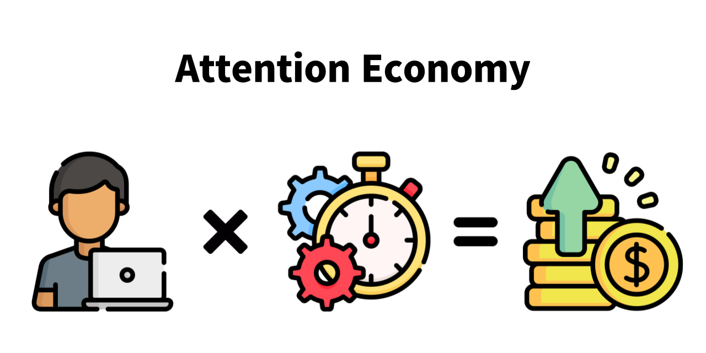
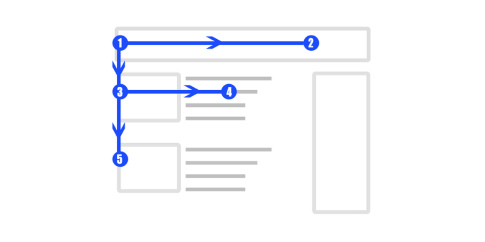

# 1부 주의 병목 구간

 

# 프롤로그 : 밈적 적합도

디지털 제품은 사용자가 가진 주의, 인지, 기억, 취향, 동기, 사회적 영향력 같은 다양한 심리적 병목 구간을 통과할 수 있느냐에 의해 성공이 판가름 난다.

훌륭한 요리를 가능하게 해 주는 과학적 배경이 화학이라면, 훌륭한 디자인을 가능하게 해 주는 과학적 배경은 바로 심리학이다.

### 밈(meme)이란?

> 밈이란 아이디어, 창작물, 문화의 구성 요소 등을 의미한다. 아주 단순한 것에서부터 매우 복잡한 형태를 지닌 것까지 "사람들 사이에 전파되는 것이 관찰될 수 있는 모든 것"들을 지칭한다.

밈 개발자들은 자신의 밈을 사용할 사람들이 누구인지 정확히 파악하고 그들의 심리적 병목 현상까지 이해해야 한다. 사용자들의 수용성에 최적화되어 설계된 밈만이 시장을 지배할 수 있다.

### 프롤로그 정리

프롤로그를 통해 밈의 정확한 정의에 대해 알 수 있었다. 그동안 팀 프로젝트에만 참여하다가 처음으로 혼자 기술 블로그를 개발하면서 디자인에 대한 관심도가 전보다 높아졌는데 "훌륭한 디자인을 가능하게 해 주는 과학적 배경은 바로 심리학이다."라는 문장을 읽고 심리학에 관해서도 관심이 생겼다.

 

# 1장 중심과 시선

당신이 만든 앱이 인기를 얻거나 당신의 비즈니스 모델이 성공하려면 당신의 아이디어를 사용자의 두뇌를 자극하는 신호로 바꿔야 한다.

외부 정보가 신경계로 전달되기 위해서는 일단 우리의 시각 범위 내로 들어와야 한다. 당신이 만든 밈이 우리 눈의 주변시에만 잡힌다면 소기의 목적을 달성할 수 없기 때문이다.

### 1장 정리

사용자의 중심와를 파악해서 적절한 곳에 정보를 표시하는 디자인의 중요성을 배웠다. 내 블로그에서 사용자의 중심와를 고려하고 있는지 다시 한번 디자인을 점검해야겠다.

 

# 2장 과업 지향성

밈 개발자로서 당신이 가장 먼저 해야 할 일은 사용자에게 목표가 있는지부터 알아보는 것이다.

### 과업 지향적 네트워크

> 매우 집중력을 요구하는 작업에 몰두하고 있을 때 뇌가 접어들게 되는 상태이다.

### 과업 회피적 네트워크

> 멍하게 있는 상태로서, 자유로우면서도 일률적이지 않은 사고를 지원하는 두뇌 네트워크이다.

피실험자들에게 문제를 풀도록 하거나 주어진 어떤 과업을 수행하라고 하면 **과업 지향적 네트워크**가 활성화된다.

디지털 미디어의 개발자로서 혹은 마케팅 담당자로서 당신이 가장 먼저 해야 할 일은 사용자들이 과업 지향적 모드에 있는지 과업 회피적 모드에 있는지 파악하는 것이다.

### 과업 지향적 사용자

- 주로 검색창을 사용

- 원하는 바를 얻기 위한 가장 효율적인 방법

### 과업 회피적 사용자

- 사이트 전체를 훑음

- 미처 알고 있지 못했던 무엇인가를 발견하기를 기대하며 사진, 링크, 아이콘들을 클릭

과업 지향적 사용자들은 자신들의 목적에 방해가 되고 주의가 분산되는 것을 싫어한다. 반면 과업 회피적 사용자들은 힘든 작업에 참여하는 것을 싫어하고 중간에 방해받는 것을 환영했다.

### 과업 지향적 모드 디자인 전략

- 사용자가 찾고자 하는 결과물을 신속히 보여줌

### 과업 회피적 모드 디자인 전략

- 머신 러닝을 이용하여 사용자가 이전 방문 시 클릭했던 것과 유사한 분야의 콘텐츠를 보여줌

- 같은 콘텐츠를 여러 웹 사이트에 반복 광고하는 소셜 마케팅 전략 구사

### 2장 정리

사용자의 목적에 따라 뇌의 활성화 영역이 달라지고 이를 고려하여 디자인 전략을 세운다는 점이 굉장히 흥미로웠다. 과업 지향적 모드와 과업 회피적 모드를 적절히 반영해서 정보를 배치하는 것이 어려울 거 같다. 블로그 프로젝트에서 각 모드의 사용자에게 맞춘 새로운 기능에 대해 생각해봤다.

### 과업 지향적 사용자를 위한 기능

- 블로그 글 검색 기능

### 과업 회피적 사용자를 위한 기능

- 현재 읽고 있는 글과 유사한 주제의 글 추천

- 가장 많은 사용자가 읽은 글 표시

 

# 3장 주의 집중

관심 경제에서는 사용자가 당신의 밈에게 시선을 줄 때 수익이 창출된다. 밈 개발자로서 당신은 이런 과정을 경제적 거래의 관점에서 볼 수 있어야 한다. 사용자가 당신이 개발한 밈을 소비하기 시작하면 당신은 그때부터 그들의 주의를 현금화할 수 있게 되는 것이다.

사람들은 페이지를 훑어볼 때 F형 패턴으로 스캔한다. 최소의 주의 집중 자원을 써서 페이지의 의미를 파악하고자 하는 사용자의 목표는 보통 상단에 배치된 헤드라인에 주목함으로써 달성될 수 있다. 하지만 헤드라인에서 우리의 기대가 충족되지 않으면 사용자들은 계속해서 아래쪽으로 시선을 옮겨 가며 읽게 된다. 이것이 F형 스캔 패턴이다.

주의 집중 병목 구간의 모양 때문에 우측 하단이 사용자 시선의 사각지대가 된다. 우측 하단의 광고는 큰 효과가 없으므로 중요한 링크는 절대 그 위치에 두면 안 된다. 일반적인 웹 사이트의 디자인은 F형 패턴을 따르는 것이 좋다. 중요한 링크는 상단에 배치하거나 좌측 아래로 이어지는 선을 따라 배치하도록 해라.

움직이는 팝업 알림과 붉은색은 사용자의 주의를 끄는 데는 매우 효과적이다. 하지만 밈 개발자가 그런 것들을 너무 많이 사용하면 어떤 문제가 생길까? 이런 알림들이 더는 사용자에게 특별한 것으로 받아들여지지 않게 되는 문제가 발생한다. 당신이 밈 개발자나 디자이너라면 이런 습관화 현상에 대해 걱정해야 한다. 주의를 끄는 디자인 요소들을 더 많이 사용할수록 주의 집중 병목 구간이 더 좁아지기 때문이다.

### 3장 정리

그동안 방문한 웹 사이트에 대해 다시 한번 생각해봤다. 웹 사이트 중 대부분이 F형 패턴을 따른 디자인이었다는 것을 알 수 있었다. 실제로 우측 하단에 광고가 있는 경우를 거의 본 적이 없다. 블로그를 개발할 때 내 프로필을 페이지 하단에 표시하다가 상단으로 위치를 옮겼는데 의도치 않게 F형 패턴을 반영한 거 같아서 다행이라고 생각했다. 그리고 핸드폰 알림을 켜 놓은 상태로 오랜 시간이 지나면 알림으로 인식되지 않고 그저 하나의 아이콘처럼 여겨졌던 경험이 생각났다. 내 심리가 이렇게 습관화 형상이라는 이름으로 불리며 디자인할 때 이러한 현상도 고려한다는 점이 신기했다.

 

### 사진 출처 📷

- [The Science behind Timeqube and How Vision Works](https://timeqube.com/science/the-science-behind-timeqube/)
- [The Perks of Using the F-Pattern in Web Design](https://www.webdesign.org/the-perks-of-using-the-f-pattern-in-web-design.23348.html)
- [What are Push Notifications and Why Does Your App Need it?](https://www.mobileappdaily.com/what-is-push-notification)
