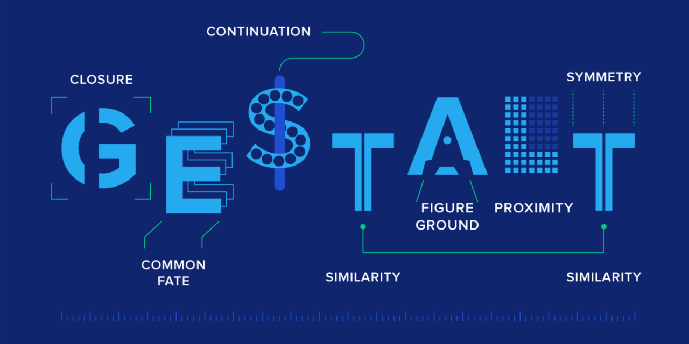
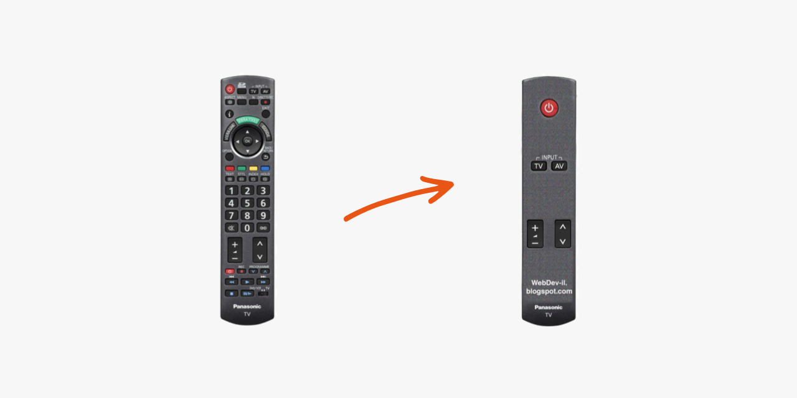
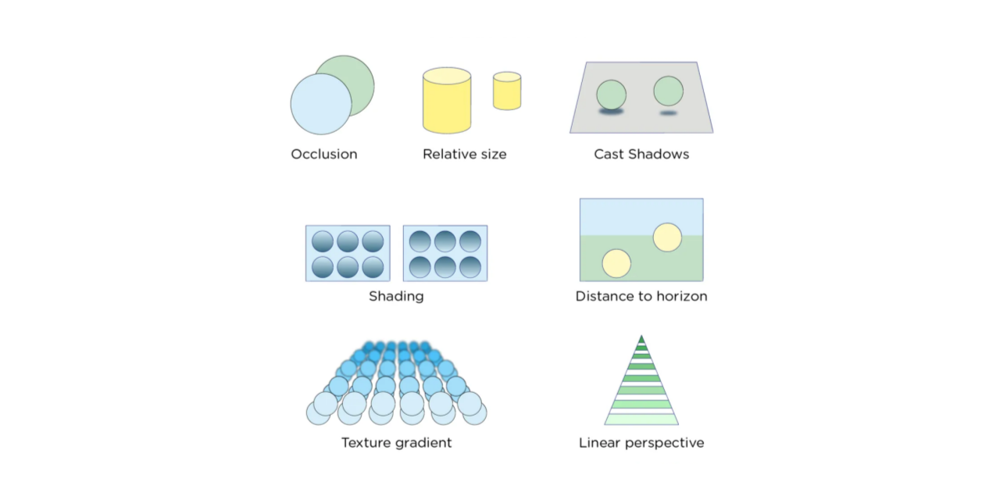

# 2부 인지 병목 구간

## 4장 게슈탈트 인지

[1부 주의 병목 구간](https://mnxmnz-book.vercel.app/bottlenecks/the-bottlenecks-of-attention/)을 통과하면 당신이 만든 밈이 사용자의 뇌까지 전달됐다. 이제 당신의 의도대로 뇌가 해석해 주는 것이 필요하다. 그렇지 않으면 그것이 얼마나 중요한 의미의 정보인지 사용자가 알 수 없다. 이것이 **인지 병목 구간**이다.

사용자는 사물의 인식에 필요한 자원을 되도록 사용하지 않으려 하는 경향이 있다. 인간은 밈이 어떤 중요한 의미를 갖고 있는지를 파악하는 데 최소한의 인식 자원만 배정한다.

밈이나 그래픽 요소를 훑어볼 때 우리는 무의식적으로 **게슈탈트 인지**를 사용한다. 이것은 **사전 인지 결정 과정**으로, 인지의 대상이 되는 사물의 크기, 형태, 위치, 주위에 배치된 사물을 기준으로 대상 사물의 기능과 정체를 추측하는 것을 의미한다. **밈을 형태나 그 주변에 배치된 사물을 기준으로 판단**한다는 뜻이다. 이것은 가장 적은 노력을 들이면서도 원하는 목표를 달성하기 위한 방법이다.

대상을 정확하게 인지하는 데는 게슈탈트 이론가들이 오랜 세월 주장했던 대로 **크기, 형태, 위치**가 엄청나게 큰 영향을 미친다. 경우에 따라 단어 자체보다 더 중요하기도 하다.

게슈탈트 원리를 이용하여 그래픽을 구성하면 그래픽 요소들의 의미를 유심히 살펴보지 않아도 잘 파악되는 장점이 있다. 사용자의 입장에서는 밈을 파악하기 위해 큰 노력을 들일 필요가 없어지는 것이다. 게슈탈트 원리를 이용한 가장 좋은 예가 음악 게임이다. 게임에 대한 명확한 설명서 없이도 이 게임을 하는 사람들은 직관적으로 게임 방법을 알 수 있게 된다.

기능이나 그래픽을 디자인할 때 게슈탈트 원리를 따르지 않는 경우 두 가지 유형의 오류가 발생한다.

1. 관련이 없는 요소들이 서로 연결된 것처럼 인식되어 잘못된 기능이 부여된 것으로 오해하는 경우
2. 서로 관련이 있는 요소들이 연결되어 있지 않아 정확한 기능이 전달되지 않는 경우

인지 병목 구간에서 살아남을 수 있는 가장 효과적인 방법인 일반적인 **게슈탈트 오류를 제거**하는 것이다. 다음과 같이 해야 한다.

게슈탈트 오류를 제거하는 방법

- 근접한 거리에 있는 경우, 중요한 링크를 웹 사이트 내에 일반적으로 광고가 게재되는 위치에서 다른 곳으로 옮긴다.
- 색깔이나 형태가 비슷한 경우, 클릭이 가능한 링크는 다른 색깔을 사용한다. 일반적인 텍스트를 파란색 혹은 밑줄로 표시를 하지 않는다.
- 크기나 형태가 비슷한 경우, 비디오를 재생하는 버튼을 표시하기 위해서 오른쪽을 향하고 있는 삼각형 외에는 쓰지 않는다.
- 같은 방향으로 움직이고 있는 경우, 위저드 스텝이나 체크아웃 프로세스를 탭으로 보이지 말고 화살표나 선으로 표시하라.
- 같은 선상에 있는 경우, 서로 연관 있는 요소들은 수평 이동 창에 표시하고 관련성 없는 것들은 제외하라.
- 같은 구역에 있는 경우, 서로 연관 있는 요소들은 박스 표시로 묶어 주고 관련성 없는 것들은 박스 바깥에 위치시켜라.
- 그래픽적으로 연결할 경우, 선을 긋고 점을 연결하라.

연관성이 없는 것들끼리 서로 밀접하게 연결된 것처럼 보이기 위해 밈 개발자들이 의도적으로 게슈탈트 원리를 이용하기도 한다.

### 4장 정리

하나의 단어를 반복해서 읽다 보면 뜻이 어색하게 느껴지는 게슈탈트 붕괴 현상에 대해 들어본 적이 있다. 게슈탈트 원리가 어떤 것인지 자세히는 몰랐는데 이번 장을 읽고 정리하면서 정확하게 이해할 수 있었다. 게슈탈트 원리를 디자인에 적용할 수 있다는 점이 흥미로웠다. 게슈탈트 오류를 제거하는 방법에 대해 상세히 적혀 있어서 앞으로 프로젝트를 할 때 지켜야 할 가이드를 얻은 느낌이라 좋았다.

 

## 5장 심도 인지

만약 만들어야 할 그래픽 요소가 공룡이고 밈은 비디오 게임이나 동영상 속의 특수 효과라면 어떤 일이 일어날까? 이런 상황이라면 디지털 밈을 정확하게 사용자들이 인식하도록 만들기 위해 단순히 게슈탈트 원리에만 의존해서는 안 된다. 표현하고자 하는 대상이 3차원 공간을 차지하고 있는 것처럼 보여야 하고 나아가 사용자가 예측하는 방식으로 그 공간을 돌아다녀야 한다.

여기서 해결해야 할 현실적인 문제는 대부분 모니터가 2차원 평판으로 구성된 평면이라는 점이다. 어떻게 해야 평평한 것에 입체감을 줄 수 있을까?

여기엔 두 가지 방법이 있다.

1. 특수한 촬영 방법을 사용하고 능동형 혹은 수동형 고글 같은 비싸고 멋진 하드웨어를 이용하는 방법
2. 소프트웨어를 이용하여 그래픽만으로 효과를 만드는 방법

방법 1의 "특수한 촬영 방법을 사용하고 하드웨어를 이용하는 방법"은 처음에는 호기심에 사용해 보지만 계속 사람들의 관심을 붙들어 두지는 못했다. 많은 전문가가 분석한 바로는 이미 대부분의 영화나 비디오 게임들이 소프트웨어만으로도 상당한 입체적 감각을 느낄 수 있도록 그래픽 효과를 적용하여 제작하고 있다는 것이 가장 큰 이유였다.

단안 깊이 단서라고 불리는 생각보다 어렵지 않은 그래픽 기법만 가지고도 평면적인 사물에 거리감을 주어 충분히 입체적으로 만들 수 있다.

결론은 다음과 같다. 소형 영화관에 투자하기 전에 그래픽 기술만으로도 충분한 입체 효과를 얻을 수 있는지 검토할 필요가 있다. 이미 입체 효과를 얻는 데 필요한 원리들을 충분히 적용하고 있다고 판단되면 더는 입체감에 신경을 쓸 것이 아니라 스토리에 더 집중하도록 하라.

### 5장 정리

1장부터 4장까지의 내용은 그동안 웹 프론트엔드를 개발하며 느낀 점과 관련된 내용이 많았다. 이번 5장은 앞의 장과 달리 내가 직접 겪어보지 않은 문제를 다뤘다. 그래서 앞의 장에 비해 비교적 덜 와닿았다. 1장부터 4장까지 읽고 정리하며 이제 프로젝트를 진행할 때 이러한 내용을 적용해보면 좋겠다는 생각이 들었는데 이번 장에서는 그런 내용이 안 느껴져서 아쉬웠다. 앞으로 그래픽 요소나 특수 효과를 제작할 일이 있을지는 모르겠지만 그래도 단안 깊이 단서와 같은 그래픽 기법에 대해 알게 돼서 좋았다.

 

#### 사진 출처 📷

- [Exploring the Gestalt Principles of Design | Toptal](https://www.toptal.com/designers/ui/gestalt-principles-of-design)
- [TAPSONIC BOLD](https://store.steampowered.com/app/938220/TAPSONIC_BOLD/)
- [Remote Control User Experience](https://www.pngitem.com/middle/hmxTmhJ_remote-control-user-experience-hd-png-download/)
- [Perceptual Organization](https://jackwestin.com/resources/mcat-content/perception/perceptual-organization)
