# 4장 커넥션 관리

## 4.1 TCP 커넥션

모든 HTTP 통신은 패킷 교환 네트워크 프로토콜의 계층화된 집합인 TCP/IP 를 통해 이루어진다.

URL 을 입력받은 브라우저는 다음과 같은 단계를 수행한다.

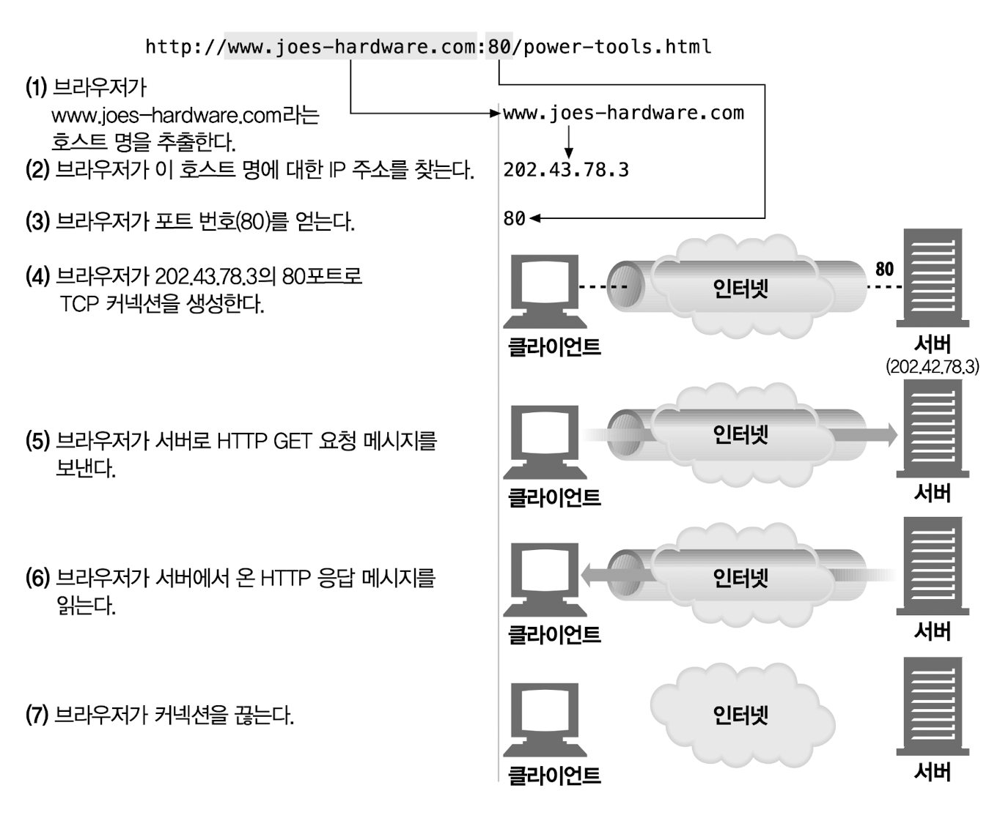

- 1단계~3단계: URL 을 통해 서버의 IP 주소와 포트 번호 확인
- 4단계: 웹 서버가 TCP 커넥션 생성
- 5단계: 커넥션을 통해 요청 메시지 전달
- 6단계: 커넥션 종료

### 4.1.1 신뢰할 수 있는 데이터 전송 통로인 TCP

TCP 는 충돌 없이 순서에 맞게 HTTP 데이터를 전달한다.

### 4.1.2 TCP 스트림은 세그먼트로 나뉘어 IP 패킷을 통해 전송된다

TCP 는 IP 패킷이라고 불리는 작은 조각을 통해 데이터를 전송한다.

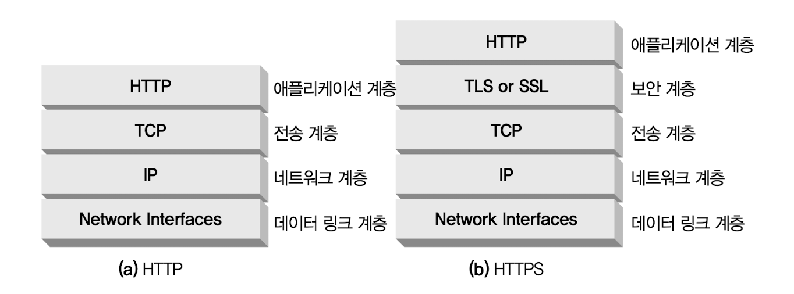

- HTTP: IP, TCP, HTTP 로 구성된 프로토콜 스택에서 최상위 계층
- HTTPS: TLS 혹은 SSL 이라 불리기도 하며 HTTP 와 TCP 사이에 있는 암호화 계층

HTTP 가 메시지를 전송할 때 다음과 같은 단계를 수행한다.

- 현재 연결되어 있는 TCP 커넥션을 통해서 메시지 데이터의 내용을 순서대로 전송
- TCP 는 세그먼트라는 단위로 데이터 스트림을 잘게 분리
- 세그먼트를 IP 패킷이라고 불리는 봉투에 담아 인터넷을 통해 데이터 전달

각 TCP 세그먼트는 하나의 IP 주소에서 다른 IP 주소로 IP 패킷에 담겨 전달된다. IP 패킷은 다음을 포함한다.

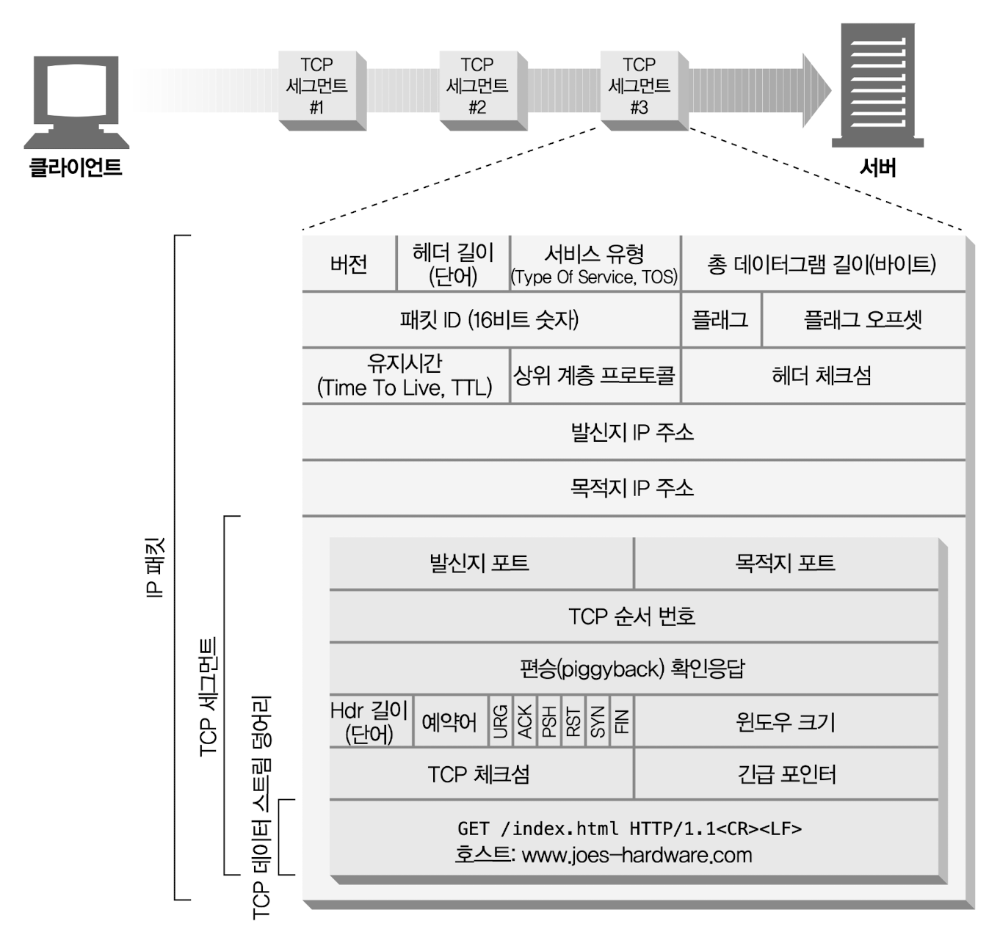

- IP 패킷 헤더
  - 발신지, 목적지 IP 주소, 크기, 기타 플래그
- TCP 세그먼트 헤더
  - TCP 포트 번호, TCP 제어 플래그, 데이터의 순서와 무결성을 검사하기 위해 사용하는 숫자 값
- TCP 데이터 조각

### 4.1.3 TCP 커넥션 유지하기

컴퓨터는 항상 TCP 커넥션을 여러 개 가지고 있다. TCP 는 포트 번호를 통해서 여러 개의 커넥션을 유지한다. IP 주소는 해당 컴퓨터에 연결되고 포트 번호는 해당 애플리케이션으로 연결된다.

TCP 커넥션은 네 가지 값으로 식별한다. 네 가지 값으로 유일한 커넥션을 생성한다.

```
<발신지 IP 주소, 발신지 포트, 수신지 IP 주소, 수신지 포트>
```

### 4.1.4 TCP 소켓 프로그래밍

소켓 API 를 사용하면 TCP 종단 데이터 구조를 생성하고 원격 서버의 TCP 종단에 그 종단 데이터 구조를 연결하여 데이터 스트림을 읽고 쓸 수 있다.

클라이언트와 서버 간에 HTTP 트랜잭션을 수행하기 위한 소켓 API 사용 방법은 다음과 같다.

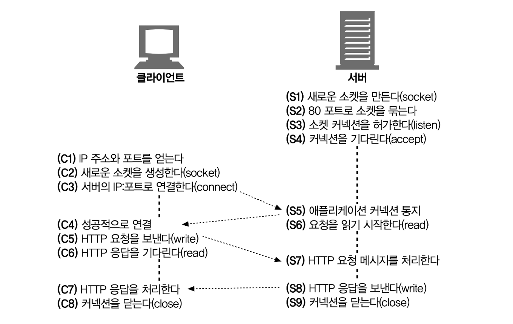

## 4.2 TCP의 성능에 대한 고려

HTTP 는 TCP 바로 위에 있는 계층이기 때문에 HTTP 트랜잭션의 성능은 그 아래 계층인 TCP 성능에 영향을 받는다.

### 4.2.1 HTTP 트랜잭션 지연

HTTP 의 주요 커넥션, 전송, 처리의 지연은 다음과 같다.

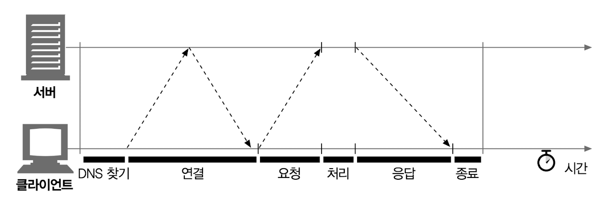

트랜잭션을 처리하는 시간은 TCP 커넥션을 설정하고 요청을 전송하고 응답 메시지를 보내는 것에 비하면 상당히 짧다. 대부분의 HTTP 지연은 TCP 네트워크 지연 때문에 발생한다.

HTTP 트랜잭션을 지연시키는 원인은 여러 가지가 있다.

- 클라이언트는 URI 에서 웹 서버의 IP 주소와 포트 번호를 알아내야 한다. 만약 URI 에 기술되어 있는 호스트에 방문한 적이 최근에 없으면 DNS 이름 분석(DNS resolution) 인프라를 사용하여 URI 에 있는 호스트 명을 IP 주소로 변환하는데 수십 초의 시간이 걸릴 것이다.
- 클라이언트는 TCP 커넥션 요청을 서버에게 보내고 서버가 커넥션 허가 응답을 회신하기를 기다린다. 커넥션 설정 시간은 새로운 TCP 커넥션에서 항상 발생한다. 이는 보통 1초~2초의 시간이 소요되지만 수백 개의 HTTP 트랜잭션이 만들어지면 소요 시간은 크게 증가할 것이다.
- 커넥션이 맺어지면 클라이언트는 HTTP 요청을 새로 생성된 TCP 파이프를 통해 전송한다. 웹 서버는 데이터가 도착하는 대로 TCP 커넥션에서 요청 메시지를 읽고 처리한다. 요청 메시지가 인터넷을 통해 전달되고 서버에 의해서 처리되는 데까지는 시간이 소요된다.
- 웹 서버가 HTTP 응답을 보내는 것 역시 시간이 소요된다.

TCP 네트워크 지연은 하드웨어의 성능, 네트워크와 서버의 전송 속도, 요청과 응답 메시지의 크기, 클라이언트와 서버 간의 거리에 따라 크게 달라진다. TCP 프로토콜의 기술적인 복잡성도 지연에 큰 영향을 끼친다.

### 4.2.2 성능 관련 중요 요소

가장 일반적인 TCP 관련 지연은 다음과 같다.

- TCP 커넥션의 핸드셰이크 설정
- 인터넷의 혼잡을 제어하기 위한 TCP 의 느린 시작(slow-start)
- 데이터를 한데 모아 한 번에 전송하기 위한 네이글(nagle) 알고리즘
- TCP 의 편승(piggyback) 확인응답(acknowledgment)을 위한 확인응답 지연 알고리즘
- TIME_WAIT 지연과 포트 고갈

고성능의 HTTP 소프트웨어를 개발하고 있다면 위 항목 각각을 모두 이해해야 한다. 그 정도의 성능 최적화를 할 게 아니라면 이 부분은 건너뛰어도 좋다.

## 4.3 HTTP 커넥션 관리

### 4.3.1 흔히 잘못 이해하는 Connection 헤더

HTTP Connection 헤더 필드는 커넥션 토큰을 쉼표로 구분하여 가지고 있으며 그 값은 다른 커넥션에 전달되지 않는다.

Connection 헤더에는 다음 세 가지 종류의 토큰이 전달될 수 있기 때문에 다소 혼란스러울 수 있다.

- HTTP 헤더 필드 명은 이 커넥션에만 해당하는 헤더를 나열한다.
- 임시적인 토큰 값은 커넥션에 대한 비표준 옵션을 의미한다.
- close 값은 커넥션 작업이 완료되면 종료되어야 함을 의미한다.

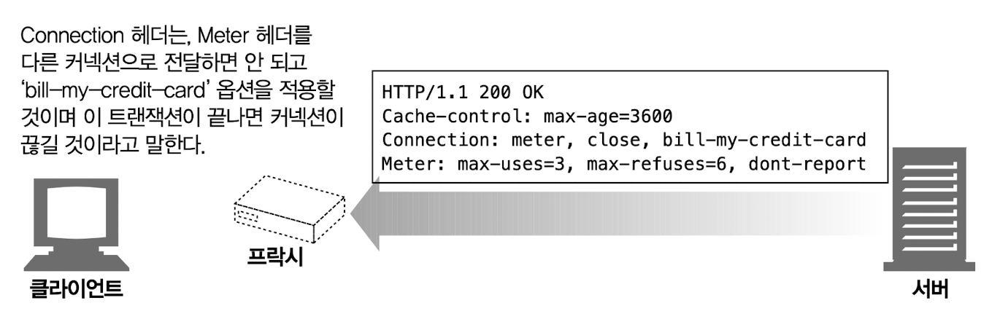

커넥션 토큰이 HTTP 헤더 필드 명을 가지고 있으면 해당 필드는 현재 커넥션만을 위한 정보이므로 다음 커넥션에 전달하면 안 된다. Connection 헤더에 있는 모든 헤더 필드는 메시지를 다른 곳으로 전달하는 시점에 삭제되어야 한다. Connection 헤더에는 홉별(hop-by-hop) 헤더 명을 기술하는데 이것을 ‘헤더 보호하기’라 한다. Connection 헤더에 명시된 헤더들이 전달되는 것을 방지하기 때문이다.

HTTP 애플리케이션이 Connection 헤더와 함께 메시지를 전달받으면 수신자는 송신자에게서 온 요청에 기술되어 있는 모든 옵션을 적용한다. 다음 홉에 메시지를 전달하기 전에 Connection 헤더와 Connection 헤더에 기술되어 있던 모든 헤더를 삭제한다.

### 4.3.2 순차적인 트랜잭션 처리에 의한 지연

커넥션 관리가 제대로 이루어지지 않으면 TCP 성능이 매우 안 좋아질 수 있다.

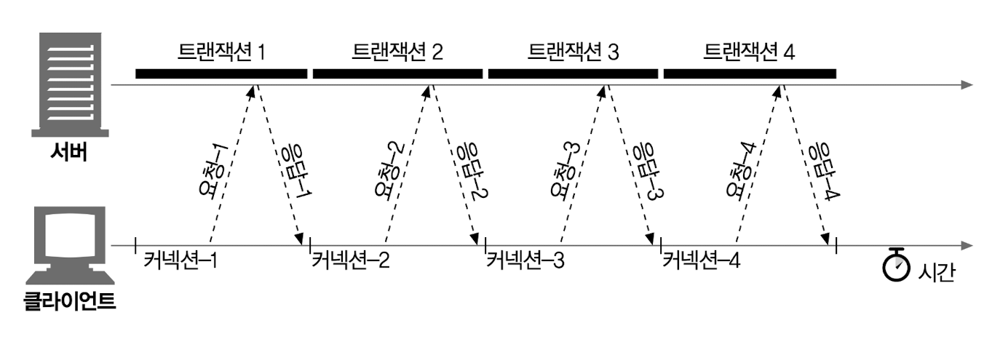

예를 들어 3개의 이미지가 있는 웹 페이지가 있다고 해보자. 브라우저가 이 페이지를 보여주려면 네 개의 HTTP 트랜잭션을 만들어야 한다. 하나는 해당 HTML 을 받기 위해 나머지 세 개는 첨부된 이미지를 받기 위한 것이다. 각 트랜잭션이 새로운 커넥션을 필요로 한다면 커넥션을 맺는데 발생하는 지연과 함께 느린 시작 지연이 발생할 것이다.

순차적인 처리로 인한 지연에는 물리적인 지연뿐 아니라 하나의 이미지를 내려받고 있는 중에는 웹 페이지의 나머지 공간에 아무런 변화가 없어서 느껴지는 심리적인 지연도 있다. 사용자는 여러 개의 이미지가 동시에 로드되는 것을 더 좋아한다.

## 4.4 병렬 커넥션

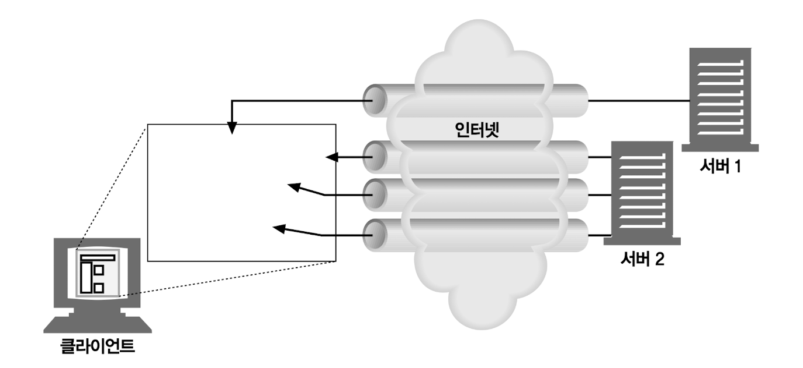

HTTP 는 클라이언트가 여러 개의 커넥션을 맺음으로써 여러 개의 HTTP 트랜잭션을 병렬로 처리할 수 있게 한다.

### 4.4.1 병렬 커넥션은 페이지를 더 빠르게 내려받는다

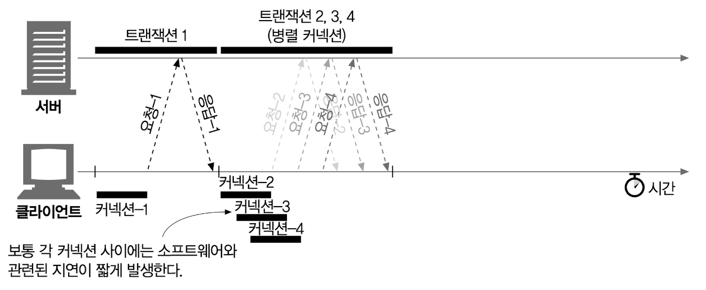

단일 커넥션의 대역폭 제한과 커넥션이 동작하지 않고 있는 시간을 활용하면 객체가 여러 개 있는 웹 페이지를 더 빠르게 내려받을 수 있을 것이다. 하나의 커넥션으로 객체를 로드할 때의 대역폭 제한과 대기 시간을 줄일 수 있다면 더 빠르게 로드할 수 있을 것이다. 각 커넥션의 지연 시간을 겹치게 하면 총 지연 시간을 줄일 수 있고 클라이언트의 인터넷 대역폭을 한 개의 커넥션이 다 써버리는 것이 아니라면 나머지 객체를 내려받는 데에 남은 대역폭을 사용할 수 있다.

### 4.4.2 병렬 커넥션이 항상 더 빠르지는 않다

클라이언트의 네트워크 대역폭이 좁을 때는 대부분의 시간을 데이터를 전송하는 데만 쓸 것이다. 여러 개의 객체를 병렬로 내려받는 경우 이 제한된 대역폭 내에서 각 객체를 전송받는 것은 느리기 때문에 성능상의 장점은 거의 없어진다.

다수의 커넥션은 메모리를 많이 소모하고 자체적인 성능 문제를 발생시킨다. 복잡한 웹 페이지는 수십 개에서 수백 개의 객체를 포함한다. 클라이언트가 수백 개의 커넥션을 열 수도 있겠지만 서버는 다른 여러 사용자의 요청도 함께 처리해야 하므로 수백 개의 커넥션을 허용하는 경우는 드물다.

브라우저는 실제로 병렬 커넥션을 사용하긴 하지만 적은 수의 병렬 커넥션만 허용한다. 서버는 특정 클라이언트로부터 과도한 수의 커넥션이 맺어졌을 경우 그것을 임의로 끊어버릴 수 있다.

### 4.4.3 병렬 커넥션은 더 빠르게 ‘느껴질 수’ 있다

화면에 여러 개의 객체가 동시에 보이면서 내려받고 있는 상황을 볼 수 있기 때문에 사용자는 더 빠르게 내려받고 있는 것처럼 느낄 수 있다.

## 4.5 지속 커넥션

서버에 HTTP 요청을 하기 시작한 애플리케이션은 웹 페이지 내의 이미지 등을 가져오기 위해서 그 서버에 또 요청하게 될 것이다. 이 속성을 사이트 지역성(site locality)라 부른다.

HTTP/1.1 을 지원하는 기기는 처리가 완료된 후에도 TCP 커넥션을 유지하여 앞으로 있을 HTTP 요청에 재사용할 수 있다. 처리가 완료된 후에도 계속 연결된 상태로 있는 TCP 커넥션을 지속 커넥션이라고 부른다.

비지속 커넥션은 각 처리가 끝날 때마다 커넥션을 끊지만 지속 커넥션은 클라이언트나 서버가 커넥션을 끊기 전까지는 트랜잭션 간에도 커넥션을 유지한다.

해당 서버에 이미 맺어져 있는 지속 커넥션을 재사용함으로써 커넥션을 맺기 위한 준비 작업에 따르는 시간을 절약할 수 있다. 이미 맺어져 있는 커넥션은 TCP의 느린 시작으로 인한 지연을 피함으로써 더 빠르게 데이터를 전송할 수 있다.

### 4.5.1 지속 커넥션 vs 병렬 커넥션

병렬 커넥션의 단점은 다음과 같다.

- 각 트랜잭션마다 새로운 커넥션을 맺고 끊기 때문에 시간과 대역폭이 소요된다.
- 각각의 새로운 커넥션은 TCP 느린 시작 때문에 성능이 떨어진다.
- 실제로 연결할 수 있는 병렬 커넥션의 수에는 제한이 있다.

지속 커넥션은 병렬 커넥션에 비해 몇 가지 장점이 있다.

- 커넥션을 맺기 위한 사전 작업과 지연을 줄여준다.
- 튜닝된 커넥션을 유지한다.
- 커넥션의 수를 줄여준다.

지속 커넥션의 단점은 다음과 같다.

- 계속 연결된 상태로 있는 수많은 커넥션이 쌓이게 된다.
- 이는 로컬의 리소스 및 원격의 클라이언트와 서버의 리소스에 불필요한 소모를 발생시킨다.

지속 커넥션은 병렬 커넥션과 함께 사용될 때 가장 효과적이다. 오늘날 많은 웹 애플리케이션은 적은 수의 병렬 커넥션만을 맺고 그것을 유지한다.

### 4.5.2 HTTP/1.0+의 Keep-Alive 커넥션

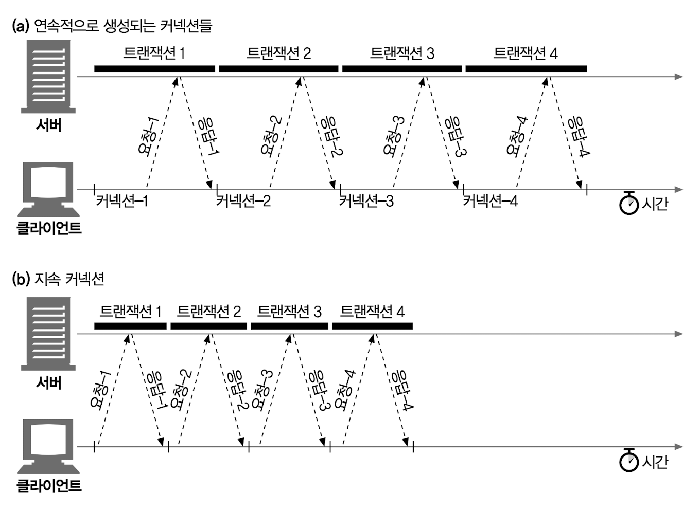

커넥션을 맺고 끊는 데 필요한 작업이 없어서 시간이 단축되었다.

### 4.5.3 Keep-Alive 동작

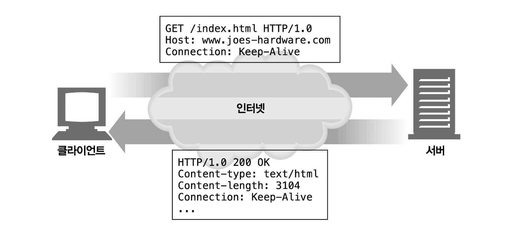

- 커넥션을 유지하기 위해 요청에 `Connection:Keep-Alive` 헤더를 포함한다. 이 요청을 받은 서버는 다음 요청도 이 커넥션을 통해 받고자 한다면 응답 메시지에 같은 헤더를 포함시켜 응답한다. 응답에 `Connection: Keep-Alive` 헤더가 없으면 클라이언트는 서버가 keep-alive 를 지원하지 않으며 응답 메시지가 전송되고 나면 서버 커넥션을 끊을 것이라 추정한다.

### 4.5.4 Keep-Alive 옵션

Keep-Alive 헤더는 커넥션을 유지하기를 바라는 요청일 뿐이다. 클라이언트나 서버가 keep-alive 요청을 받았다고 해서 무조건 그것을 따를 필요는 없다. 언제든지 현재의 keep-alive 커넥션을 끊을 수 있으며 keep-alive 커넥션에서 처리되는 트랜잭션의 수를 제한할 수 있다.

keep-alive 의 동작은 Keep-Alive 헤더의 쉼표로 구분된 옵션으로 제어할 수 있다.

- timeout 파라미터: Keep-Alive 응답 헤더를 통해 보낸다. 커넥션이 얼마간 유지될 것인지를 의미한다. 하지만 이대로 동작한다는 보장은 없다.
- max 파라미터: Keep-Alive 응답 헤더를 통해 보낸다. 커넥션이 몇 개의 HTTP 트랜잭션을 처리할 때까지 유지될 것인지를 의미한다. 하지만 이대로 동작한다는 보장은 없다.
- Keep-Alive 헤더: 진단이나 디버깅을 주목적으로 하는 처리되지 않는 임의의 속성을 지원하기도 한다. 문법은 이름[=값] 같은 식이다.

Keep-Alive 헤더 사용은 선택 사항이지만 Connection:Keep-Alive 헤더가 있을 때만 사용할 수 있다.

### 4.5.6 Keep-Alive와 멍청한(dumb) 프락시

프록시는 Connection 헤더를 이해하지 못해서 해당 헤더를 삭제하지 않고 요청 그대로 다음 프록시에 전달한다.

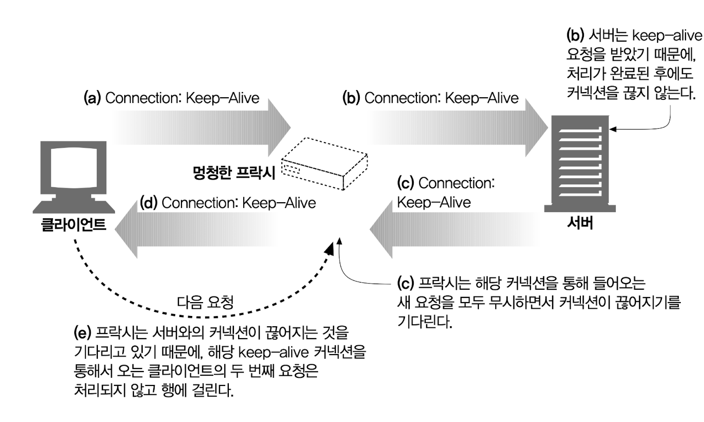

### 4.5.7 Proxy-Connection 살펴보기

클라이언트의 요청이 중개 서버를 통해 이어지는 경우 모든 헤더를 무조건 전달하는 문제를 해결하기 위해 Proxy-Connection 이라는 헤더를 사용한다. Proxy-Connection 은 프록시를 별도로 설정할 수 있는 현대의 브라우저에서 지원하고 있으며 많은 프록시가 이것을 인식한다.

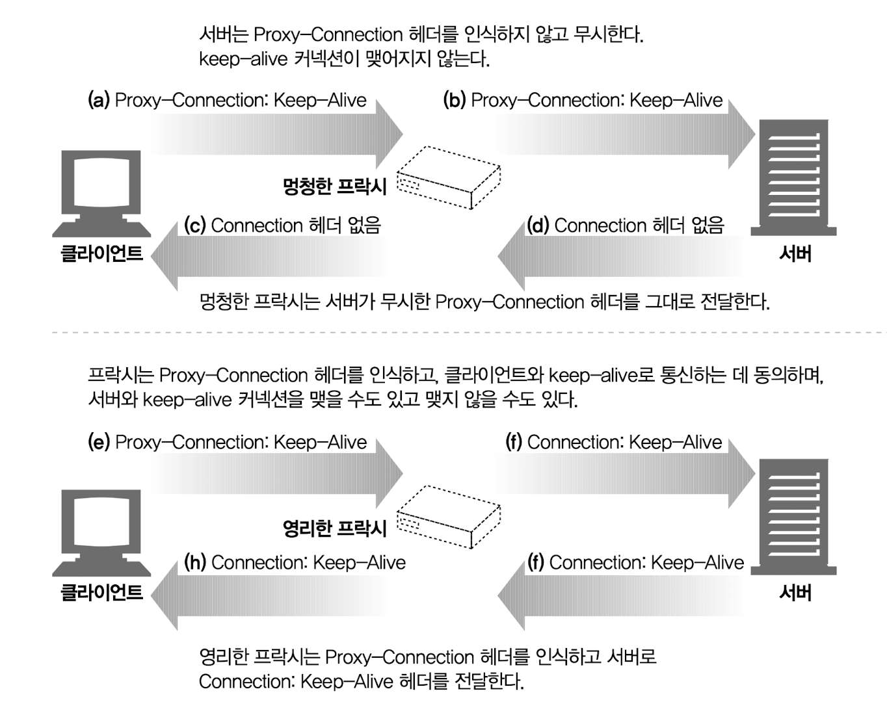

이 방식은 클라이언트와 서버 사이에 한 개의 프록시만 있는 경우에서만 동작한다.

다음과 같이 잘못된 헤더를 생성하는 문제가 다시 발생할 수 있다.

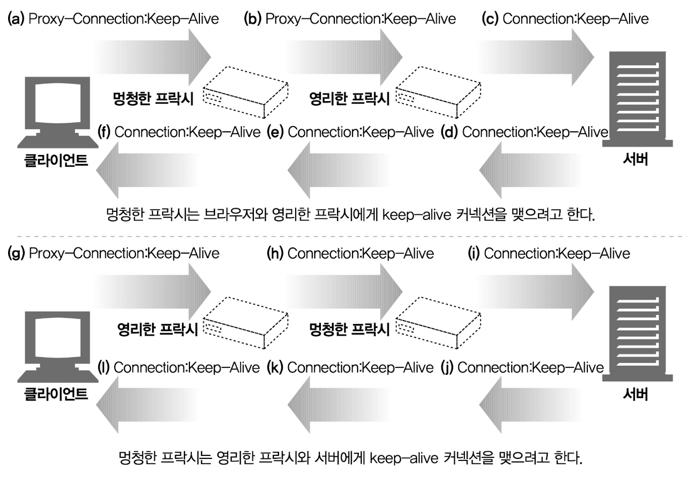

### 4.5.8 HTTP/1.1의 지속 커넥션

HTTP/1.1 에서는 별도의 설정을 하지 않는 한 모든 커넥션을 지속 커넥션으로 취급한다. HTTP/1.1 애플리케이션은 트랜잭션이 끝난 다음 커넥션을 끊으려면 Connection:close 헤더를 명시해야 한다.

## 4.6 파이프라인 커넥션

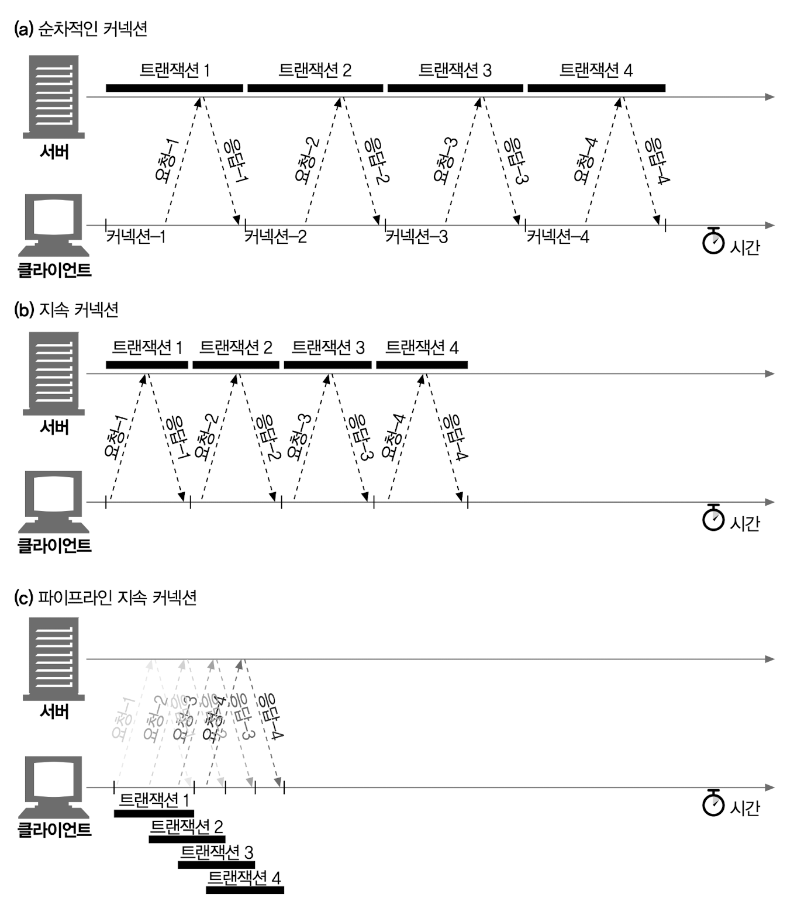

- HTTP 클라이언트는 커넥션이 지속 커넥션인지 확인하기 전까지는 파이프라인을 이어서는 안 된다.
- HTTP 응답은 요청 순서와 같게 와야 한다. HTTP 메시지는 순번이 매겨져 있지 않아서 응답이 순서 없이 오면 순서에 맞게 정렬시킬 방법이 없다.
- HTTP 클라이언트는 커넥션이 언제 끊어지더라도 완료되지 않은 요청이 파이프라인에 있으면 언제든 다시 요청을 보낼 준비가 되어 있어야 한다. 클라이언트가 지속 커넥션을 맺고 나서 바로 10개의 요청을 보낸다고 하더라도 서버는 5개의 요청만 처리하고 커넥션을 임의로 끊을 수 있다. 남은 5개의 요청은 실패할 것이고 클라이언트는 예상치 못하게 끊긴 커넥션을 다시 맺고 요청을 보낼 수 있어야 한다.
