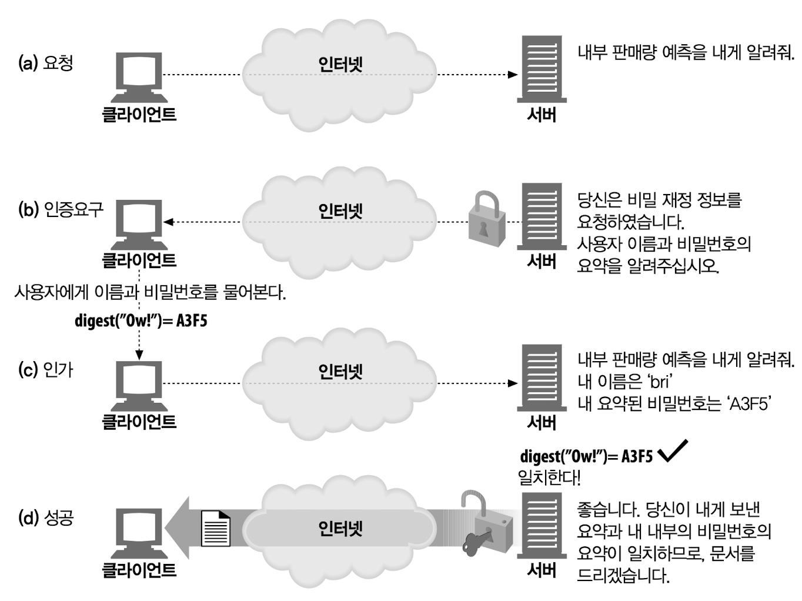

# 13장 다이제스트 인증

## 13.1 다이제스트 인증의 개선점

다이제스트 인증의 특징은 다음과 같다.

- 비밀번호를 절대로 네트워크를 통해 평문으로 전송하지 않는다.
- 인증 체결을 가로채서 재현하려는 악의적인 사람들을 차단한다.
- 구현하기에 따라서, 메시지 내용 위조를 막는 것도 가능하다.
- 그 외 몇몇 잘 알려진 형태의 공격을 막는다.

### 13.1.1 비밀번호를 안전하게 지키기 위해 다이제스트 사용하기

비밀번호를 보내는 대신, 클라이언트는 비밀번호를 비가역적으로 뒤섞은 '핑거프린트(fingerprint)' 혹은 '다이제스트(digest)'를 보낸다.

1. 클라이언트가 보호된 문서를 요구한다.
2. 서버는 클라이언트가 비밀번호를 알고 있음을 스스로 증명하여 신원을 인증하기 전까지 문서를 제공하는 것을 거부한다. 서버는 클라이언트에게 사용자 이름과 다이제스트 형태의 비밀번호를 요구한다.
3. 클라이언트는 비밀번호의 다이제스트를 전달하여 자신이 비밀번호를 알고 있음을 증명한다. 서버는 모든 사용자의 비밀번호를 알고 있으므로, 클라이언트가 제공한 다이제스트와 서버가 스스로 계산한 다이제스트가 일치하는지 비교하여 사용자가 비밀번호를 알고 있는지 확인할 수 있다. 비밀번호를 모르는 사람은 올바른 다이제스트를 만들어 내기 쉽지 않을 것이다.
4. 서버는 클라이언트가 제공한 다이제스트와 서버가 내부적으로 계산한 다이제스트를 비교한다. 일치하면 이는 클라이언트가 비밀번호를 알고 있는 것이다. 이 다이제스트 함수는 매우 긴 자릿수의 숫자를 만들어낼 수 있도록 되어 있기 때문에 사실상 찍어서 맞추는 것은 불가능하다. 서버가 일치 여부를 확인하면, 클라이언트에게 문서가 제공된다. 이 모든 과정에서 비밀번호는 결코 네트워크를 통해 전송되지 않는다.

### 13.1.2 단방향 다이제스트

다이제스트는 '정보 본문의 압축'이다. 다이제스트는 단방향 함수로 동작하고, 일반적으로 입력 가능한 무한 가지의 모든 입력값을 유한한 범위의 압축으로 변환한다.

다이제스트 함수는 보통 암호 체크섬(cryptographic checksums)으로 불리며, 단방향 해시 함수이거나 핑거프린트 함수(fingerprint function)이다.

### 13.1.3 재전송 방지를 위한 난스(nonce) 사용

재전송 공격을 방지하기 위해서 서버는 클라이언트에게 난스(nonce)라고 불리는 특별한, 그리고 자주 바뀌는(대략 1밀리초마다, 혹은 인증할 때마다) 증표를 건네준다. 난스를 비밀번호에 섞으면 난스가 바뀔 때마다 다이제스트도 바뀌게 만들어준다. 이것은 재전송 공격을 막아주는데, 왜냐하면 저장된 비밀번호 요약은 특정 난스 값에 대해서만 유효하고, 비밀번호 없이 공격자가 올바른 다이제스트를 계산하는 것은 가능하지 않기 때문이다.

다이제스트 인증은 난스를 사용할 것을 요구하는데, 왜냐면 자잘한 재전송 공격이 난스를 쓰지 않는 다이제스트 인증을 실질적으로 기본 인증만큼 허약한 것으로 만들기 때문이다. 난스는 WWW-Authenticate 인증요구에 담겨서 서버에서 클라이언트로 넘겨진다.
