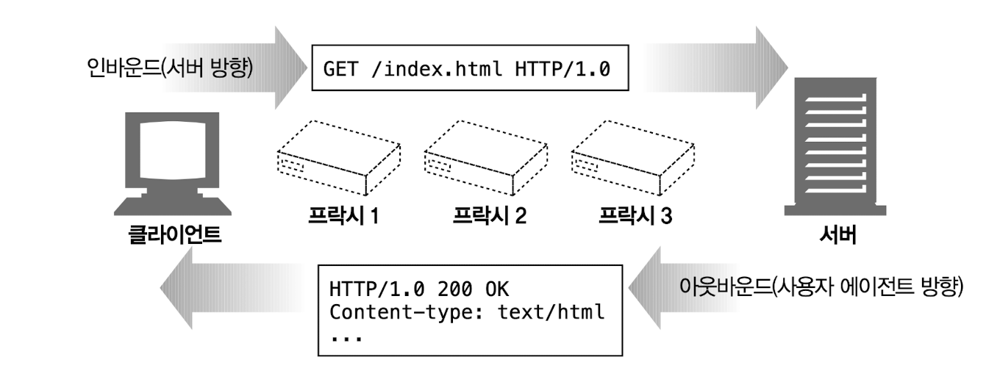
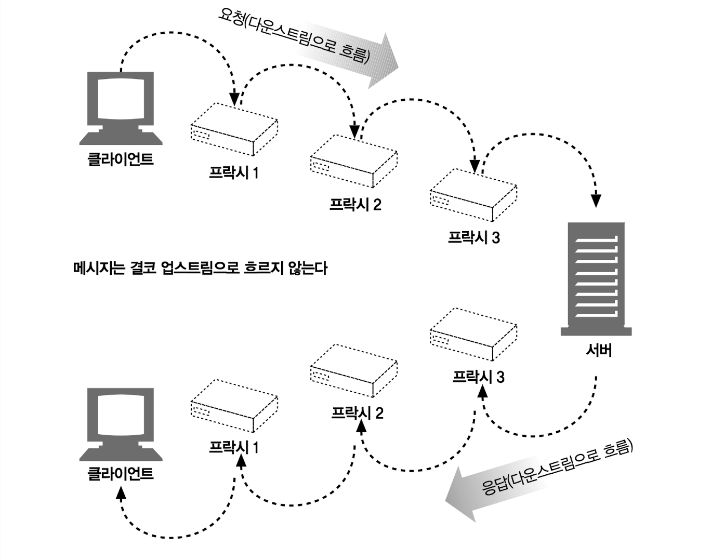

# 3장 HTTP 메시지

## 3.1 메시지의 흐름

> **HTTP 메시지**: HTTP 애플리케이션 간에 주고받은 데이터의 블록

- 메시지의 내용과 의미를 설명하는 텍스트 메타 정보로 시작하고 그 다음에 선택적으로 데이터가 올 수 있음

### 3.1.1 메시지는 원 서버 방향을 인바운드로 하여 송신된다



트랜잭션 방향

- **인바운드**: 메시지가 원 서버로 향하는 것
- **아웃바운드**: 모든 처리가 끝난 뒤에 메시지가 사용자 에이전트로 돌아오는 것

### 3.1.2 다운스트림으로 흐르는 메시지



요청/응답에 관계없이 모든 메시지는 다운스트림으로 흐름

## 3.2 메시지의 각 부분

메시지

- **시작줄**: 어떤 메시지인지 서술
- **헤더** **블록**: 속성을 담음
  - 줄 단위로 분리된 아스키 문자열
  - 각 줄은 캐리지 리턴과 개행 문자로 구성된 두 글자의 줄바꿈 문자열로 끝남
  - 이 줄바꿈 문자열은 ‘CRLF’라고 씀
  - 견고한 애플리케이션이라면 개행 문자도 받아들일 수 있어야 함
  - 잘못 만들어진 HTTP 애플리케이션들 중에서는 캐리지 리턴과 개행 문자 모두를 항상 전송하지는 않는 것들도 있음
- **본문**: 데이터를 담음 → 없을 수 있음
  - 엔티티 본문이나 메시지 본문은 단순히 선택적인 데이터 덩이리
  - 텍스트나 이진 데이터를 포함할 수도 있고 그냥 비어있을 수도 있음

### 3.2.1 메시지 문법

요청 메시지의 형식

```
<메서드> <요청 URL> <버전>

<헤더>

<엔티티 본문>
```

응답 메시지의 형식

```
<버전> <상태 코드> <사유 구절>

<헤더>

<엔티티 본문>
```

메서드

- 클라이언트 측에서 서버가 리소스에 대해 수행하길 바라는 동작(GET, HEAD, POST)

요청 URL

- 요청 대상이 되는 리소스를 지칭하는 완전한 URL 혹은 URL 경로 구성요소

버전

- 해당 메시지에서 사용 중인 HTTP 버전

상태 코드

- 요청 중에 무엇이 일어났는지 설명하는 세 자리의 숫자

사유 구절

- 숫자로 된 상태 코드의 의미를 사람이 이해할 수 있게 설명하는 짧은 문구

헤더

- 이름, 콜론(:), 선택적인 공백, 값, CRLF가 순서대로 나타나는 0개 이상의 헤더들
- 이 헤더의 목록은 빈줄(CRLF)로 끝나 헤더 목록의 끝과 엔티티 본문의 시작을 표시
- HTTP/1.1과 같은 몇몇 버전의 HTTP는 요청이나 응답에 어떤 특정 헤더가 포함되어야만 유효한 것으로 간주

엔티티 본문

- 엔티티 본문은 임의의 데이터 블록을 포함
- 헤더나 엔티티 본문이 없더라도 HTTP 헤더의 집합은 항상 빈 줄(CRLF)로 끝나야 함

### 3.2.2 시작줄

- **요청 메시지의 시작줄**: 무엇을 해야 하는지
- **응답 메시지의 시작줄**: 무슨 일이 일어났는지

요청줄

- **요청 메시지**: 서버에게 리소스에 대해 무언가를 해달라고 부탁
- **요청 메시지의 시작줄/요청줄**
  - 서버에서 어떤 동작이 일어나야 하는지 설명해주는 메서드와 그 동작에 대한 대상을 지칭하는 요청 URL이 들어있음
  - 클라이언트가 어떤 HTTP 버전으로 말하고 있는지 서버에게 알려주는 HTTP 버전도 포함
  - 모든 필드는 공백으로 구분

응답줄

- **응답 메시지**: 수행 결과에 대한 상태 정보와 결과 데이터를 클라이언트에게 돌려줌
- **응답 메시지의 시작줄/응답줄**
  - 응답 메시지에서 쓰인 HTTP의 버전, 숫자로 된 상태 코드, 수행 상태에 대해 설명해주는 텍스트로 된 사유 구절
  - 모든 필드는 공백으로 구분

메서드

| 메서드  | 설명                                                    | 메시지 본문이 있는가? |
| ------- | ------------------------------------------------------- | --------------------- |
| GET     | 서버에서 어떤 문서를 가져온다.                          | 없음                  |
| HEAD    | 서버에서 어떤 문서에 대해 헤더만 가져온다.              | 없음                  |
| POST    | 서버가 처리해야 할 데이터를 보낸다.                     | 있음                  |
| PUT     | 서버에 요청 메시지의 본문을 저장한다.                   | 있음                  |
| TRACE   | 메시지가 프락시를 거쳐 서버에 도달하는 과정을 추적한다. | 없음                  |
| OPTIONS | 서버가 어떤 메서드를 수행할 수 있는지 확인한다.         | 없음                  |
| DELETE  | 서버에서 문서를 제거한다.                               | 없음                  |

상태 코드

| 전체 범위 | 정의된 범위 | 분류            |
| --------- | ----------- | --------------- |
| 100-199   | 100-101     | 정보            |
| 200-299   | 200-206     | 성공            |
| 300-399   | 300-305     | 리다이렉션      |
| 400-499   | 400-415     | 클라이언트 에러 |
| 500-599   | 500-505     | 서버 에러       |

### 3.2.3 헤더

### 3.2.4 엔티티 본문

### 3.2.5 버전 0.9 메시지

## 3.3 메서드

### 3.3.1 안전한 메서드(Safe Method)

### 3.3.2 GET

### 3.3.3 HEAD

### 3.3.4 PUT

### 3.3.5 POST

### 3.3.6 TRACE

### 3.3.7 OPTIONS

### 3.3.8 DELETE

### 3.3.9 확장 메서드

## 3.4 상태 코드

### 3.4.1 100-199: 정보성 상태 코드

### 3.4.2 200-299: 성공 상태 코드

### 3.4.3 300-399: 리다이렉션 상태 코드

### 3.4.4 400-499: 클라이언트 에러 상태 코드

### 3.4.5 500-599: 서버 에러 상태 코드

## 3.5 헤더

### 3.5.1 일반 헤더

### 3.5.2 요청 헤더

### 3.5.3 응답 헤더

### 3.5.4 엔티티 헤더

## 3.6 추가 정보
