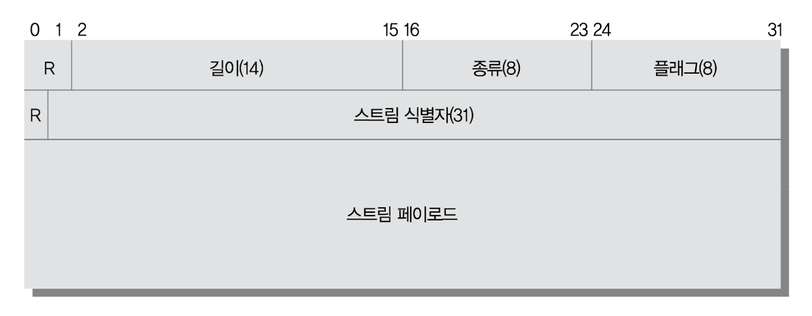

# 10장 HTTP/2.0

이 장은 HTTP/2.0의 8번째 초안에 기반하여 작성되었다.

## 10.1 HTTP/2.0의 등장 배경

HTTP/1.1의 메시지 포맷은 구현의 단순성과 접근성에 주안점을 두고 최적화되었다. 커넥션 하나를 통해 요청 하나를 보내고 그에 대해 응답 하나만을 받는 HTTP의 메시지 교환 방식은 응답을 받아야만 그다음 요청을 보낼 수 있기 때문에 심각한 회전 지연(latency)을 피할 수 없었다.

2009년, 구글은 SPDY 프로토콜을 내놓았다. SPDY는 헤더를 압축하여 대역폭을 절약했고, 하나의 TCP 커넥션에 여러 요청을 동시에 보내 회전 지연을 줄이는 것이 가능했으며, 클라이언트가 요청을 보내지 않아도 서버가 능동적으로 리소스를 푸시하는 기능도 갖추고 있다.

구글의 [SPDY](https://www.chromium.org/spdy/spdy-whitepaper)에 따르면 SPDY를 적용했을 때 RTT(Round-trip delay time)가 20ms인 상황에서는 12.34%의 성능 개선 효과가 있었으며, 80ms인 상황에서는 23.85%, 200ms인 상황에서는 26.79%의 성능 개선 효과가 있었다.

2012년, HTTP 작업 그룹은 SPDY를 기반으로 HTTP/2.0 프로토콜을 설계하기로 결정하였음을 메일링 리스트를 통해 밝혔다. HTTP 작업 그룹은 SPDY의 초안을 그대로 가져와서 HTTP/2.0 초안을 만들었다.

## 10.2 개요

HTTP/2.0은 서버와 클라이언트 사이의 TCP 커넥션 위에서 동작한다. 이때 TCP 커넥션을 초기화하는 것은 클라이언트다.

HTTP/2.0 요청과 응답은 길이가 정의된(최대 16383바이트) 한 개 이상의 프레임에 담긴다. 이때 HTTP 헤더는 압축되어 담긴다.

프레임들에 담긴 요청과 응답은 스트림을 통해 보내진다. 한 개의 스트림이 한 쌍의 요청과 응답을 처리한다. 하나의 커넥션 위에 여러 개의 스트림이 동시에 만들어질 수 있으므로, 여러 개의 요청과 응답을 동시에 처리하는 것 역시 가능하다.

HTTP/2.0은 이들 스트림에 대한 흐름 제어와 우선순위 부여 기능도 제공한다.

HTTP/2.0은 새로운 상호작용 모델인 서버 푸시를 도입했다. 이를 통해 서버는 클라이언트에게 필요하다고 생각하는 리소스라면 그에 대한 요청을 명시적으로 받지 않더라도 능동적으로 클라이언트에게 보내줄 수 있다.

기존 웹 애플리케이션들과 호환성을 최대한 유지하기 위해, HTTP/2.0은 요청과 응답 메시지의 의미를 HTTP/1.1과 같도록 유지하고 있다.

## 10.3 HTTP/1.1과의 차이점

### 10.3.1 프레임

HTTP/2.0에서 모든 메시지는 프레임에 담겨 전송된다. 모든 프레임은 8바이트 크기의 헤더로 시작하며, 뒤이어 최대 16383바이트 크기의 페이로드가 온다.

프레임 헤더의 각 필드는 다음과 같다.

- R: 예약된 2비트 필드. 값의 의미가 정의되어 있지 않으며, 반드시 0이어야 한다. 받는 쪽에서는 이 값을 무시해야 한다.
- 길이: 페이로드의 길이를 나타내는 14비트 무부호 정수(unsigned integer). 이 길이에 프레임 헤더는 포함되지 않는다.
- 종류: 프레임의 종류
- 플래그: 8비트 플래그. 플래그 값의 의미는 프레임의 종류에 따라 다르다.
- R: 예약된 1비트 필드. 첫 번째 R과 마찬가지로 값의 의미가 정의되어 있지 않으며, 반드시 0이어야 한다. 받는 쪽에서는 이 값을 무시해야 한다.
- 스트림 식별자: 31비트 스트림 식별자. 특별히 0은 커넥션 전체와 연관된 프레임을 의미한다.

### 10.3.2 스트림과 멀티플렉싱

스트림은 HTTP/2.0 커넥션을 통해 클라이언트와 서버 사이에서 교환되는 프레임의 독립된 양방향 시퀀스다.

한 쌍의 HTTP 요청과 응답은 하나의 스트림을 통해 이루어진다. 클라이언트는 새 스트림을 만들어 그를 통해 HTTP 요청을 보낸다. 요청을 받은 서버는 그 요청과 같은 스트림으로 응답을 보낸다. 그러고 나면 스트림이 닫히게 된다.

HTTP/1.1에서는 한 TCP 커넥션을 통해 요청을 보냈을 때, 그에 대한 응답이 도착하고 나서야 같은 TCP 커넥션으로 다시 요청을 보낼 수 있다. 따라서 웹브라우저는 회전 지연을 줄이기 위해 여러 개의 TCP 커넥션을 만들어 동시에 여러 개의 요청을 보내는 방법을 사용한다. 그러나 TCP 커넥션을 무한정 만들 수는 없기에 오늘날에는 회전 지연이 늘어나는 것을 피하기 어렵다.

그러나 HTTP/2.0에서는 하나의 커넥션에 여러 개의 스트림이 동시에 열릴 수 있다.

스트림은 우선순위를 가질 수 있다. 사용자가 웹페이지를 보려고 할 때, 네트워크 대역폭이 충분하지 않아 프레임의 전송이 느리다면, 웹브라우저는 보다 중요한 리소스를 요청하는 스트림에게 더 높은 우선순위를 부여할 수 있을 것이다. 그러나 이 우선순위에 따르는 것은 의무사항이 아니기 때문에, 요청이 우선순위대로 처리된다는 보장은 없다.

모든 스트림은 31비트의 무부호 정수로 된 고유한 식별자를 갖는다.

- 홀수: 스트림이 **클라이언트**에 의해 초기화되었을 때
- 짝수: 스트림이 **서버**에 의해 초기화되었을 때

새로 만들어지는 스트림의 식별자는 이전에 만들어졌거나 예약된 스트림들의 식별자보다 커야 한다. 이 규칙을 어기는 식별자를 받았다면 에러 코드가 PROTOCOL_ERROR인 커넥션 에러로 응답해야 한다.

서버와 클라이언트는 스트림을 협상 없이 일방적으로 만든다. 스트림을 만들 때 협상을 위해 TCP 패킷을 주고받느라 시간을 낭비하지 않아도 됨을 의미한다.

HTTP/2.0 커넥션에서 한번 사용한 스트림 식별자는 다시 사용할 수 없다. 커넥션을 오래 사용하다보면 스트림에 할당할 수 있는 식별자가 고갈되기도 하는데, 그런 경우엔 커넥션을 다시 맺으면 된다.

HTTP/2.0은 WINDOW_UPDATE 프레임을 이용한 흐름 제어를 통해, 스트림이 서로 간섭해서 망가지는 것을 막아준다.

### 10.3.3 헤더 압축

HTTP/1.1에서 헤더는 아무런 압축 없이 그대로 전송되었다. 요즈음에는 웹페이지 하나를 보기 위해 수십에서 많으면 수백 번의 요청을 보내기 때문에, 헤더의 크기가 회전 지연과 대역폭 양쪽 모두에 실질적인 영향을 끼치게 되었다.

이를 개선하기 위해 HTTP/2.0에서는 HTTP 메시지의 헤더를 압축하여 전송한다. 헤더는 HPACK 명세에 정의된 헤더 압축 방법으로 압축된 뒤 '헤더 블록 조각'들로 쪼개져서 전송된다. 받는 쪽에서는 이 조각들을 이은 뒤 압축을 풀어 원래의 헤더 집합으로 복원한다.

HPACK은 헤더를 압축하고 해제할 때 '압축 콘텍스트'를 사용한다. 따라서 오작동하지 않으려면 항상 올바른 압축 콘텍스트를 유지해야 한다. 이 압축 콘텍스트는 수신한 헤더의 압축을 풀면 이에 영향을 받아 바뀐다. 송신 측은 수신 측이 헤더의 압축을 풀었으며 그에 따라 압축 콘텍스트가 변경되었다고 가정할 것이다. 따라서 헤더를 받은 수신 측은 어떤 경우에도 반드시 압축 해제를 수행해야 한다. 만약 그럴 수 없다면 반드시 COMPRESSION_ERROR와 함께 커넥션을 끊어야 한다.
