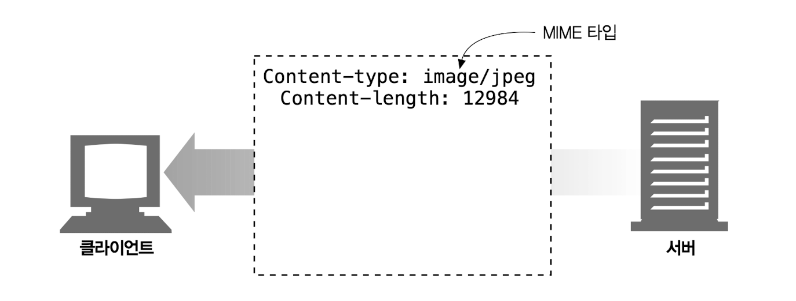

# 1장 HTTP 개관

## 1.1 HTTP: 인터넷의 멀티미디어 배달부

HTTP는 신뢰성 있는 데이터 전송 프로토콜을 사용하기 때문에, 데이터가 지구 반대편에서 오더라도 전송 중 손상되거나 꼬이지 않음을 보장한다. 개발자는 인터넷의 결함이나 약점에 대한 걱정 없이 애플리케이션 고유의 기능을 구현하는데 집중할 수 있다.

## 1.2 웹 클라이언트와 서버

클라이언트는 서버에게 HTTP 요청을 보내고 서버는 요청된 데이터를 HTTP 응답으로 돌려준다.

## 1.3 리소스

웹 서버는 웹 리소스를 관리하고 제공한다. 가장 단순한 웹 리소스는 웹 서버 파일 시스템의 정적 파일이다. 그러나 리소스는 반드시 정적 파일이어야 할 필요는 없다. 동적 콘텐츠 리소스는 사용자가 누구인지, 어떤 정보를 요청했는지, 몇 시인지에 따라 다른 콘텐츠를 생성한다.

### 1.3.1 미디어 타입

인터넷은 수천 가지 데이터 타입을 다루기 때문에, HTTP는 웹에서 전송되는 객체 각각에 신중하게 MIME 타입이라는 데이터 포맷 라벨을 붙인다. MIME(Multipurpose Internet Mail Extensions, 다목적 인터넷 메일 확장)은 원래 각기 다른 전자메일 시스템 사이에서 메시지가 오갈 때 겪는 문제점을 해결하기 위해 설계되었다.

웹 서버는 모든 HTTP 객체 데이터에 MIME 타입을 붙인다. 웹 브라우저는 서버로부터 객체를 돌려받을 때, 다룰 수 있는 객체인지 MIME 타입을 통해 확인한다.

MIME 타입은 사선(/)으로 구분된 주 타입(primary object type)과 부 타입(specific subtype)으로 이루어진 문자열 라벨이다.

- **HTML 텍스트 문서**: text/html
- **Plain ASCII 텍스트 문서**: text/plain
- **JPEG 이미지**: image/jpeg
- **GIF 이미지**: image/gif
- **애플 퀵타임 동영상**: video/quicktime
- **마이크로소프트 파워포인트 프레젠테이션**: application/vdn.ms-powerpoint

### 1.3.2 URI

서버 리소스 이름은 통합 자원 식별자(Uniform Resource Identifier), 혹은 URI로 불린다. 정보 리소스를 고유하게 식별하고 위치를 지정할 수 있다.

### 1.3.3 URL

### 1.3.4 URN

## 1.4 트랜잭션

### 1.4.1 메서드

### 1.4.2 상태 코드

### 1.4.3 웹페이지는 여러 객체로 이루어질 수 있다

## 1.5 메시지

### 1.5.1 간단한 메시지의 예

## 1.6 TCP 커넥션

### 1.6.1 TCP/IP

### 1.6.2 접속, IP 주소 그리고 포트번호

### 1.6.3 텔넷(Telnet)을 이용한 실제 예제

## 1.7 프로토콜 버전

## 1.8 웹의 구성요소

### 1.8.1 프락시

### 1.8.2 캐시

### 1.8.3 게이트웨이

### 1.8.4 터널

### 1.8.5 에이전트

## 1.9 시작의 끝

## 1.10 추가 정보

### 1.10.1 HTTP 프로토콜에 대한 정보

### 1.10.2 역사적 시각

### 1.10.3 기타 월드 와이드 웹 정보
