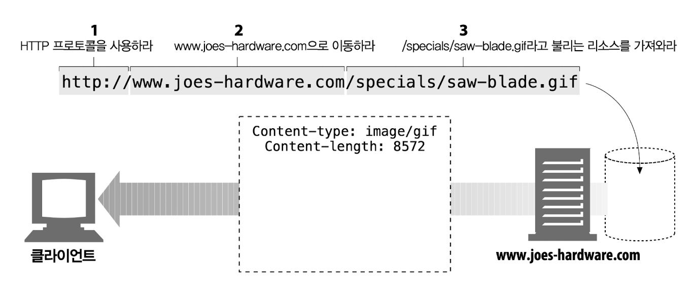
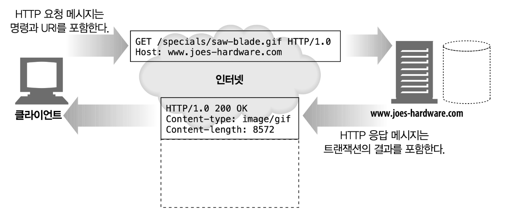
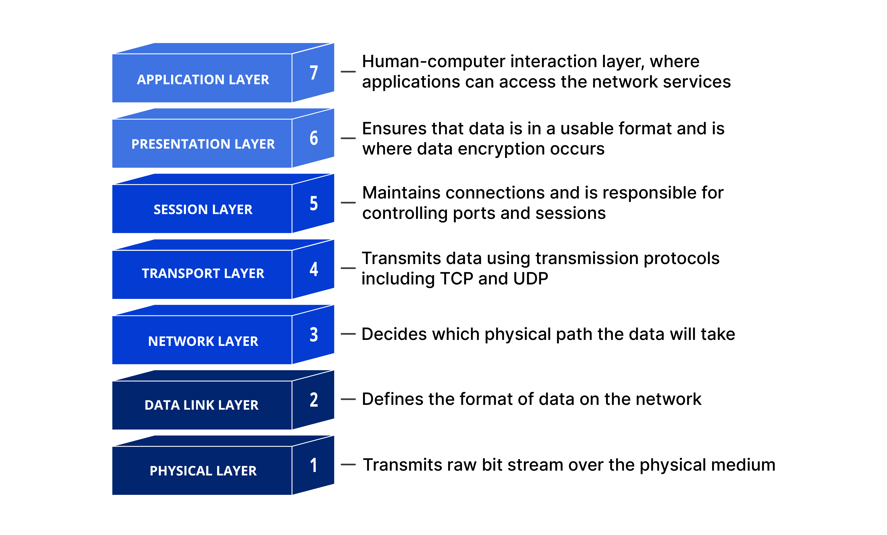
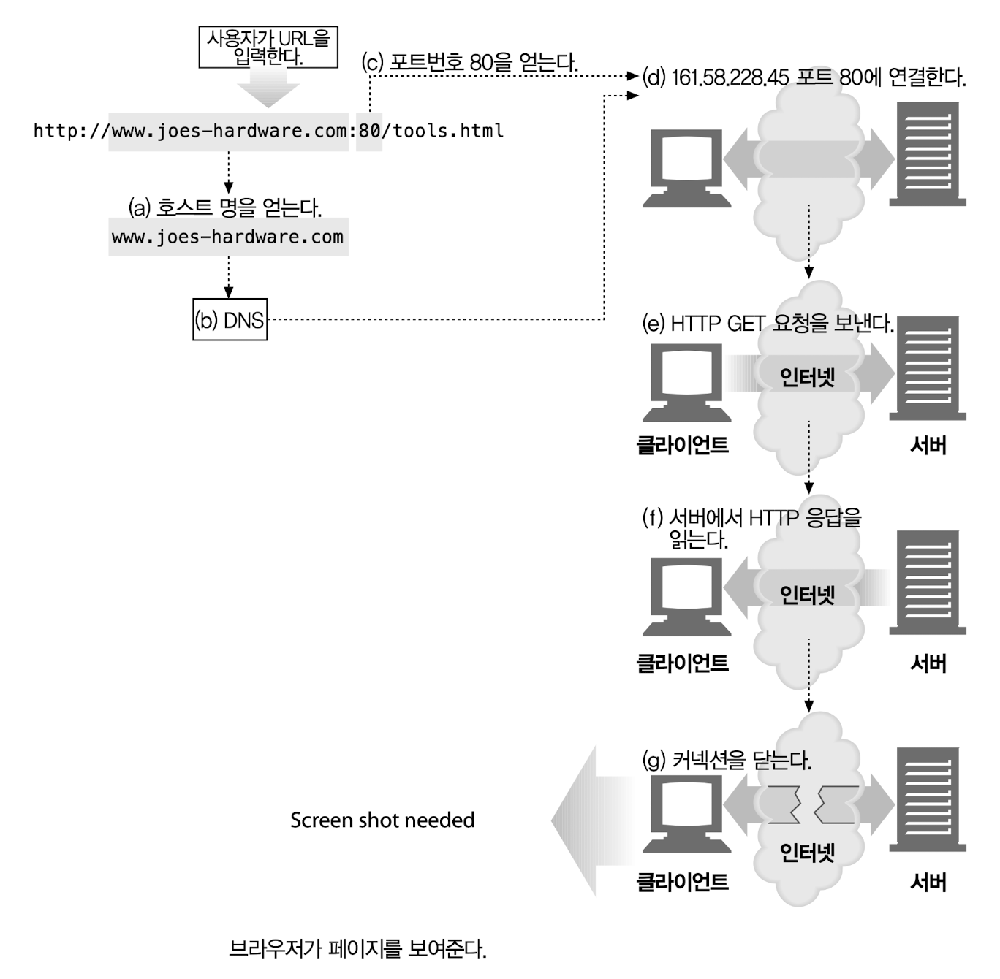
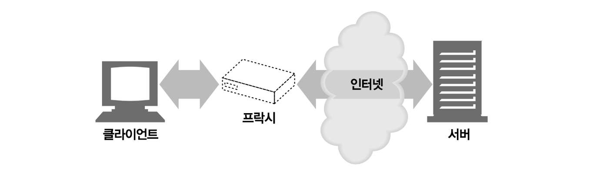
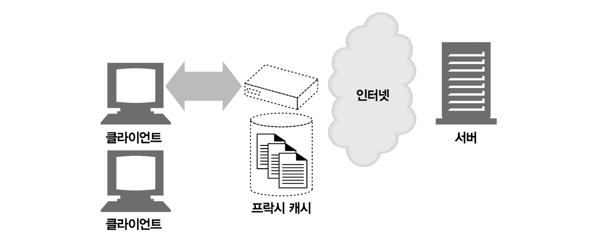
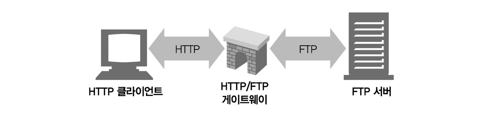
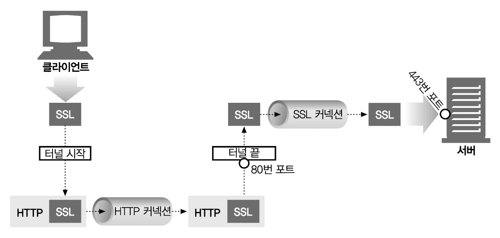
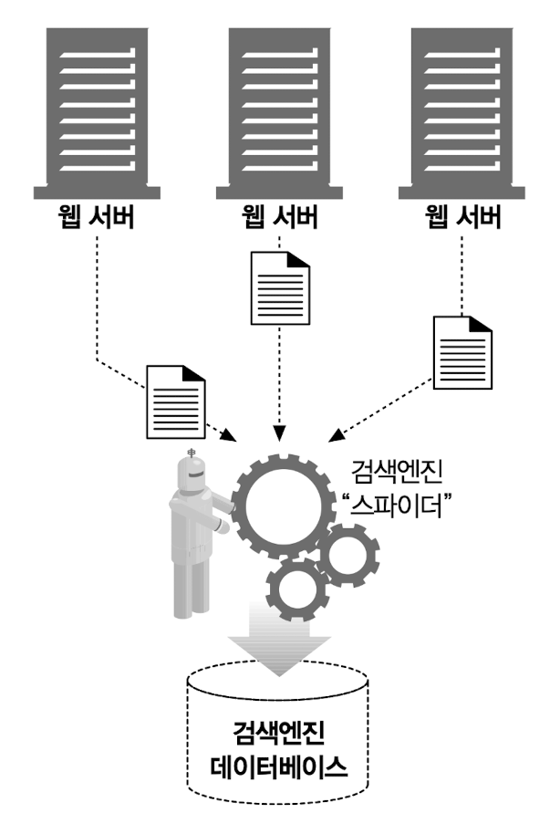

# 1장 HTTP 개관

## 1.1 HTTP: 인터넷의 멀티미디어 배달부

HTTP는 신뢰성 있는 데이터 전송 프로토콜을 사용하기 때문에, 데이터가 지구 반대편에서 오더라도 전송 중 손상되거나 꼬이지 않음을 보장한다. 개발자는 인터넷의 결함이나 약점에 대한 걱정 없이 애플리케이션 고유의 기능을 구현하는데 집중할 수 있다.

## 1.2 웹 클라이언트와 서버

클라이언트는 서버에게 HTTP 요청을 보내고 서버는 요청된 데이터를 HTTP 응답으로 돌려준다.

## 1.3 리소스

웹 서버는 웹 리소스를 관리하고 제공한다. 가장 단순한 웹 리소스는 웹 서버 파일 시스템의 정적 파일이다. 그러나 리소스는 반드시 정적 파일이어야 할 필요는 없다. 동적 콘텐츠 리소스는 사용자가 누구인지, 어떤 정보를 요청했는지, 몇 시인지에 따라 다른 콘텐츠를 생성한다.

### 1.3.1 미디어 타입

인터넷은 수천 가지 데이터 타입을 다루기 때문에, HTTP는 웹에서 전송되는 객체 각각에 신중하게 MIME 타입이라는 데이터 포맷 라벨을 붙인다. MIME(Multipurpose Internet Mail Extensions, 다목적 인터넷 메일 확장)은 원래 각기 다른 전자메일 시스템 사이에서 메시지가 오갈 때 겪는 문제점을 해결하기 위해 설계되었다.

웹 서버는 모든 HTTP 객체 데이터에 MIME 타입을 붙인다. 웹 브라우저는 서버로부터 객체를 돌려받을 때, 다룰 수 있는 객체인지 MIME 타입을 통해 확인한다.


MIME 타입은 사선(/)으로 구분된 주 타입(primary object type)과 부 타입(specific subtype)으로 이루어진 문자열 라벨이다.

- **HTML 텍스트 문서**: text/html
- **Plain ASCII 텍스트 문서**: text/plain
- **JPEG 이미지**: image/jpeg
- **GIF 이미지**: image/gif
- **애플 퀵타임 동영상**: video/quicktime
- **마이크로소프트 파워포인트 프레젠테이션**: application/vdn.ms-powerpoint

### 1.3.2 URI

서버 리소스 이름은 통합 자원 식별자(Uniform Resource Identifier), 혹은 URI로 불린다. 정보 리소스를 고유하게 식별하고 위치를 지정할 수 있다.



### 1.3.3 URL

통합 자원 지시자(Uniform Resource Locator, URL)는 리소스 식별자의 가장 흔한 형태다. URL은 특정 서버의 한 리소스에 대한 구체적인 위치를 서술한다. URL은 리소스가 정확히 어디에 있고 어떻게 접근할 수 있는지 분명히 알려준다.

대부분의 URL은 세 부분으로 이루어진 표준 포맷을 따른다.

- 첫 번째 부분은 스킴(scheme)이라고 불리는데, 리소스에 접근하기 위해 사용되는 프로토콜을 서술한다. 보통 HTTP 프로토콜(http://)이다.
- 두 번째 부분은 서버의 인터넷 주소를 제공한다.
- 마지막은 웹 서버의 리소스를 가리킨다.

### 1.3.4 URN

URI의 두 번째 종류는 유니폼 리소스 이름(Uniform Resource Name, URN)이다. URN은 콘텐츠를 이루는 한 리소스에 대해, 그 리소스의 위치에 영향 받지 않는 유일무이한 이름 역할을 한다. 리소스가 그 이름을 변하지 않게 유지하는 한, 여러 종류의 네트워크 접속 프로토콜로 접근해도 문제없다.

다음의 URN은 인터넷 표준 문서 'RFC 2141'가 어디에 있거나 상관없이 그것을 지칭하기 위해 사용할 수 있다.

```
urn:ietf:rfc:2141
```

URN은 여전히 실험 중인 상태고 아직 널리 채택되지 않았다. 효율적인 동작을 위해 URN은 리소스 위치를 분석하기 위한 인프라 지원이 필요한데, 그러한 인프라가 부재하기에 URN 채택이 더 늦춰지고 있다.

## 1.4 트랜잭션

HTTP 트랜잭션은 요청 명령과 응답 결과로 구성되어 있다.



### 1.4.1 메서드

| HTTP 메서드 |                                 설명                                 |
| :---------: | :------------------------------------------------------------------: |
|     GET     |            서버에서 클라이언트로 지정한 리소스를 보내라.             |
|     PUT     | 클라이언트에서 서버로 보낸 데이터를 지정한 이름의 리소스로 저장하라. |
|   DELETE    |                  지정한 리소스를 서버에서 삭제하라.                  |
|    POST     |     클라이언트 데이터를 서버 게이트웨이 애플리케이션으로 보내라.     |
|    HEAD     |       지정한 리소스에 대한 응답에서, HTTP 헤더 부분만 보내라.        |

### 1.4.2 상태 코드

| HTTP 상태 코드 |                      설명                      |
| :------------: | :--------------------------------------------: |
|      200       |        좋다. 문서가 바르게 반환되었다.         |
|      302       | 다시 보내라. 다른 곳에 가서 리소스를 가져가라. |
|      404       |          없음. 리소스를 찾을 수 없다.          |

HTTP는 각 숫자 상태 코드에 텍스트로 된 "사유 구절"도 함께 보낸다.

```
200 OK
200 Document attached
200 Success
200 All's cool, dude
```

### 1.4.3 웹 페이지는 여러 객체로 이루어질 수 있다

웹 브라우저는 시각적으로 풍부한 웹 페이지를 가져올 때 대량의 HTTP 트랜잭션을 수행한다. 페이지 레이아웃을 서술하는 HTML '뼈대'를 한 번의 트랜잭션으로 가져온 뒤, 첨부된 이미지, 그래픽 조각, 자바 애플릿 등을 가져오기 위해 추가로 HTTP 트랜잭션들을 수행한다.

## 1.5 메시지

HTTP 메시지는 다음의 세 부분으로 이루어진다.

- **시작줄**: 메시지의 첫 줄은 시작줄로, 요청이라면 무엇을 해야 하는지 응답이라면 무슨 일이 일어났는지 나타낸다.
- **헤더**: 시작줄 다음에는 0개 이상의 헤더 필드가 이어진다. 각 헤더 필드는 쉬운 구문 분석을 위해 쌍점(:)으로 구분되어 있는 하나의 이름과 하나의 값으로 구성된다. 헤더 필드를 추가하려면 그저 한 줄을 더하기만 하면 된다. 헤더는 빈 줄로 끝난다.
- **본문**: 빈 줄 다음에는 어떤 종류의 데이터든 들어갈 수 있는 메시지 본문이 필요에 따라 올 수 있다. 요청의 본문은 웹 서버로 데이터를 실어 보내며, 응답의 본문은 클라이언트로 데이터를 반환한다. 문자열이며 구조적인 시작줄이나 헤더와 달리, 본문은 임의의 이진 데이터를 포함할 수 있다. 물론 본문은 텍스트도 포함할 수 있다.

### 1.5.1 간단한 메시지의 예


## 1.6 TCP 커넥션

### 1.6.1 TCP/IP

HTTP는 애플리케이션 계층 프로토콜이다. HTTP는 네트워크 통신의 핵심적인 세부사항에 대해서 신경 쓰지 않는다. 대신 대중적이고 신뢰성 있는 인터넷 전송 프로토콜인 TCP/IP에게 맡긴다.

TCP는 다음을 제공한다.

- 오류 없는 데이터 전송
- 순서에 맞는 전달 (데이터는 언제나 보낸 순서대로 도착한다)
- 조각나지 않는 데이터 스트림 (언제든 어떤 크기로든 보낼 수 있다)

인터넷 자체가 전 세계의 컴퓨터와 네트워크 장치들 사이에서 대중적으로 사용되는 TCP/IP에 기초하고 있다. TCP/IP는 TCP와 IP가 층을 이루는, 패킷 교환 네트워크 프로토콜의 집합이다. TCP/IP는 각 네트워크와 하드웨어의 특성을 숨기고, 어떤 종류의 컴퓨터나 네트워크든 서로 신뢰성 있는 의사소통을 하게 해 준다.

일단 TCP 커넥션이 맺어지면, 클라이언트와 서버 컴퓨터 간에 교환되는 메시지가 없어지거나, 손상되거나, 순서가 뒤바뀌어 수신되는 일은 결코 없다.

네트워크 개념상, HTTP 프로토콜은 TCP 위의 계층이다. HTTP는 자신의 메시지 데이터를 전송하기 위해 TCP를 사용한다. 이와 유사하게 TCP는 IP 위의 계층이다.

- **HTTP**: 애플리케이션 계층
- **TCP**: 전송 계층
- **IP**: 네트워크 계층
- **네트워크를 위한 링크 인터페이스**: 데이터 링크 계층
- **물리적인 네트워크 하드웨어**: 물리 계층



### 1.6.2 접속, IP 주소 그리고 포트번호

HTTP 클라이언트가 서버에 메시지를 전송할 수 있게 되기 전에, 인터넷 프로토콜(IP) 주소와 포트번호를 사용해 클라이언트와 서버 사이에 TCP/IP 커넥션을 맺어야 한다.

TCP에서는 서버 컴퓨터에 대한 IP 주소와 그 서버에서 실행 중인 프로그램이 사용 중인 포트번호가 필요하다.

HTTP 서버의 IP 주소와 포트번호는 URL을 통해 알아낼 수 있다.

```
http://207.200.83.29:80/index.html
http://www.netscape.com:80/index.html
http://www.netscape.com/index.html
```

- 첫 번째 URL은 IP 주소와 포트번호가 있다.
- 두 번째 URL은 도메인 이름 혹은 호스트 명이 있다. 호스트 명은 IP 주소에 대해 이해하기 쉬운 형태의 별명이다. 호스트 명은 DNS를 통해 IP로 변환할 수 있다.
- 세 번째 URL은 포트번호가 없다. 포트번호가 없는 경우에는 기본값 80으로 가정한다.



1. 웹 브라우저는 서버의 URL에서 호스트 명을 추출한다.
2. 웹 브라우저는 서버의 호스트 명을 IP로 변환한다.
3. 웹 브라우저는 URL에서 포트번호를 추출한다.
4. 웹 브라우저는 웹 서버와 TCP 커넥션을 맺는다.
5. 웹 브라우저는 서버에 HTTP 요청을 보낸다.
6. 서버는 웹 브라우저에 HTTP 응답을 돌려준다.
7. 커넥션이 닫히면, 웹 브라우저는 문서를 보여준다.

### 1.6.3 텔넷(Telnet)을 이용한 실제 예제

텔넷 유틸리티는 키보드를 목적지의 TCP 포트로 연결하고 출력 TCP 포트를 화면으로 연결한다. 텔넷은 원격 터미널 세션을 위해 흔히 사용하지만, HTTP 서버를 포함한 일반적인 TCP 서버에 연결하기 위해 사용할 수도 있다.

웹 서버와 직접 대화하기 위해 텔넷 유틸리티를 사용할 수 있다. 텔넷은 직접 컴퓨터의 포트로 TCP 커넥션을 연결해서 그 포트로 글자를 타이핑해 넣을 수 있게 한다.

## 1.7 프로토콜 버전

**HTTP/0.9**

- 1991년도의 HTTP 프로토타입이다.
- 심각한 디자인 결함이 다수 있고 구식 클라이언트하고만 같이 사용할 수 있다.
- 오직 GET 메서드만 지원하고 멀티미디어 콘텐츠에 대한 MIME 타입이나 HTTP 헤더, 버전 번호는 지원하지 않는다.
- 간단한 HTML 객체를 받아오기 위해 만들어진 것으로 금방 1.0으로 대체되었다.

**HTTP/1.0**

- 처음으로 널리 쓰이기 시작한 버전이다.
- 버전 번호, HTTP 헤더, 추가 메서드, 멀티미디어 객체 처리를 추가했다.
- 시각적으로 매력적인 웹 페이지와 상호 작용하는 폼을 실현하여 월드 와이드 웹을 대세로 만들었다.
- 잘 정의된 명세는 아니고 상업적, 학술적으로 급성장하던 시기에 만들어진 잘 동작하는 용례의 모음에 가깝다.

**HTTP/1.0+**

- 1990년대 중반 월드 와이드 웹이 급격히 팽창하고 상업적으로도 성공하면서 여러 웹 클라이언트와 서버는 그에 따른 요구를 만족하기 위해 HTTP에 기능을 추가했다.
- 오래 지속되는 "keep-alive" 커넥션, 가상 호스팅 지원, 프록시 연결 지원을 포함해 많은 기능이 공식적이진 않지만, 사실상의 표준으로 HTTP에 추가되었다.

**HTTP/1.1**

- HTTP 설계의 구조적 결함 교정, 두드러진 성능 최적화, 잘못된 기능 제거에 집중했다.
- 더 복잡해진 웹 애플리케이션과 배포를 지원한다.
- 현재의 HTTP 버전이다.

**HTTP/2.0**

- HTTP/1.0 성능 문제를 개선하기 위해 구글의 SPDY 프로토콜을 기반으로 설계가 진행 중인 프로토콜이다.

:::note

**2024년도 기준 HTTP/2.0 현황**

- [HTTP/2](https://http2.github.io)
- [HTTP 2.0 소개 & 통신 기술 알아보기](https://inpa.tistory.com/entry/WEB-%F0%9F%8C%90-HTTP-20-%ED%86%B5%EC%8B%A0-%EA%B8%B0%EC%88%A0-%EC%9D%B4%EC%A0%9C%EB%8A%94-%ED%99%95%EC%8B%A4%ED%9E%88-%EC%9D%B4%ED%95%B4%ED%95%98%EC%9E%90)

> HTTP 완벽 가이드 영어 원서 출판 연도: 2002년도

:::

## 1.8 웹의 구성요소

**프록시**

- 클라이언트와 서버 사이에 위치한 HTTP 중개자

**캐시**

- 많이 찾는 웹 페이지를 클라이언트 가까이에 보관하는 HTTP 창고

**게이트웨이**

- 다른 애플리케이션과 연결된 특별한 웹 서버

**터널**

- 단순히 HTTP 통신을 전달하기만 하는 특별한 프록시

**에이전트**

- 자동화된 HTTP 요청을 만드는 준지능적 웹 클라이언트

### 1.8.1 프록시



프록시는 클라이언트와 서버 사이에 위치하여 클라이언트의 모든 HTTP 요청을 받아 서버에게 전달한다. 이 애플리케이션은 사용자를 위한 프록시로 동작하며 사용자를 대신해서 서버에 접근한다.

프록시는 주로 보안을 위해 사용한다. 모든 웹 트래픽 흐름 속에서 신뢰할 만한 중개자 역할을 한다. 또한 요청과 응답을 필터링한다. 회사에서 무엇인가를 다운받을 때 애플리케이션 바이러스를 검출할 수 있다.

### 1.8.2 캐시



웹 캐시와 캐시 프록시는 자신을 거쳐 가는 문서 중 자주 찾는 것의 사본을 저장하는 특별한 종류의 HTTP 프록시 서버이다.

HTTP는 캐시를 효율적으로 동작하게 하고 캐시한 콘텐츠를 최신 버전으로 유지하면서 동시에 프라이버시도 보호하기 위한 많은 기능을 정의한다.

### 1.8.3 게이트웨이



게이트웨이는 주로 HTTP 트래픽을 다른 프로토콜로 변환하기 위해 사용한다. 게이트웨이는 언제나 스스로가 리소스를 갖고 있는 진짜 서버인 것처럼 요청을 다룬다.

HTTP/FTP 게이트웨이는 FTP URI에 대한 HTTP 요청을 받아들인 뒤 FTP 프로토콜을 이용해 문서를 가져온다. 받은 문서는 HTTP 메시지에 담아 클라이언트에게 보낸다.

### 1.8.4 터널



터널은 두 커넥션 사이에서 raw 데이터를 열어보지 않고 그대로 전달하는 HTTP 애플리케이션이다. HTTP 터널은 주로 비 HTTP 데이터를 하나 이상의 HTTP 연결을 통해 그대로 전송하기 위해 사용한다.

HTTP 터널을 활용하는 대표적인 예로 암호화된 SSL 트래픽을 HTTP 커넥션으로 전송함으로써 웹 트래픽만 허용하는 사내 방화벽을 통과시키는 것이 있다.

HTTP/SSL 터널은 HTTP 요청을 받아들여 목적지의 주소와 포트번호로 커넥션을 맺는다. 이후부터는 암호화된 SSL 트래픽을 HTTP 채널을 통해 목적지 서버로 전송할 수 있게 된다.

### 1.8.5 에이전트



사용자 에이전트는 사용자를 위해 HTTP 요청을 만들어주는 클라이언트 프로그램이다. 웹 요청을 만드는 애플리케이션은 뭐든 HTTP 에이전트다.

사람의 통제 없이 스스로 웹을 돌아다니며 HTTP 트랜잭션을 일으키고 콘텐츠를 받아오는 자동화된 사용자 에이전트가 있다. 자동화된 에이전트는 보통 '스파이더'나 '웹로봇'과 같은 이름을 갖고 있다.

스파이더는 웹을 돌아다니며 검색 엔진의 데이터베이스나 가격 비교 로봇을 위한 제품 카탈로그와 같은 유용한 웹 콘텐츠 보관소를 만든다.

<br />

<hr />

**사진 출처 📷**

- [OSI 모델이란? | OSI 7계층 | Cloudflare](https://www.cloudflare.com/ko-kr/learning/ddos/glossary/open-systems-interconnection-model-osi/)
