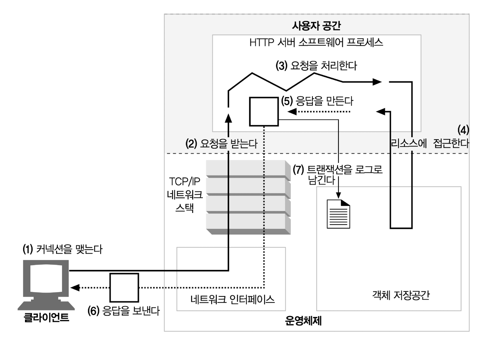
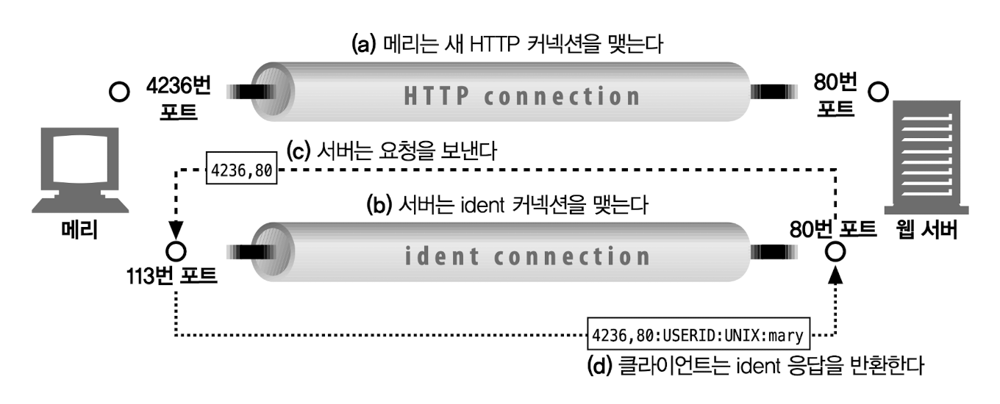
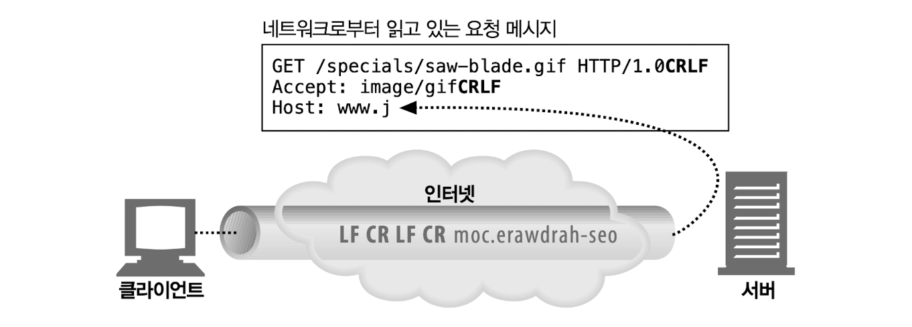
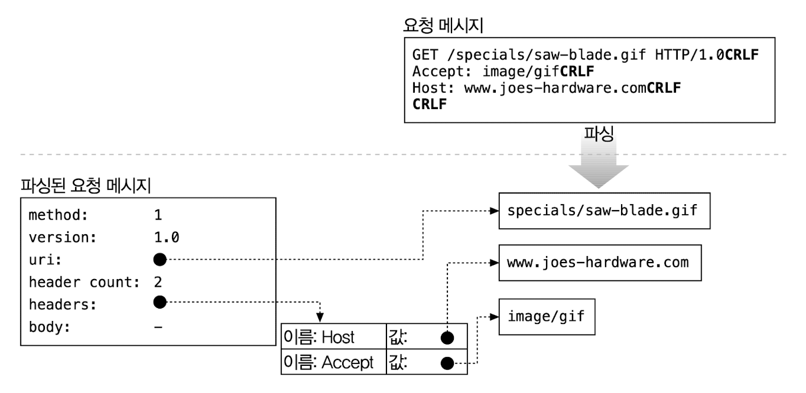
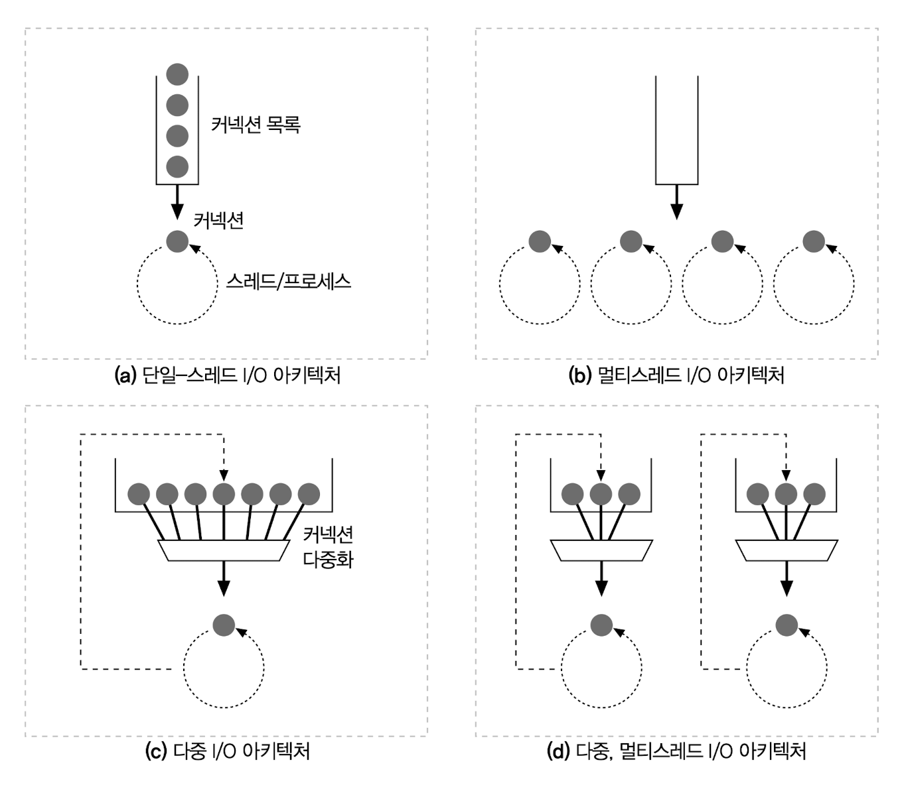
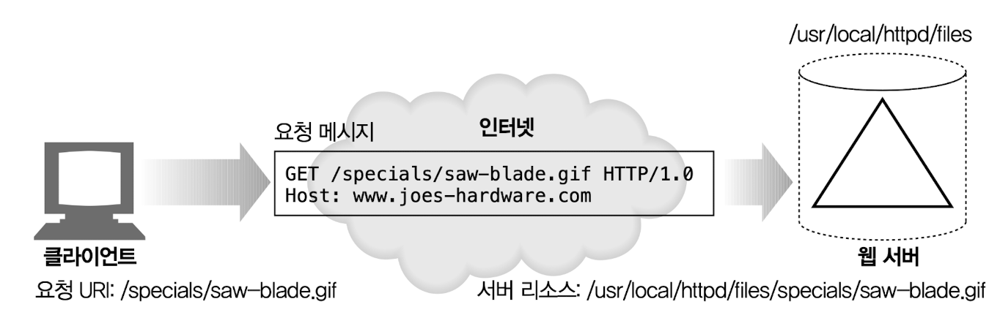

# 5장 웹 서버

## 5.1 다채로운 웹 서버

### 5.1.1 웹 서버 구현

- **웹 서버**가 제공하는 것
  - HTTP 프로토콜 구현
  - 웹 리소스 관리
  - 웹 서버 관리
- **운영체제**가 제공하는 것
  - 컴퓨터 시스템의 하드웨어 관리
  - TCP/IP 네트워크 지원
  - 웹 리소스를 유지하기 위한 파일 시스템
  - 현재 연산 활동을 제어하기 위한 프로세스 관리

## 5.3 진짜 웹 서버가 하는 일

기본 웹 서버의 요청 단계는 다음과 같다.

## 5.4 단계 1: 클라이언트 커넥션 수락

### 5.4.1 새 커넥션 다루기

새 커넥션이 맺어지고 받아들여지면 서버는 새 커넥션을 커넥션 목록에 추가하고 커넥션에서 오가는 데이터를 지켜보기 위해 준비를 한다.

일부 웹 서버는 클라이언트의 IP 주소나 호스트 명이 인가되지 않았거나 악의적이라고 알려진 것인 경우 커넥션을 닫는다.

### 5.4.2 클라이언트 호스트 명 식별

대부분의 웹 서버는 ‘역방향 DNS(reverse DNS)’를 사용해서 클라이언트의 IP 주소를 클라이언트의 호스트 명으로 변환하도록 설정되어 있다. 호스트 명 룩업(hostname lookup)은 시간이 오래 걸릴 수 있어 웹 트랜잭션을 느려지게 할 수 있다. 대용량 웹 서버는 호스트 명 분석(hostname resolution)을 꺼두거나 특정 콘텐츠에 대해서만 켜놓는다.

### 5.4.3 ident를 통해 클라이언트 사용자 알아내기

ident 프로토콜은 서버에게 어떤 사용자 이름이 HTTP 커넥션을 초기화했는지 찾아낼 수 있게 해준다. 일반 로그 포맷(Common Log Format)의 두 번째 필드는 각각 HTTP 요청의 ident 사용자 이름을 담고 있다.

- 클라이언트가 ident 프로토콜을 지원하면 클라이언트는 ident 결과를 위해 TCP 포트 113번을 listen 한다.

ident 는 공공 인터넷에서는 다음과 같은 이유로 잘 동작하지 않는다.

- 많은 클라이언트 PC 는 identd 신원 확인 프로토콜 데몬 소프트웨어를 실행하지 않는다.
- ident 프로토콜은 HTTP 트랜잭션을 유의미하게 지연시킨다.
- 방화벽이 ident 트래픽이 들어오는 것을 막는 경우가 많다.
- ident 프로토콜은 안전하지 않고 조작하기 쉽다.
- ident 프로토콜은 가상 IP 주소를 잘 지원하지 않는다.
- 클라이언트 사용자 이름의 노출로 인한 프라이버시 침해의 우려가 있다.

## 5.5 단계 2: 요청 메시지 수신

커넥션에 데이터가 도착하면 웹 서버는 네트워크 커넥션에서 그 데이터를 읽어 들이고 파싱하여 요청 메시지를 구성한다.

요청 메시지를 파싱할 때 웹 서버는 다음과 같은 일을 한다.

- 요청줄을 파싱하여 요청 메서드, 지정된 리소스의 식별자(URI), 버전 번호를 찾는다. 각 값은 스페이스 한 개로 분리되어 있으며 요청줄은 캐리지 리턴 줄바꿈(CRLF) 문자열로 끝난다.
- 메시지의 헤더를 읽는다. 각 메시지 헤더는 CRLF 로 끝난다.
- 헤더의 끝을 의미하는 CRLF 로 끝나는 빈 줄을 찾아낸다.
- 요청 본문이 있다면 읽어 들인다.

요청 메시지를 파싱할 때 웹 서버는 입력 데이터를 네트워크로부터 불규칙적으로 받는다. 네트워크 커넥션은 언제라도 무효화될 수 있다. 웹 서버는 파싱해서 이해하는 것이 가능한 수준의 분량을 확보할 때까지 데이터를 네트워크로부터 읽어서 메시지 일부분을 메모리에 임시로 저장해 둘 필요가 있다.

### 5.5.1 메시지의 내부 표현

일부 웹 서버는 요청 메시지를 쉽게 다를 수 있도록 내부의 자료 구조에 저장한다.

### 5.5.2 커넥션 입력/출력 처리 아키텍처

단일 스레드 웹 서버

- 한 번에 하나씩 요청 처리
- 처리 도중 모든 다른 커넥션 무시 → 성능 문제
- 로드가 적은 서버나 type-o-serve 와 같은 진단 도구에서 사용

멀티 프로세스와 멀티 스레드 웹 서버

- 여러 요청을 동시에 처리하기 위해 여러 개의 프로세스 혹은 고효율 스레드 할당
- 일부 서버는 매 커넥션마다 스레드/프로세스 하나 할당 → 서버가 수만 개의 동시 커넥션을 처리할 때 그로 인해 만들어진 프로세스와 스레드는 많은 메모리와 시스템 리소스 낭비
- 대부분의 멀티 스레드 웹 서비스는 스레드/프로세스의 최대 개수를 제한하여 사용

다중 I/O 서버

- 대량의 커넥션을 지원하기 위해 많은 웹 서버는 다중 아키텍처 채택
- 커넥션의 상태가 바뀌면 그 커넥션에 대해 작은 양의 처리 수행
- 처리 완료 후 커넥션은 다음 상태 변경을 위해 열린 커넥션의 목록 확인
- 어떤 커넥션에 대해 작업을 수행하는 것은 그 커넥션에 실제로 해야 할 일이 있을 때
- 스레드와 프로세스는 유휴 상태의 커넥션에 매여 기다리느라 리소스를 낭비하지 않음

다중 멀티 스레드 웹 서버

- 일부 시스템은 자신의 컴퓨터 플랫폼에 올라와 있는 CPU 여러 개의 이점을 살리기 위해 멀티 스레딩과 다중화 결합
- 여러 개의 스레드(보통 하나의 물리적 프로세스)는 각각 열려있는 커넥션(혹은 열려있는 커넥션의 부분 집합)을 감시하고 각 커넥션에 대해 작업 수행

## 5.6 단계 3: 요청 처리

웹 서버가 요청받으면 서버는 요청으로부터 메서드, 리소스, 헤더, 본문을 얻어내어 처리한다.

## 5.7 단계 4: 리소스의 매핑과 접근

### 5.7.1 Docroot

웹 서버 파일 시스템의 특별한 폴더를 웹 콘텐츠를 위해 예약해 둔다. 이 폴더는 문서 루트 혹은 docroot 로 불린다. 웹 서버는 요청 메시지에서 URI 를 가져와서 문서 루트 뒤에 붙인다.

### 5.7.2 디렉터리 목록

### 5.7.3 동적 콘텐츠 리소스 매핑

### 5.7.4 서버사이드 인클루드(Server-Side Includes, SSI)

### 5.7.5 접근 제어

## 5.8 단계 5: 응답 만들기

### 5.8.1 응답 엔터티

### 5.8.2 MIME 타입 결정하기

### 5.8.3 리다이렉션

## 5.9 단계 6: 응답 보내기

## 5.10 단계 7: 로깅
