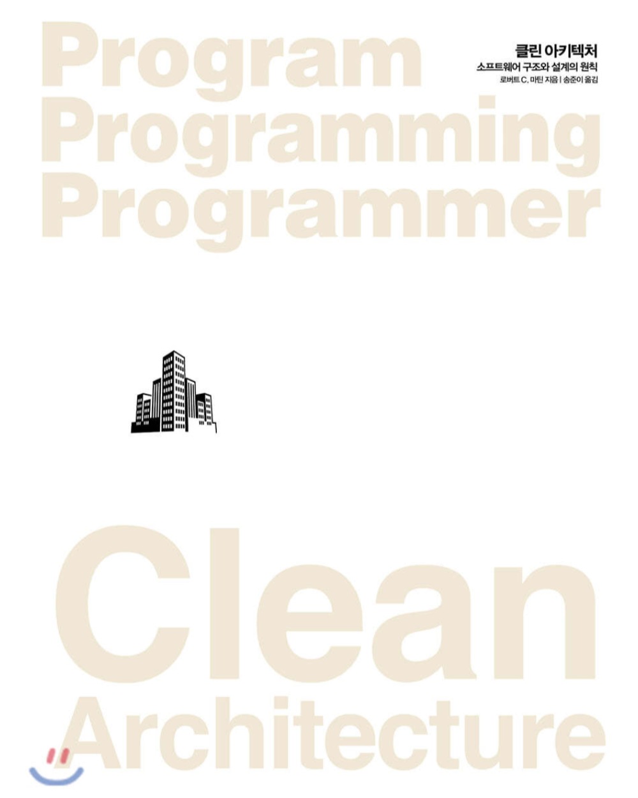
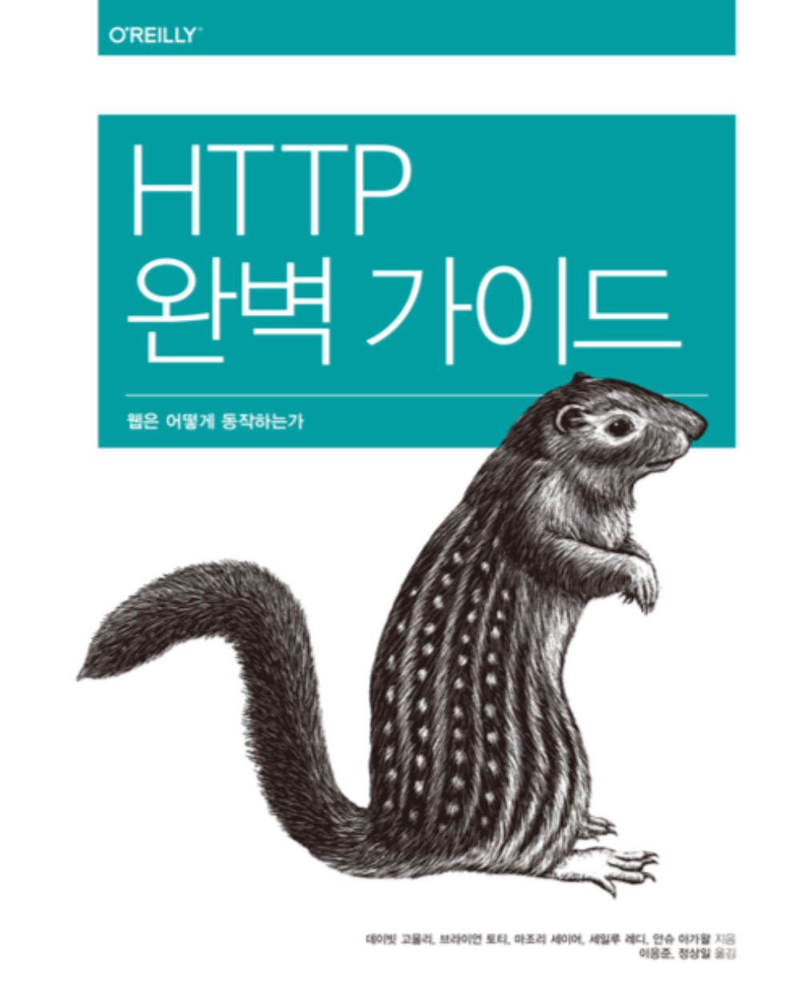
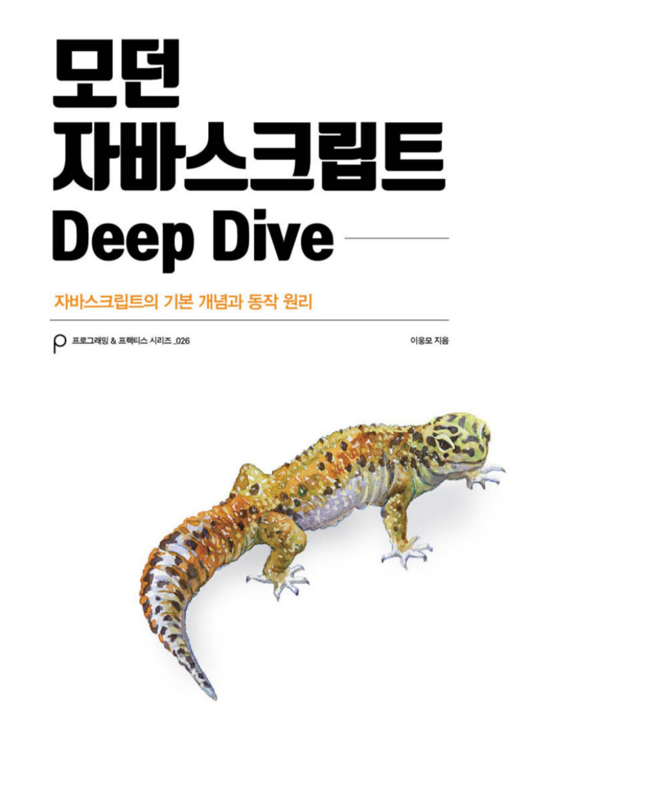
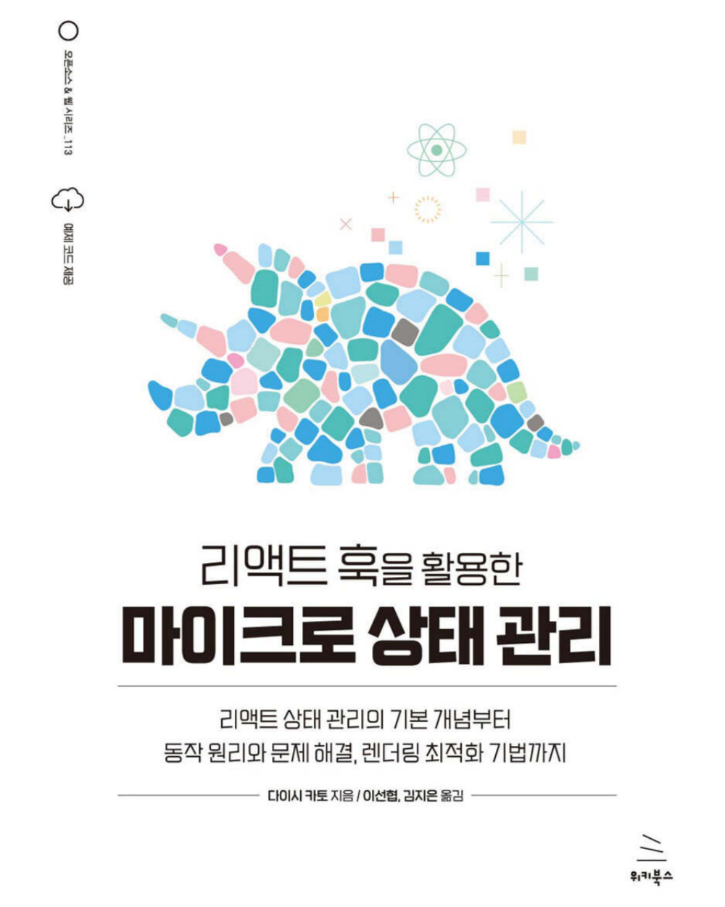
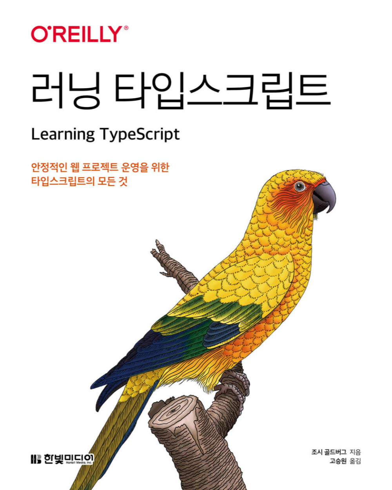
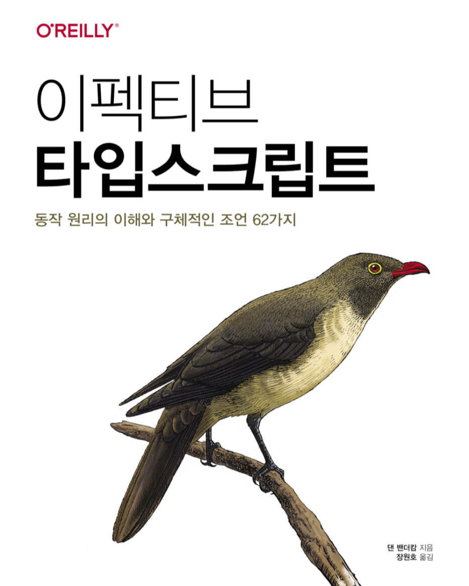

# 안녕하세요 👋

개발 서적을 읽고 기록하고 있습니다.

## 책 목록 📚

읽은 책 및 읽고 있는 책 목록입니다.
| Software Architecture | Computer Architecture | Network |
| :---------------------------------------------------------------------------------------: | :------------------------------------------------------------------------------------------: | :-------------------------------------------------------------------------: |
|  **[클린 아키텍처](/category/클린-아키텍처)** |  **[한 권으로 읽는 컴퓨터 구조와 프로그래밍](/category/한-권으로-읽는-컴퓨터-구조와-프로그래밍)** |  **[HTTP 완벽 가이드](/category/http-완벽-가이드)** |

|                                                               Programming Language                                                                |                                                                                         Frontend                                                                                          |                                   UI/UX                                   |
| :-----------------------------------------------------------------------------------------------------------------------------------------------: | :---------------------------------------------------------------------------------------------------------------------------------------------------------------------------------------: | :-----------------------------------------------------------------------: |
|  **[모던 자바스크립트 Deep Dive](/category/모던-자바스크립트-deep-dive)** |  **[리액트 훅을 활용한 마이크로 상태 관리](/category/리액트-훅을-활용한-마이크로-상태-관리)** |  **[UX 심리학](/category/ux-심리학)** |
|                      **[러닝 타입스크립트](/category/러닝-타입스크립트)**                     |                                                                                                                                                                                           |                                                                           |
|              **[이펙티브 타입스크립트](/category/이펙티브-타입스크립트)**             |                                                                                                                                                                                           |                                                                           |
