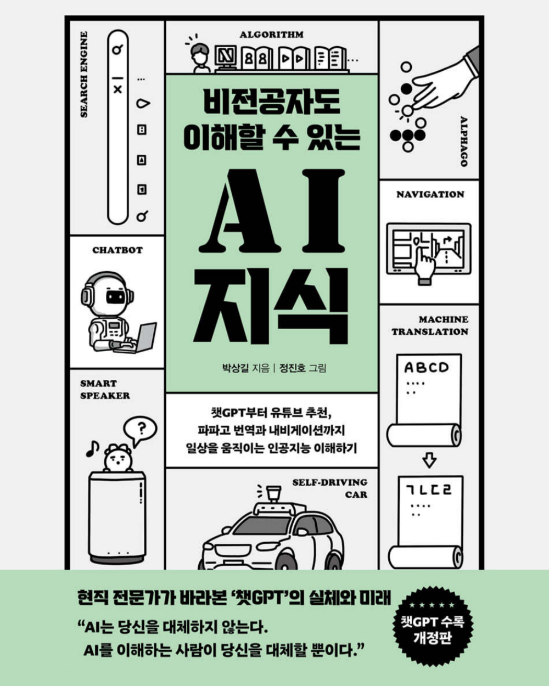

# 안녕하세요 👋

개발 서적을 읽고 기록하고 있습니다.

## 책 목록 📚

읽은 책 및 읽고 있는 책 목록입니다.

|                                           Computer Science                                            |                                                               Programming Language                                                                |                                  Design                                   |                                                                                    AI                                                                                     |
| :---------------------------------------------------------------------------------------------------: | :-----------------------------------------------------------------------------------------------------------------------------------------------: | :-----------------------------------------------------------------------: | :-----------------------------------------------------------------------------------------------------------------------------------------------------------------------: |
|  **[HTTP 완벽 가이드](/category/http-완벽-가이드)** |  **[모던 자바스크립트 Deep Dive](/category/모던-자바스크립트-deep-dive)** |  **[UX 심리학](/category/ux-심리학)** |  **[비전공자도 이해할 수 있는 AI 지식](/category/비전공자도-이해할-수-있는-ai-지식)** |
|        **[클린 아키텍처](/category/클린-아키텍처)**       |                      **[러닝 타입스크립트](/category/러닝-타입스크립트)**                     |                                                                           |                                                                                                                                                                           |
|                                                                                                       |              **[이펙티브 타입스크립트](/category/이펙티브-타입스크립트)**             |                                                                           |                                                                                                                                                                           |
