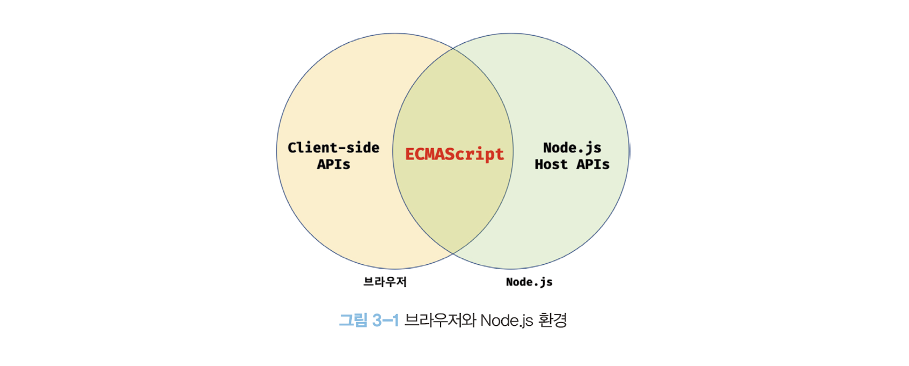
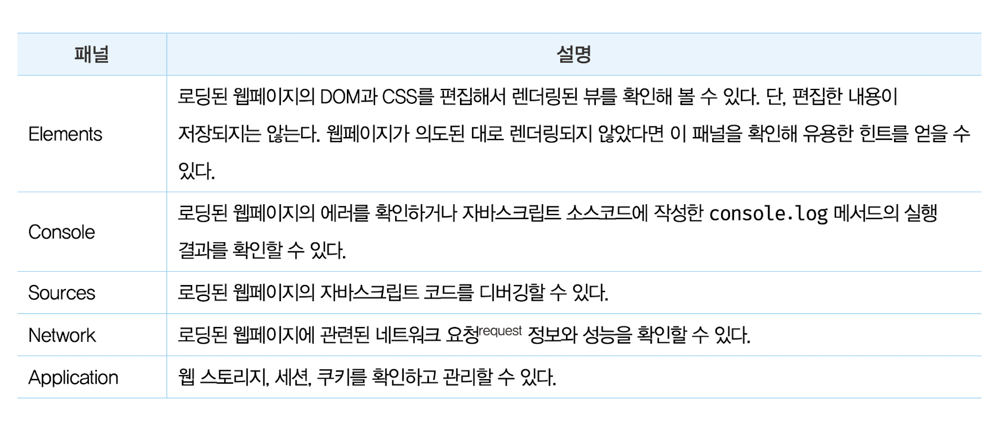

# 3장 자바스크립트 개발 환경과 실행 방법

## 3.1 자바스크립트 실행 환경

브라우저는 ECMAScript와 DOM, BOM, Canvas, XMLHttpRequest, fetch, requestAnimationFrame, SVG, Web Storage, Web Component, Web Worker 같은 **클라이언트 사이드 Web API**를 지원한다. Node.js는 클라이언트 사이드 Web API를 지원하지 않고 ECMAScript와 Node.js 고유의 API를 지원한다.

## 3.2 웹 브라우저

### 3.2.1 개발자 도구

### 3.2.2 콘솔

콘솔은 자바스크립트 코드를 직접 입력해 그 결과를 확인할 수 있는 REPL(Read Eval Print Loop: 입력 수행 출력 반복) 환경으로 사용할 수도 있다.

### 3.2.3 브라우저에서 자바스크립트 실행

브라우저는 HTML 파일을 로드하면 script 태그에 포함된 자바스크립트 코드를 실행한다.

### 3.2.4 디버깅

에러가 발생한 코드 왼쪽의 라인 번호를 클릭해 브레이크포인트를 걸고 다시 버튼을 클릭하면 다음과 같이 디버깅 모드로 들어간다.

