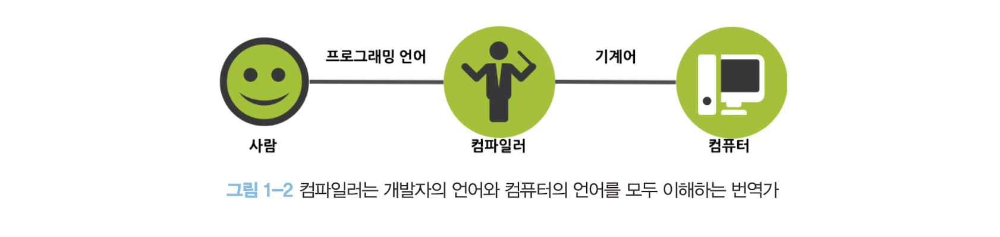

# 1장 프로그래밍

## 1.1 프로그래밍이란?

컴퓨터와 사람은 사고, 인지의 방식이 다르다. 따라서 컴퓨터의 관점에서 문제를 사고해야 한다. 여기에는 논리적, 수학적 사고가 필요하며, 해결 과제를 작은 단위로 분해하고 패턴화해서 추출하며, 프로그래밍 내에서 사용될 모든 개념은 평가 가능하도록 정의해야 한다.

## 1.2 프로그래밍 언어

기계어로 직접 명령을 전달하는 것을 대신할 가장 유용한 대안은 사람이 이해할 수 있는 약속된 구문(문법)으로 구성된 "프로그래밍 언어"를 사용해 프로그램을 작성한 후, 그것을 컴퓨터가 이해할 수 있는 기계어로 변환하는 일종의 번역기를 이용하는 것이다. 이 일종의 번역기를 **컴파일러** 혹은 **인터프리터**라고 한다.

## 1.3 구문과 의미

> **프로그래밍은 요구사항의 집합을 분석해서 적절한 자료구조와 함수의 집합으로 변환한 후, 그 흐름을 제어하는 것이다.**
