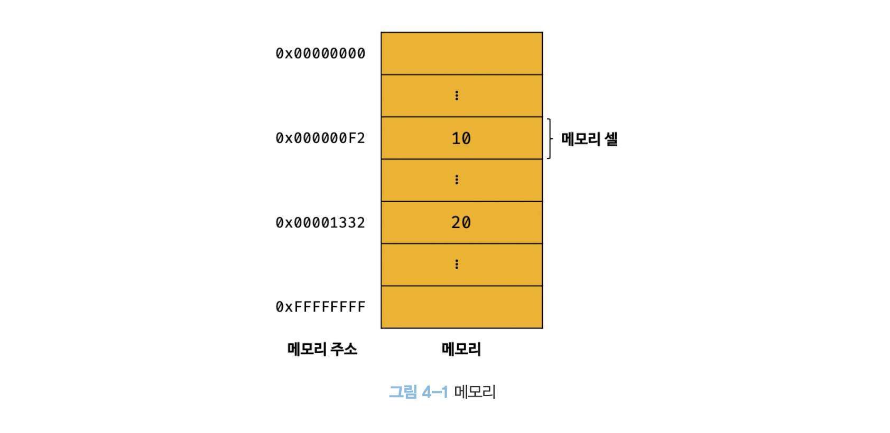
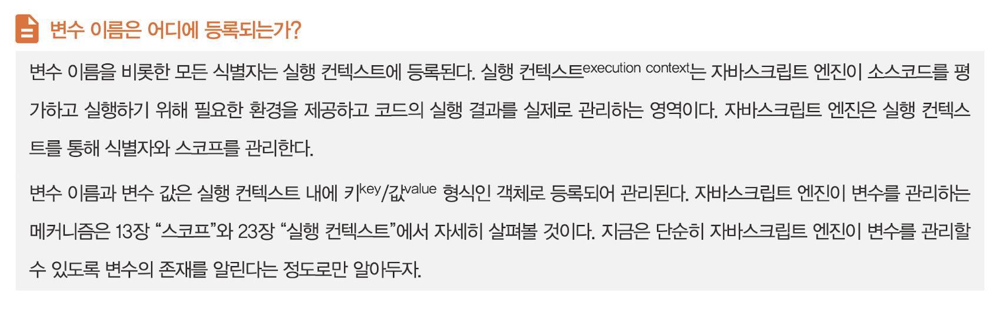
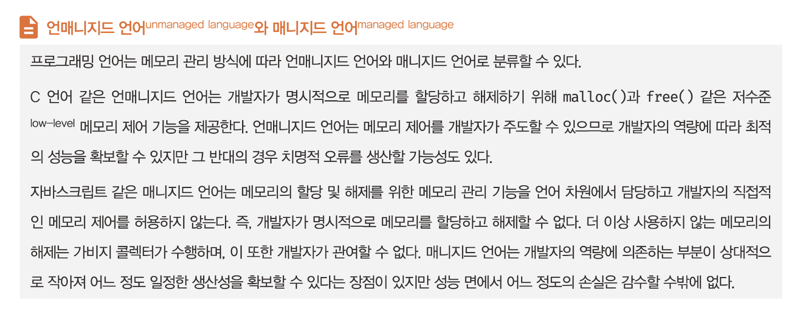

# 4장 변수

## 4.1 변수란 무엇인가? 왜 필요한가?

컴퓨터는 CPU를 사용해 연산하고, 메모리를 사용해 데이터를 기억한다. 메모리는 데이터를 저장할 수 있는 메모리 셀의 집합체다. 메모리 셀 하나의 크기는 1바이트(8비트)이며, 컴퓨터는 메모리 셀의 크기, 즉 1바이트 단위로 데이터를 저장하거나 읽어들인다.



메모리 주소를 통해 값에 직접 접근하는 것은 치명적 오류를 발생시킬 가능성이 높은 매우 위험한 일이다. 만약 실수로 운영체제가 사용하고 있는 값을 변경하면 시스템을 멈추게 하는 치명적인 오류가 발생할 수도 있다. 따라서 자바스크립트는 직접적인 메모리 제어를 허용하지 않는다.

만약 자바스크립트가 개발자의 직접적인 메모리 제어를 허용하더라도 문제가 있다. 값이 저장될 메모리 주소는 코드가 실행될 때 메모리의 상황에 따라 임의로 결정된다. 따라서 동일한 컴퓨터에서 동일한 코드를 실행해도 코드가 실행될 때마다 값이 저장될 메모리 주소는 변경된다. 이처럼 코드가 실행되기 이전에는 값이 저장된 메모리 주소를 알 수 없으며, 알려 주지도 않는다. 따라서 메모리 주소를 통해 값에 직접 접근하려는 시도는 올바른 방법이 아니다.

프로그래밍 언어는 기억하고 싶은 값을 메모리에 저장하고, 저장된 값을 읽어 들여 재사용하기 위해 변수라는 메커니즘을 제공한다.

> **변수는 하나의 값을 저장하기 위해 확보한 메모리 공간 자체 또는 그 메모리 공간을 식별하기 위해 붙인 이름을 말한다.**

변수는 프로그래밍 언어에서 값을 저장하고 참조하는 메커니즘으로, **값의 위치를 가리키는 상징적인 이름**이다. 상징적 이름인 변수는 프로그래밍 언어의 컴파일러 또는 인터프리터에 의해 값이 저장된 메모리 공간의 주소로 치환되어 실행된다.

```js
var result = 10 + 20;
```


## 4.2 식별자

식별자는 값이 저장되어 있는 메모리 주소와 매핑 관계를 맺으며, 이 매핑 정보도 메모리에 저장되어야 한다. 이처럼 **식별자는 값이 아니라 메모리 주소를 기억하고 있다.** 식별자로 값을 구별해서 식별한다는 것은 식별자가 기억하고 있는 메모리 주소를 통해 메모리 공간에 저장된 값에 접근할 수 있다는 의미다. 즉, 식별자는 메모리 주소에 붙인 이름이라고 할 수 있다. 메모리 상에 존재하는 어떤 값을 식별할 수 있는 이름은 모두 식별자라고 부른다.

## 4.3 변수 선언

변수 선언이란 변수를 생성하는 것을 말한다. 좀 더 자세히 말하면 값을 저장하기 위한 메모리 공간을 확보하고 변수 이름과 확보된 메모리 공간의 주소를 연결해서 값을 저장할 수 있게 준비하는 것이다. 변수 선언에 의해 확보된 메모리 공간은 확보가 해제되기 전까지는 누구도 확보된 메모리 공간을 사용할 수 없도록 보호되므로 안전하게 사용할 수 있다.

변수를 선언한 이후, 아직 변수에 값을 할당하지 않았다면 변수 선언에 의해 확보된 메모리 공간은 비어 있을 것으로 생각할 수 있으나 확보된 메모리 공간에는 자바스크립트 엔진에 의해 `undefined`라는 값이 암묵적으로 할당되어 초기화된다.

자바스크립트 엔진은 변수 선언을 다음과 같은 2단계에 걸쳐 수행한다.

- 선언 단계: 변수 이름을 등록해서 자바스크립트 엔진에 변수의 존재를 알린다.
- 초기화 단계: 값을 저장하기 위한 메모리 공간을 확보하고 암묵적으로 `undefined`를 할당해 초기화한다.



`var` 키워드를 사용한 변수 선언은 선언 단계와 초기화 단계가 동시에 진행된다. `var score;`는 선언 단계를 통해 변수 이름 `score`를 등록하고, 초기화 단계를 통해 `score` 변수에 암묵적으로 `undefined`를 할당해 초기화한다.

초기화 단계를 거치지 않으면 확보된 메모리 공간에는 이전에 다른 애플리케이션이 사용했던 값이 남아있을 수 있다. 이러한 값을 쓰레기 값이라 한다.

선언하지 않은 식별자에 접근하면 ReferenceError가 발생한다. ReferenceError는 식별자를 통해 값을 참조하려 했지만 자바스크립트 엔진이 등록된 식별자를 찾을 수 없을 때 발생하는 에러다.

## 4.4 변수 선언의 실행 시점과 변수 호이스팅

자바스크립트 엔진은 소스코드를 한 줄씩 순차적으로 실행하기에 앞서 먼저 소스코드의 평가 과정을 거치면서 소스코드를 실행하기 위한 준비를 한다. 이때 소스코드 실행을 위한 준비 단계인 소스코드의 평가 과정에서 자바스크립트 엔진은 변수 선언을 포함한 모든 선언문을 소스코드에서 찾아내 먼저 실행한다. 그리고 소스코드의 평가 과정이 끝나면 비로소 변수 선언을 포함한 모든 선언문을 제외하고 소스코드를 한 줄씩 순차적으로 실행한다.

**변수 선언문이 코드의 선두로 끌어 올려진 것처럼 동작하는 자바스크립트 고유의 특징을 변수 호이스팅**이라 한다.

## 4.5 값의 할당

자바스크립트 엔진은 변수 선언과 값의 할당을 하나의 문으로 단축 표현해도 변수 선언과 값의 할당을 2개의 문으로 나누어 각각 실행한다. **변수 선언은 소스코드가 순차적으로 실행되는 시점인 런타임 이전에 먼저 실행되지만 값의 할당은 소스코드가 순차적으로 실행되는 시점인 런타임에 실행된다.**


이전 값 `undefined`가 저장되어 있던 메모리 공간을 지우고 그 메모리 공간에 할당 값 80을 새롭게 저장하는 것이 아니라 새로운 메모리 공간을 확보하고 그곳에 할당 값 80을 저장한다는 점에 주의하자.

## 4.6 값의 재할당


현재 `score` 변수의 값은 90이다. `score` 변수의 이전 값인 `undefined`와 80은 어떤 변수도 값으로 갖고 있지 않다. 다시 말해, 어떤 식별자와도 연결되어 있지 않다. 이것은 `undefined`와 80이 더 이상 필요하지 않다는 것을 의미한다. 아무도 사용하고 있지 않으니 필요하지 않은 것이다. 이러한 불필요한 값들은 가비지 콜렉터에 의해 메모리에서 자동 해제된다. 단, 메모리에서 언제 해제될지는 예측할 수 없다.



