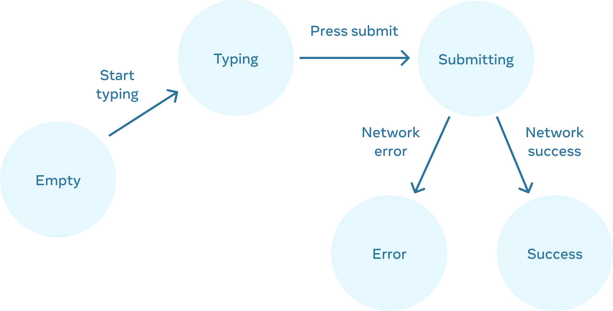
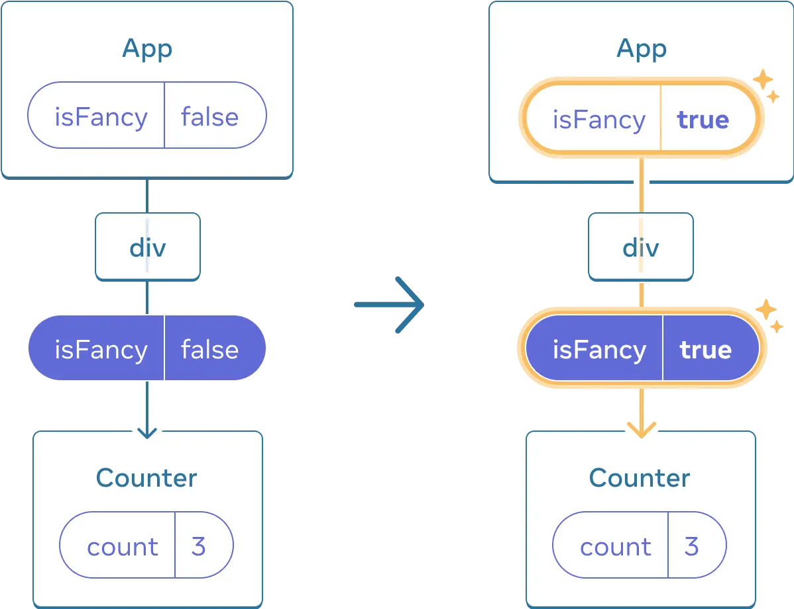

# 6장 State 관리하기

## 1. State를 사용해 Input 다루기

### 1-1. 선언형 UI와 명령형 UI 비교

#### 명령형 UI

> 직접 UI 를 조작하는 방식

- 각 요소의 상태를 개별적으로 변경
- 복잡한 시스템에서 관리하기 어려움
- 직접 DOM 을 조작하는 방식

#### 선언형 UI

> React 접근 방식

- 각 시각적 상태를 state 로 표현
- state 변경에 따라 자동으로 UI 업데이트
- 코드가 예측할 수 있고 유지 보수하기 쉬움

### 1-2. UI를 선언적인 방식으로 생각하기

#### 1. 컴포넌트의 시각적 상태 확인

- 비어있는 상태
- 입력 중인 상태
- 제출 중인 상태
- 성공 상태
- 에러 상태

#### 2. state 변화를 트리거하는 요소 파악



- 사용자 입력
- 네트워크 응답

#### 3. useState로 state 모델링

> 각 시각적 상태를 state 로 표현

- UI 의 각 상태를 독립적인 state 로 표현
- 상태의 의미가 명확해야 함
- 상태 간의 관계를 고려하여 설계

```tsx
const [answer, setAnswer] = useState('');
const [error, setError] = useState(null);
const [status, setStatus] = useState('typing');
```

#### 4. 불필요한 state 제거

> state 역설 확인하기

- `isTyping` 과 `isSubmitting` 이 동시에 `true` 일 수 없음
- state 가 충분히 제한되지 않았음을 의미
- 두 boolean 에 대한 네 가지 조합이 있지만 유효한 state 는 세 개뿐
- 불가능한 state 를 제거하기 위해 세 가지 값 'typing', 'submitting', 'success' 을 하나의 status 로 통합

```tsx
// 불필요한 state
const [isTyping, setIsTyping] = useState(false);
const [isSubmitting, setIsSubmitting] = useState(false);

// status 하나로 통합
const [status, setStatus] = useState('typing'); // 'typing' | 'submitting' | 'success'
```

> 중복 정보 확인하기

- `isEmpty` 와 `isTyping` 을 각각의 state 변수로 분리하면 싱크가 맞지 않거나 버그가 발생할 수 있음
- `isEmpty` 를 지우고 `answer.length === 0` 으로 체크할 수 있음

> 파생된 정보 확인하기

- `isError` 는 `error !== null` 로 확인할 수 있기 때문에 필요하지 않음

#### 5. 이벤트 핸들러 연결

- state 업데이트 로직 구현
- 사용자 입력 처리
- 비동기 작업 처리

## 2. State 구조 선택하기

### 2-1. State 구조화 원칙

#### 연관된 state 그룹화하기

- 항상 함께 업데이트되는 state 는 하나로 통합
- x, y 좌표는 `position` 객체로 통합

#### State 모순 피하기

- 여러 state 조각이 서로 모순되는 구조 피하기
- 불가능한 state 조합 방지

#### 불필요한 state 피하기

- props 나 기존 state 에서 계산 가능한 정보는 state 로 저장하지 않기
- 파생된 정보는 필요할 때 계산

#### State 중복 피하기

- 동일한 데이터가 여러 곳에 중복되면 동기화 유지가 어려움
- 중복 데이터 제거로 버그 가능성 감소

#### 깊게 중첩된 state 피하기

- 깊은 계층 구조는 업데이트가 복잡함
- 가능한 평탄한 구조로 설계

#### Props를 state에 미러링하지 않기

- props 를 state 로 복사하면 불필요한 중복 발생
- props 가 변경되어도 state 는 자동으로 업데이트되지 않음
- props 를 직접 사용하거나 필요한 경우에만 state 로 변환

```tsx
function Message({ initialColor }) {
  const [color, setColor] = useState(initialColor);
}
```

### 2-2. State 구조화 예시

```tsx
// 연관된 state 분리
const [x, setX] = useState(0);
const [y, setY] = useState(0);

// 연관된 state 통합
const [position, setPosition] = useState({ x: 0, y: 0 });
```

### 2-3. State 업데이트 시 주의사항

- 객체 state 업데이트 시 스프레드 연산자 사용
- 중첩된 객체 업데이트 시 불변성 유지
- 배열 state 업데이트 시 적절한 배열 메서드 사용

## 3. 컴포넌트 간 State 공유하기

### 3-1. State 끌어올리기

- 두 컴포넌트의 state 가 항상 함께 변경되어야 할 때 사용
- 각 컴포넌트에서 state 를 제거하고 가장 가까운 공통 부모 컴포넌트로 이동
- props 를 통해 자식 컴포넌트에 state 전달

### 3-2. 제어 컴포넌트와 비제어 컴포넌트

#### 제어 컴포넌트

- 컴포넌트의 중요한 정보가 props 에 의해 제어됨
- 부모 컴포넌트가 동작을 지정할 수 있음
- 더 유연하지만 부모 컴포넌트에서 props 설정 필요

#### 비제어 컴포넌트

- 자체 지역 state 가짐
- 설정이 적어 부모 컴포넌트에서 사용하기 쉬움
- 여러 컴포넌트를 함께 조정할 때 덜 유연함

### 3-3. State 구조화 원칙

#### 단일 진리의 원천 (Single Source of Truth)

- 각 고유한 state 에 대해 "소유"할 컴포넌트 선택
- 모든 state 가 한 곳에 존재한다는 의미가 아님
- 공유된 state 를 중복하지 않고 공통 부모로 끌어올림
- 필요한 자식에게 props 로 전달

#### State 위치 결정

- 입력과 같은 리프 컴포넌트에 가까운 state
- 앱 상단에 더 가까운 state
- 애플리케이션의 변화에 따라 state 위치 조정 가능

## 4. State를 보존하고 초기화하기

### 4-1. State와 렌더 트리의 관계

#### State는 렌더 트리의 위치에 연결됨

- React 는 UI 트리에서의 위치를 통해 각 state 가 어떤 컴포넌트에 속하는지 추적
- 컴포넌트가 UI 트리에서 같은 위치에 있으면 state 보존
- 컴포넌트가 UI 트리에서 제거되면 state 도 함께 제거

### 4-2. State 보존과 초기화

#### 같은 위치의 같은 컴포넌트는 state 보존

```jsx
import { useState } from 'react';

export default function App() {
  const [isFancy, setIsFancy] = useState(false);

  return (
    <div>
      {isFancy ? <Counter isFancy={true} /> : <Counter isFancy={false} />}
      <label>
        <input type="checkbox" checked={isFancy} onChange={e => setIsFancy(e.target.checked)} />
        Use fancy styling
      </label>
    </div>
  );
}

function Counter({ isFancy }) {
  const [score, setScore] = useState(0);
  const [hover, setHover] = useState(false);

  let className = 'counter';

  if (hover) {
    className += ' hover';
  }
  if (isFancy) {
    className += ' fancy';
  }

  return (
    <div className={className} onPointerEnter={() => setHover(true)} onPointerLeave={() => setHover(false)}>
      <h1>{score}</h1>
      <button onClick={() => setScore(score + 1)}>Add one</button>
    </div>
  );
}
```



- 동일한 컴포넌트가 같은 위치에 렌더링되면 state 유지
- 컴포넌트의 state 는 JSX 태그에 저장되지 않고 트리 위치와 연관됨

#### 같은 위치의 다른 컴포넌트는 state 초기화

- 다른 컴포넌트로 교체되면 state 초기화
- 컴포넌트의 타입이 변경되면 state 초기화

### 4-3. State 초기화 방법

#### 1. 다른 위치에 컴포넌트 렌더링

- 조건부 렌더링으로 컴포넌트를 다른 위치에 배치
- 각 위치는 독립적인 state 를 가짐

#### 2. key 를 이용한 state 초기화

- key 를 명시하면 React 는 부모 내에서의 순서 대신에 key 자체를 위치의 일부로 사용
- 컴포넌트에 다른 key 를 부여하여 state 초기화
- key 가 변경되면 React 는 컴포넌트를 새로 생성
- 폼 초기화나 리스트 아이템 업데이트에 유용

### 4-4. 주의사항

```jsx
import { useState } from 'react';

export default function MyComponent() {
  const [counter, setCounter] = useState(0);

  // MyComponent 를 렌더링할 때마다 다른 MyTextField 함수 생성
  function MyTextField() {
    const [text, setText] = useState('');

    return <input value={text} onChange={e => setText(e.target.value)} />;
  }

  return (
    <>
      <MyTextField />
      {/* 버튼(counter)을 클릭하면 입력한 값(text) 초기화 */}
      <button onClick={() => setCounter(counter + 1)}>Clicked {counter} times</button>
    </>
  );
}
```

- 중첩해서 컴포넌트를 정의하면 의도치 않게 state 가 초기화될 수 있음
- 컴포넌트를 함수 내부에서 정의하지 않기
- 컴포넌트를 최상위 레벨에서 정의하기

### 4-5. 제거된 컴포넌트의 State 보존하기

#### 1. 모든 컴포넌트를 렌더링하고 CSS로 숨기기

- 모든 채팅을 렌더링하고 CSS 로 숨김 처리
- 컴포넌트가 트리에서 제거되지 않아 state 유지
- 간단한 UI 에서 효과적이나 숨겨진 트리가 크면 성능 저하 가능성 높음

#### 2. State를 상위로 끌어올리기

- 각 수신자의 임시 메시지를 부모 컴포넌트에서 관리
- 자식 컴포넌트가 제거되어도 state 유지 가능
- 가장 일반적으로 사용되는 해결책

#### 3. 외부 저장소 활용하기

- localStorage 와 같은 외부 저장소 사용
- 페이지를 닫아도 state 유지 가능
- 컴포넌트 초기화 시 저장된 데이터 활용

> 어떤 방법을 선택하더라도 각 채팅은 개념적으로 구분되므로 현재 수신자를 기반으로 `<Chat>` 컴포넌트에 `key` 를 부여하는 것이 적절

## 5. State 로직을 reducer로 작성하기

### 5-1. Reducer란?

- 컴포넌트의 state 업데이트 로직을 컴포넌트 외부의 단일 함수로 통합
- 여러 이벤트 핸들러에 분산된 state 업데이트 로직을 관리하기 쉽게 만들 수 있음
- `useState`에서 `useReducer`로 리팩토링 가능

#### Reducer 이름의 유래

- JavaScript 의 `reduce()` 배열 메서드에서 유래
- `reduce()` 는 배열의 여러 값을 하나의 값으로 누적하는 것처럼 Reducer 도 여러 state 업데이트를 하나의 state 로 누적하는 역할 수행
- 이전 state 와 action 을 받아 다음 state 를 반환하는 순수 함수

### 5-2. useState에서 useReducer로 변환하기

#### 1. State 설정에서 Action 전달로 변경

```tsx
// 직접 state 설정
function handleAddTask(text) {
  setTasks([
    ...tasks,
    {
      id: nextId++,
      text: text,
      done: false,
    },
  ]);
}
```

```tsx
// action 전달
function handleAddTask(text) {
  dispatch({
    type: 'added',
    id: nextId++,
    text: text,
  });
}
```

#### 2. Reducer 함수 작성

```tsx
function tasksReducer(tasks, action) {
  switch (action.type) {
    case 'added': {
      return [
        ...tasks,
        {
          id: action.id,
          text: action.text,
          done: false,
        },
      ];
    }
    case 'changed': {
      return tasks.map(t => {
        if (t.id === action.task.id) {
          return action.task;
        }

        return t;
      });
    }
    case 'deleted': {
      return tasks.filter(t => t.id !== action.id);
    }
    default: {
      throw Error('Unknown action: ' + action.type);
    }
  }
}
```

#### 컴포넌트에서 reducer 사용

```tsx
const [tasks, dispatch] = useReducer(tasksReducer, initialTasks);
```

### 5-3. useState와 useReducer 비교하기

#### useState

- 간단한 state 관리에 적합
- 독립적인 state 값들을 다룰 때 유용
- 코드가 간결하고 직관적
- 디버깅이 상대적으로 어려울 수 있음

#### useReducer

- 복잡한 state 로직에 적합
- 여러 state 값들이 함께 업데이트될 때 유용
- 디버깅과 테스트가 용이
- 코드가 조금 더 길어질 수 있음

#### 선택 기준

- state 업데이트 로직이 복잡할 때
- 여러 state 를 함께 업데이트할 때
- 디버깅이 중요할 때
- 테스트가 필요할 때

### 5-4. Reducer 작성 시 주의사항

#### Reducer는 순수해야 함

- 렌더링 중에 실행되므로 순수 함수여야 함
- 입력이 같으면 항상 같은 결과를 반환해야 함
- 사이드 이펙트를 수행하면 안 됨
- 객체와 배열을 변경하지 않고 업데이트해야 함

#### Action 설계 원칙

- 각 action 은 하나의 사용자 상호작용을 설명해야 함
- 여러 필드가 있는 경우 개별 action 보다 하나의 action 으로 통합
- 디버깅을 위해 action 로그가 명확해야 함

### 5-5. Immer로 간결한 Reducer 작성하기

- Immer 라이브러리를 사용하여 reducer 를 더 간결하게 작성할 수 있음
- `useImmerReducer` 를 사용하면 state 를 직접 변경하는 것처럼 작성할 수 있음
- 내부적으로 Immer 가 변경 사항이 반영된 복사본을 생성

```tsx
import { useImmerReducer } from 'use-immer';

function tasksReducer(draft, action) {
  switch (action.type) {
    case 'added': {
      draft.push({
        id: action.id,
        text: action.text,
        done: false,
      });
      break;
    }
    case 'changed': {
      const index = draft.findIndex(t => t.id === action.task.id);
      draft[index] = action.task;
      break;
    }
    case 'deleted': {
      return draft.filter(t => t.id !== action.id);
    }
    default: {
      throw Error('Unknown action: ' + action.type);
    }
  }
}

export default function TaskApp() {
  const [tasks, dispatch] = useImmerReducer(tasksReducer, initialTasks);

  function handleAddTask(text) {
    dispatch({
      type: 'added',
      id: nextId++,
      text: text,
    });
  }

  function handleChangeTask(task) {
    dispatch({
      type: 'changed',
      task: task,
    });
  }

  function handleDeleteTask(taskId) {
    dispatch({
      type: 'deleted',
      id: taskId,
    });
  }

  return (
    <>
      <h1>Prague itinerary</h1>
      <AddTask onAddTask={handleAddTask} />
      <TaskList tasks={tasks} onChangeTask={handleChangeTask} onDeleteTask={handleDeleteTask} />
    </>
  );
}
```

## 6. Context를 사용해 데이터를 깊게 전달하기

### 6-1. Props 전달의 문제점

#### Prop Drilling

- 여러 컴포넌트를 거쳐 props 전달
- 중간 컴포넌트가 해당 데이터를 사용하지 않아도 전달
- 유지보수가 어려움

### 6-2. Context의 기본 개념

#### Context란?

- 컴포넌트 트리를 통해 데이터를 전달하는 방법
- props drilling 없이 깊은 곳에 있는 컴포넌트에 데이터 전달 가능
- React 내장 기능으로 별도의 라이브러리 불필요

### 6-3. Context 사용 방법

#### 1. Context 생성하기

```tsx
import { createContext } from 'react';

export const LevelContext = createContext(1);
```

#### 2. Context Provider로 감싸기

```tsx
import { LevelContext } from './LevelContext.js';

export default function Section({ level, children }) {
  return <LevelContext.Provider value={level}>{children}</LevelContext.Provider>;
}
```

#### 3. Context 사용하기

```tsx
import { useContext } from 'react';
import { LevelContext } from './LevelContext.js';

export default function Heading({ children }) {
  const level = useContext(LevelContext);
}
```

### 6-4. Context 사용 시 주의사항

#### Context 사용 전 고려사항

> **props 전달이 간단한 경우**

- 몇 개의 props 만 전달하는 경우는 Context 불필요
- 일반적인 props 전달 방식 사용 권장

> **컴포넌트 추출과 children 사용**

- 중간 컴포넌트들을 추출하여 children 으로 전달
- 데이터를 사용하는 컴포넌트와 전달하는 컴포넌트 사이의 계층 줄이기

### 6-5. Context의 일반적인 사용 사례

#### 1. 테마 지정

- 다크 모드/라이트 모드 전환
- 앱 전체의 시각적 스타일 관리

#### 2. 현재 계정

- 로그인한 사용자 정보 관리
- 여러 계정 동시 운영 시 활용

#### 3. 라우팅

- 현재 경로 정보 관리
- 링크 활성화 상태 관리

#### 4. 상태 관리

- 앱 전반에 걸친 상태 관리
- Reducer 와 함께 사용하여 복잡한 상태 관리

### 6-6. Context와 State 조합

- Context 는 정적인 값으로 제한되지 않음
- Provider 의 value prop 을 state 로 관리할 수 있음
- state 변경 시 하위 컴포넌트들이 자동으로 업데이트

```tsx
function App() {
  const [theme, setTheme] = useState('light');

  return (
    <ThemeContext.Provider value={theme}>
      <Page />
    </ThemeContext.Provider>
  );
}
```

## 7. Reducer와 Context로 앱 확장하기

### 7-1. Reducer와 Context 결합의 필요성

#### 기존 방식의 한계

- Reducer 로 state 업데이트 로직을 통합할 수 있지만 앱이 커지면 다른 문제 발생
- State 와 dispatch 함수가 최상위 컴포넌트에서만 사용 가능
- 하위 컴포넌트에서 사용하려면 props 로 전달해야 함
- 수백 개의 컴포넌트를 거쳐 전달하는 것은 비효율적

### 7-2. Reducer와 Context 결합 방법

#### 1. Context 생성하기

```tsx
import { createContext } from 'react';

export const TasksContext = createContext(null);
export const TasksDispatchContext = createContext(null);
```

#### 2. Provider 컴포넌트 생성

```tsx
export function TasksProvider({ children }) {
  const [tasks, dispatch] = useReducer(tasksReducer, initialTasks);

  return (
    <TasksContext.Provider value={tasks}>
      <TasksDispatchContext.Provider value={dispatch}>{children}</TasksDispatchContext.Provider>
    </TasksContext.Provider>
  );
}
```

#### 3. Custom Hook 생성

```tsx
export function useTasks() {
  return useContext(TasksContext);
}

export function useTasksDispatch() {
  return useContext(TasksDispatchContext);
}
```

### 7-3. 컴포넌트에서 사용하기

#### Provider로 감싸기

```tsx
function TaskApp() {
  return (
    <TasksProvider>
      <h1>Day off in Kyoto</h1>
      <AddTask />
      <TaskList />
    </TasksProvider>
  );
}
```

#### Context 사용하기

```tsx
function TaskList() {
  const tasks = useTasks();
  return (
    <ul>
      {tasks.map(task => (
        <li key={task.id}>
          <Task task={task} />
        </li>
      ))}
    </ul>
  );
}

function Task({ task }) {
  const dispatch = useTasksDispatch();
}
```

### 7-4. 장점

#### 1. 코드 구조화

- State 로직과 UI 로직 분리
- 컴포넌트는 데이터를 어디서 가져오는지가 아닌 무엇을 보여줄지에 집중
- Context 와 reducer 를 별도 파일로 분리하여 관리 용이

#### 2. 재사용성

- Custom Hook 을 통해 context 사용 단순화
- 여러 컴포넌트에서 동일한 로직 재사용 가능
- 앱의 다른 부분에서도 동일한 패턴 적용 가능

#### 3. 확장성

- 앱이 커질수록 context-reducer 조합을 여러 개 만들 수 있음
- 각 기능별로 독립적인 state 관리 가능
- 트리 아래의 모든 컴포넌트에서 데이터 접근 용이

### 7-5. 주의사항

#### 1. Context 분리

- State 와 dispatch 함수를 위한 별도의 context 생성
- 각각의 책임을 명확히 분리하여 관리

#### 2. Custom Hook 활용

- Context 사용을 단순화하기 위한 Custom Hook 생성
- Hook 이름은 `use` 로 시작하는 것이 관례
- 다른 Hook 들도 Custom Hook 내에서 사용 가능

#### 3. Provider 구조

- Provider 컴포넌트를 통해 모든 것을 하나로 묶기
- children을 prop 으로 받아 JSX 전달 가능
- 중첩된 Provider 구조로 여러 context 관리 가능
