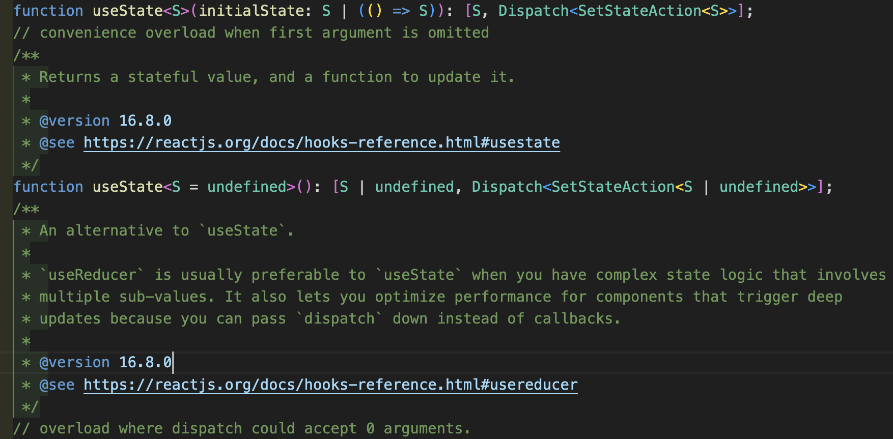

# 5장 함수

## 5.1 함수 매개변수

변수와 마찬가지로 타입스크립트를 사용하면 타입 애너테이션으로 함수 매개변수의 타입을 선언할 수 있다. 다음과 같이 `: string`을 사용해 `song` 매개변수가 string 타입임을 타입스크립트에 알린다.

```ts
function sing(song: string) {
  console.log(`Singing: ${song}!`);
}
```

코드를 유효한 타입스크립트 구문으로 만들기 위해 함수 매개변수에 적절한 타입 애너테이션을 추가할 필요는 없다. 타입스크립트는 타입 오류로 오류를 계속 알리지만 이미 시작된 자바스크립트는 계속 실행된다.

### 5.1.1 필수 매개변수

타입스크립트는 함수에 선언된 모든 매개변수가 필수라고 가정한다.

```ts
function singTwo(first: string, second: string) {
  console.log(`${first} / ${second}`);
}

singTwo('Ball and Chain'); // ERROR

singTwo('I Will Survive', 'Higher Love'); // OK

singTwo('Go Your Own Way', 'The CHain', 'Dreams'); // ERROR
```

함수에 필수 매개변수를 제공하도록 강제하면 예상되는 모든 인숫값을 함수 내에 존재하도록 만들어 타입 안정성을 강화하는 데 도움이 된다. 모든 인숫값이 존재하는지 확인하지 못하면 이전 `singTwo` 함수가 `undefined`를 로그로 남기거나 인수를 무시하는 것과 같이 코드에서 예기치 못한 동작이 발생한다.

### 5.1.2 선택적 매개변수

자바스크립트에서 함수 매개변수가 제공되지 않으면 함수 내부의 인숫값은 `undefined`으로 기본값이 설정된다. 타입스크립트에서는 선택적 객체 타입 속성과 유사하게 타입 애너테이션의 `:` 앞에 `?`를 추가해 매개변수가 선택적이라고 표시한다.

함수 호출에 선택적 매개변수를 제공할 필요는 없다. 선택적 매개변수에는 항상 `| undefined`가 유니언 타입으로 추가되어 있다.

```ts
function announceSong(song: string, singer?: string) {
  console.log(`Song: ${song}`);

  if (singer) {
    console.log(`Singer: ${singer}`);
  }
}

announceSong('Greensleeves'); // OK
announceSong('Greensleeves', undefined); // OK
announceSong('Chandelier', 'Sia'); // OK
```

선택적 매개변수는 `| undefined`를 포함하는 유니언 타입 매개변수와는 다르다. `?`으로 표시된 선택적 매개변수가 아닌 매개변수는 값이 명시적으로 `undefined`일지라도 항상 제공되어야 한다.

```ts
function announceSongBy(song: string, singer: string | undefined) {
  console.log(`Song: ${song}`);

  if (singer) {
    console.log(`Singer: ${singer}`);
  }
}

announceSongBy('Greensleeves'); // ERROR

announceSongBy('Greensleeves', undefined); // OK
announceSongBy('Chandelier', 'Sia'); // OK
```

:::note

**선택적 매개변수 대신 `| undefined`를 포함하는 유니언 타입 매개변수 사용하면 유용한 상황?**

- 실무에서는 선택적 매개변수를 사용한다. `undefined`를 넘기는 상황 자체가 잘못된 것이다.

:::

함수에서 사용되는 모든 선택적 매개변수는 마지막 매개변수여야 한다. 필수 매개변수 전에 선택적 매개변수를 위치시키면 다음과 같이 타입스크립트 구문 오류가 발생한다.

```ts
function announceSinger(singer?: string, song: string) {
  // ...
}
```

:::note

**선택적 매개변수는 반드시 마지막에 작성하는 이유**

- 선택적 매개변수를 첫 번째 매개변수로 선언하고 그 뒤에 여러 개의 필수 매개변수를 선언하면
- 함수를 사용할 때 첫 번째로 넘긴 값이 맨 처음에 작성한 옵셔널 매개변수인지
- 아니면 두 번째로 선언한 필수 매개변수인지 명확하게 판단할 수 없다.

:::

:::note

**타입으로 분리하는 매개변수 개수의 기준**

- 매개변수는 2개~3개를 권장하고 있다. 너무 많아지면 관리하기 어렵다.
- [GitHub - 738/clean-code-typescript: 🚿 타입스크립트를 위한 클린코드 - 한글 번역판 🇰🇷](https://github.com/738/clean-code-typescript#함수의-매개변수는-2개-혹은-그-이하가-이상적입니다)

:::

### 5.1.3 기본 매개변수

자바스크립트에서 선택적 매개변수를 선언할 때 `=`와 값이 포함된 기본값을 제공할 수 있다. 선택적 매개변수에는 기본적으로 값이 제공되기 때문에 해당 타입스크립트 타입에는 암묵적으로 함수 내부에 `| undefined` 유니언 타입이 추가된다. 타입스크립트는 함수의 매개변수에 대해 인수를 누락하거나 `undefined` 인수를 사용해서 호출하는 것을 여전히 허용한다.

```ts
function rateSong(song: string, rating = 0) {
  console.log(`${song} gets ${rating}/5 stars!`);
}

rateSong('Photograph'); // OK
rateSong('Set Fire to the Rain', 5); // OK
rateSong('Set Fire to the Rain', undefined); // OK

rateSong('At Last!', '100'); // ERROR
```

### 5.1.4 나머지 매개변수

`...` 스프레드 연산자는 함수 선언의 마지막 매개변수에 위치하고 해당 매개변수에서 시작해 함수에 전달된 나머지 인수가 모두 단일 배열에 저장되어야 함을 나타낸다.

```ts
function singAllTheSongs(singer: string, ...songs: string[]) {
  for (const song of songs) {
    console.log(`${song}, by ${singer}`);
  }
}

singAllTheSongs('Alicia Keys'); // OK
singAllTheSongs('Lady Gaga', 'Bad Romance', 'Just Dance', 'Poker Face'); // OK

singAllTheSongs('Ella Fitzgerald', 2000); // ERROR
```

## 5.2 반환 타입

타입스크립트는 지각적이다. 함수가 반환할 수 있는 가능한 모든 값을 이해하면 함수가 반환하는 타입을 알 수 있다.

```ts
// (songs: string[]) => number
function singSongs(songs: string[]) {
  for (const song of songs) {
    console.log(`${song}`);
  }

  return songs.length;
}
```

함수에 다른 값을 가진 여러 개의 반환문을 포함하고 있다면 타입스크립트는 반환 타입을 가능한 모든 타입의 조합으로 유추한다.

```ts
// (songs: string[], index: number) => string | undefined
function getSongAt(songs: string[], index: number) {
  return index < songs.length ? songs[index] : undefined;
}
```

### 5.2.1 명시적 반환 타입

변수와 마찬가지로 타입 애너테이션을 사용해 함수의 반환 타입을 명시적으로 선언하지 않는 것이 좋다. 그러나 함수에서는 반환 타입을 명시적으로 선언하는 방식이 유용할 때가 종종 있다.

- 가능한 반환값이 많은 함수가 항상 동일한 타입의 값을 반환하도록 강제한다.
- 타입스크립트는 재귀 함수의 반환 타입을 통해 타입을 유추하는 것을 거부한다.
- 수백 개 이상의 타입스크립트 파일이 있는 매우 큰 프로젝트에서 타입스크립트 타입 검사 속도를 높일 수 있다.

```ts
function singSongsRecursive(songs: string[], count = 0): number {
  return songs.length ? singSongsRecursive(songs.slice(1), count + 1) : count;
}
```

```ts
const singSongsRecursive2 = (songs: string[], count = 0): number => {
  return songs.length ? singSongsRecursive2(songs.slice(1), count + 1) : count;
};
```

```ts
function getSongRecordingDate(song: string): Date | undefined {
  switch (song) {
    case 'Strange Fruit':
      return new Date('April 20, 1939'); // OK
    case 'Greensleeves':
      return 'unknown'; // ERROR
    default:
      return undefined; // OK
  }
}
```

## 5.3 함수 타입

함수 타입 구문은 화살표 함수와 유사하지만 함수 본문 대신 타입이 있다.

```ts
let nothingInGiveString: () => string;
```

```ts
let inputAndOutput: (songs: string[], count?: number) => number;
```

함수 타입은 콜백 매개변수(함수로 호출되는 매개변수)를 설명하는 데 자주 사용된다.

```ts
const songs = ['Juice', 'Shake It Off', "What's Up"];

function runOnSongs(getSongAt: (index: number) => string) {
  for (let i = 0; i < songs.length; i += 1) {
    console.log(getSongAt(i));
  }
}

function getSongAt(index: number) {
  return `${songs[index]}`;
}

runOnSongs(getSongAt); // OK

function logSong(song: string) {
  return `${song}`;
}

runOnSongs(logSong); // ERROR
```

### 5.3.1 함수 타입 괄호

함수 타입은 다른 타입이 사용되는 모든 곳에 배치할 수 있다. 여기에는 유니언 타입도 포함된다.

유니언 타입의 애너테이션에서 함수 반환 위치를 나타내거나 유니언 타입을 감싸는 부분을 표시할 때 괄호를 사용한다.

```ts
// string | undefined 유니언을 반환하는 함수
let retunrsStringOrUndefined: () => string | undefined;

// undefined나 string을 반환하는 함수
let maybeReturnsString: (() => string) | undefined;
```

### 5.3.2 매개변수 타입 추론

타입스크립트는 선언된 타입의 위치에 제공된 함수의 매개변수 타입을 유추할 수 있다.

```ts
let singer: (song: string) => string;

singer = function (song) {
  return `Singing: ${song.toUpperCase()}!`; // OK
};
```

함수를 매개변수로 갖는 함수에 인수로 전달된 함수는 해당 매개변수 타입도 잘 유추할 수 있다.

```ts
const songs = ['Call Me', 'Jolene', 'The Chain'];

// song: string
// index: number
songs.forEach((song, index) => {
  console.log(`${song} is at index ${index}`);
});
```

### 5.3.3 함수 타입 별칭

함수 타입에서도 타입 별칭을 사용할 수 있다.

```ts
type StringToNumber = (input: string) => number;

let stringToNumber: StringToNumber;

stringToNumber = input => input.length; // OK

stringToNumber = input => input.toUpperCase(); // ERROR
```

함수 매개변수에서도 함수 타입을 참조하는 별칭을 입력할 수 있다.

```ts
type NumberToString = (input: number) => string;

function usesNumberToString(numberToString: NumberToString) {
  console.log(`The string is: ${numberToString(1234)}`);
}

usesNumberToString(input => `${input}! Hooray!`); // OK

usesNumberToString(input => input * 2); // ERROR
```

타입 별칭은 함수 타입에 유용하다. 타입 별칭을 이용하면 반복적으로 작성하는 매개변수와 반환 타입을 갖는 코드 공간을 많이 절약할 수 있다.

## 5.4 그 외 반환 타입

### 5.4.1 void 반환 타입

타입스크립트는 void 키워드를 사용해 반환값이 없는 함수의 반환 타입을 확인할 수 있다.

```ts
function logSong(song: string | undefined): void {
  if (!song) {
    return; // OK
  }

  console.log(`${song}`);

  return true; // ERROR
}
```

함수 타입 선언 시 void 반환 타입은 매우 유용하다. 함수 타입을 선언할 때 void를 사용하면 함수에서 반환되는 모든 값은 무시된다.

```ts
let songLogger: (song: string) => void;

songLogger = song => {
  console.log(`${song}`);
};

songLogger('Heart of Glass'); // OK
```

자바스크립트 함수는 실젯값이 반환되지 않으면 기본으로 모두 `undefined`를 반환하지만 void는 `undefined`와 동일하지 않다. void는 함수의 반환 타입이 무시된다는 것을 의미하고 `undefined`는 반환되는 리터럴 값이다. `undefined`를 포함하는 대신 void 타입의 값을 할당하려고 하면 타입 오류가 발생한다.

```ts
function returnsVoid() {
  return;
}

let lazyValue: string | undefined;

lazyValue = returnsVoid(); // ERROR
```

`undefined`와 void를 구분해서 사용하면 유용하다. void를 반환하도록 선언된 타입 위치에 전달된 함수가 반환된 모든 값을 무시하도록 설정할 때 유용하다.

```ts
const records: string[] = [];

function saveRecords(newRecords: string[]) {
  newRecords.forEach(record => records.push(record));
}

saveRecords(['21', 'Come On Over', 'The Bodyguard']);
```

void 타입은 자바스크립트가 아닌 함수의 반환 타입을 선언하는 데 사용하는 타입스크립트 키워드이다. void 타입은 함수의 반환값이 자체적으로 반환될 수 있는 값도 아니고 사용하기 위한 것도 아니라는 표시이다.

### 5.4.2 never 반환 타입

일부 함수는 값을 반환하지 않을 뿐만 아니라 반환할 생각도 전혀 없다. never 반환 함수는 의도적으로 항상 오류를 발생시키거나 무한 루프를 실행하는 함수이다.

```ts
function fail(message: string): never {
  throw new Error(`Invariant failure: ${message}.`);
}

function workWithUnsafeParam(param: unknown) {
  if (typeof param !== 'string') {
    fail(`param should be a string, not ${typeof param}`);
  }

  param.toUpperCase(); // OK
}
```

never는 void와 다르다. void는 아무것도 반환하지 않는 함수를 위한 것이고 never는 절대 반환하지 않는 함수를 위한 것이다.

## 5.5 함수 오버로드

일부 자바스크립트 함수는 선택적 매개변수와 나머지 매개변수만으로 표현할 수 없는 매우 다른 매개변수들로 호출될 수 있다. 이러한 함수는 **오버로드 시그니처**라고 불리는 타입스크립트 구문으로 설명할 수 있다. 하나의 최종 **구현 시그니처**와 그 함수의 본문 앞에 서로 다른 버전의 함수 이름, 매개변수, 반환 타입을 여러 번 선언한다.

오버로드된 함수 호출에 대해 구문 오류를 생성할지 여부를 결정할 때 타입스크립트는 함수의 오버로드 시그니처만 확인한다. 구현 시그니처는 함수의 내부 로직에서만 사용한다.

```ts
function createDate(timestamp: number): Date;

function createDate(month: number, day: number, year: number): Date;

function createDate(monthOrTimestamp: number, day?: number, year?: number) {
  return day === undefined || year === undefined ? new Date(monthOrTimestamp) : new Date(year, monthOrTimestamp, day);
}

createDate(554356800); // OK

createDate(7, 27, 1987); // OK

createDate(4, 1); // ERROR
```

함수 오버로드는 복잡하고 설명하기 어려운 함수 타입에 사용하는 최후의 수단이다. 함수를 단순하게 유지하고 가능하면 함수 오버로드를 사용하지 않는 것이 좋다.

### 5.5.1 호출 시그니처 호환성

오버로드된 함수의 구현에서 사용되는 구현 시그니처는 매개변수 타입과 반환 타입에 사용하는 것과 동일하다. 따라서 함수의 오버로드 시그니처에 있는 반환 타입과 각 매개변수는 구현 시그니처에 있는 동일한 인덱스의 매개변수에 할당할 수 있어야 한다. 구현 시그니처는 모든 오버로드 시그니처와 호환되어야 한다.

```ts
function format(data: string): string; // OK

function format(data: string, needle: string, haystack: string): string; // OK

function format(getData: () => string): string; // ERROR

function format(data: string, needle?: string, haystack?: string) {
  return needle && haystack ? data.replace(needle, haystack) : data;
}
```

:::note

**실무에서 오버로드를 사용하는 케이스**



- 라이브러리와 같은 코어를 개발할 때 많이 사용한다.

:::
