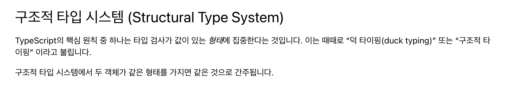

# 4장 객체

객체 리터럴은 각자의 타입이 있는 키와 값의 집합이다.

## 4.1 객체 타입

`{ ... }` 구문을 사용해서 객체 리터럴을 생성하면 타입스크립트는 해당 속성을 기반으로 새로운 객체 타입 또는 타입 형태를 고려한다. 해당 객체 타입은 객체의 값과 동일한 속성명과 원시 타입을 갖는다.

```ts
const poet = {
  born: 1935,
  name: 'Mary Oliver',
};

poet['born']; // number
poet.name; // string

poet.end; // ERROR
```

`null`과 `undefined`를 제외한 모든 값은 그 값에 대한 실제 타입의 멤버 집합을 가지므로 타입스크립트는 모든 값의 타입을 확인하기 위해 객체 타입을 이해해야 한다.

### 4.1.1 객체 타입 선언

객체 타입은 객체 리터럴과 유사하게 보이지만 필드 값 대신 타입을 사용해 설명한다.

```ts
let poetLater: {
  born: number;
  name: string;
};

poetLater = {
  born: 1935,
  name: 'Mary Oliver',
};

poetLater = 'Sappho'; // ERROR
```

### 4.1.2 별칭 객체 타입

타입 별칭을 사용하면 타입스크립트의 할당 가능성 오류 메시지를 조금 더 직접적으로 읽기 쉽게 만드는 이점이 있다.

```ts
type Poet = {
  born: number;
  name: string;
};

let poetLater: Poet;

// OK
poetLater = {
  born: 1935,
  name: 'Sara Teasdale',
};

// ERROR
poetLater = 'Emily Dickinson';
```

## 4.2 구조적 타이핑

타입스크립트의 타입 시스템은 **구조적으로 타입화**되어 있다. 타입을 충족하는 모든 값을 해당 타입의 값으로 사용할 수 있다. 매개변수나 변수가 특정 객체 타입으로 선언되면 타입스크립트에 어떤 객체를 사용하든 해당 속성이 있어야 한다고 말해야 한다.

```ts
type WithFirstName = {
  firstName: string;
};

type WithLastName = {
  lastName: string;
};

const hasBoth = {
  firstName: 'Lucille',
  lastName: 'Clifton',
};

let withFirstName: WithFirstName = hasBoth; // OK

let withLastName: WithLastName = hasBoth; // OK
```

구조적 타이핑은 **덕 타이핑**과 다르다.

- 구조적 타이핑: 타입스크립트의 타입 검사기에서 정적 시스템이 타입을 검사하는 것(타입스크립트)
- 덕 타이핑: 런타임에서 사용될 때까지 객체 타입을 검사하지 않는 것(자바스크립트)

:::note



[타입스크립트 공식 문서](https://www.typescriptlang.org/ko/docs/handbook/typescript-in-5-minutes.html#%EA%B5%AC%EC%A1%B0%EC%A0%81-%ED%83%80%EC%9E%85-%EC%8B%9C%EC%8A%A4%ED%85%9C-structural-type-system)에서는 구조적 타이핑과 덕 타이핑을 구분하지 않는다.

:::

### 4.2.1 사용 검사

객체 타입으로 애너테이션된 위치에 값을 제공할 때 타입스크립트는 값을 해당 객체 타입에 할당할 수 있는지 확인한다.

```ts
type FirstAndLastNames = {
  first: string;
  last: string;
};

// OK
const hasBoth: FirstAndLastNames = {
  first: 'Sarojini',
  last: 'Naidu',
};

const hasOnlyOne: FirstAndLastNames = {
  // ERROR
  first: 'Sappho',
};
```

```ts
type TimeRange = {
  start: Date;
};

const hasStartString: TimeRange = {
  start: '1879-02-13', // ERROR
};
```

### 4.2.2 초과 속성 검사

변수가 객체 타입으로 선언되고 초깃값에 객체 타입에서 정의된 것보다 많은 필드가 있다면 타입스크립트에서 타입 오류가 발생한다. 변수를 객체 타입으로 선언하는 것은 타입 검사기가 해당 타입에 예상되는 필드만 있는지 확인하는 방법이기도 하다.

```ts
type Poet = {
  born: number;
  name: string;
};

// OK
const poetMatch: Poet = {
  born: 1928,
  name: 'Maya Angelou',
};

const extraProperty: Poet = {
  activity: 'walking', // ERROR
  born: 1935,
  name: 'Mary Oliver',
};
```

초과 속성 검사는 객체 타입으로 선언된 위치에서 생성되는 객체 리터럴에 대해서만 일어난다. 기존 객체 리터럴을 제공하면 초과 속성 검사를 우회한다.

```ts
type Poet = {
  born: number;
  name: string;
};

const existingObject = {
  activity: 'walking',
  born: 1935,
  name: 'Mary Oliver',
};

const extraPropertyButOk: Poet = existingObject; // OK
```

### 4.2.3 중첩된 객체 타입

자바스크립트 객체는 다른 객체의 멤버로 중첩될 수 있으므로 타입스크립트의 객체 타입도 타입 시스템에서 중첩된 객체 타입을 나타낼 수 있어야 한다.

```ts
type Poem = {
  author: {
    firstName: string;
    lastName: string;
  };
  name: string;
};

// OK
const poemMatch: Poem = {
  author: {
    firstName: 'Sylvia',
    lastName: 'Plath',
  },
  name: 'Lady Lazarus',
};

const poemMismatch: Poem = {
  author: {
    name: 'Sylvia Plath', // ERROR
  },
  name: 'Tulips',
};
```

중첩된 타입을 자체 타입 별칭으로 추출하면 타입스크립트의 타입 오류 메시지에 더 많은 정보를 담을 수 있다.

```ts
type Author = {
  firstName: string;
  lastName: string;
};

type Poem = {
  author: Author;
  name: string;
};

const poemMismatch2: Poem = {
  author: {
    name: 'Sylvia Plath', //  ERROR
  },
  name: 'Tulips',
};
```

중첩된 객체 타입을 고유한 타입 이름으로 바꿔서 사용하면 코드와 오류 메시지가 더 읽기 쉬워진다.

### 4.2.4 선택적 속성

모든 객체에 객체 타입 속성이 필요한 건 아니다. 타입의 속성 애너테이션에서 `:` 앞에 `?`를 추가하면 선택적 속성임을 나타낼 수 있다.

```ts
type Book = {
  author?: string;
  pages: number;
};

// OK
const ok: Book = {
  author: 'Rita Dove',
  pages: 80,
};

// ERROR
const missing: Book = {
  author: 'Rita Dove',
};
```

선택적 속성과 `undefined`를 포함한 유니언 타입의 속성 사이에는 차이가 있다. `?`를 사용해 선택적으로 선언된 속성은 존재하지 않아도 된다. 필수로 선언된 속성과 `| undefined`는 그 값이 `undefined`일지라도 반드시 존재해야 한다.

```ts
type Writers = {
  author: string | undefined;
  editor?: string;
};

// OK
const hasRequired: Writers = {
  author: undefined,
};

// ERROR
const missingRequired: Writers = {
  // ...
};
```

## 4.3 객체 타입 유니언

### 4.3.1 유추된 객체 타입 유니언

변수에 여러 객체 타입 중 하나가 될 수 있는 초깃값이 주어지면 타입스크립트는 해당 타입을 객체 타입 유니언으로 유추한다. 유니언 타입은 가능한 각 객체 타입을 구성하고 있는 요소를 모두 가질 수 있다. 객체 타입에 정의된 각각의 가능한 속성은 비록 초깃값이 없는 선택적 타입이지만 각 객체 타입의 구성 요소로 주어진다.

```ts
/**
 * 타입
 * { name: string; pages: number; rhymes?: undefined; } | { name: string; pages?: undefined; ryhmes: boolean; }
 */
const poem = Math.random() > 0.5 ? { name: 'The Double Image', pages: 7 } : { name: 'Her Kind', rhymes: true };

poem.name; // string
poem.pages; // number | undefined
poem.rhymes; // booleans | undefined
```

### 4.3.2 명시된 객체 타입 유니언

객체 타입의 조합을 명시하면 객체 타입을 더 명확히 정의할 수 있다. 코드를 조금 더 작성해야 하지만 객체 타입을 더 많이 제어할 수 있다는 이점이 있다. 특히 값의 타입이 객체 타입으로 구성된 유니언이라면 타입스크립트의 타입 시스템은 이런 모든 유니언 타입에 존재하는 속성에 대한 접근만 허용한다.

```ts
type PoemWithPages = {
  name: string;
  pages: number;
};

type PoemWithRhymes = {
  name: string;
  rhymes: boolean;
};

type Poem = PoemWithPages | PoemWithRhymes;

const poem2: Poem = Math.random() > 0.5 ? { name: 'The Double Image', pages: 7 } : { name: 'Her Kind', rhymes: true };

poem2.name; // OK

poem2.pages; // ERROR

poem2.rhymes; // ERROR
```

잠재적으로 존재하지 않는 객체의 멤버에 대한 접근을 제한하면 코드의 안전을 지킬 수 있다. 값이 여러 타입 중 하나일 경우 모든 타입에 존재하지 않는 속성이 객체에 존재할 거라 보장할 수 없다.

리터럴 타입이나 원시 타입 모두 혹은 둘 중 하나로 이루어진 유니언 타입에서 모든 타입에 존재하지 않은 속성에 접근하기 위해 타입을 좁혀야 하는 것처럼 객체 타입 유니언도 타입을 좁혀야 한다.

### 4.3.3 객체 타입 내로잉

타입 검사기가 유니언 타입 값에 특정 속성이 포함된 경우에만 코드 영역을 실행할 수 있음을 알게 되면 값의 타입을 해당 속성을 포함하는 구성 요소로만 좁힌다. 코드에서 객체의 형태를 확인하고 타입 내로잉이 객체에 적용된다.

```ts
type PoemWithPages = {
  name: string;
  pages: number;
};

type PoemWithRhymes = {
  name: string;
  rhymes: boolean;
};

type Poem = PoemWithPages | PoemWithRhymes;

const poem: Poem = Math.random() > 0.5 ? { name: 'The Double Image', pages: 7 } : { name: 'Her Kind', rhymes: true };

if ('pages' in poem) {
  poem.pages; // OK
} else {
  poem.rhymes; // OK
}

// ERROR
if (poem.pages) {
  // ...
}
```

### 4.3.4 판별된 유니언

자바스크립트와 타입스크립트에서 유니언 타입으로 된 객체의 또 다른 인기 있는 형태는 객체의 속성이 객체의 형태를 나타내도록 하는 것이다. 이러한 타입 형태를 **판별된 유니언**이라 부르고, 객체의 타입을 가리키는 속성이 **판별값**이다. 타입스크립트는 코드에서 판별 속성을 사용해 타입 내로잉을 수행한다.

```ts
type PoemWithPages = {
  name: string;
  pages: number;
  type: 'pages';
};

type PoemWithRhymes = {
  name: string;
  rhymes: boolean;
  type: 'rhymes';
};

type Poem = PoemWithPages | PoemWithRhymes;

const poem: Poem =
  Math.random() > 0.5
    ? { name: 'The Double Image', pages: 7, type: 'pages' }
    : { name: 'Her Kind', rhymes: true, type: 'rhymes' };

if (poem.type === 'pages') {
  console.log(`It's got pages: ${poem.pages}`); // OK
} else {
  console.log(`It rhymes: ${poem.rhymes}`);
}

poem.type; // "pages" | "rhymes"

poem.pages; // ERROR
```

## 4.4 교차 타입

**`&` 교차 타입**을 사용해 여러 타입을 동시에 나타낸다. 교차 타입은 일반적으로 여러 기존 객체 타입을 별칭 객체 타입으로 결합해 새로운 타입을 생성한다.

```ts
type Artwork = {
  genre: string;
  name: string;
};

type Writing = {
  pages: number;
  name: string;
};

type WrittenArt = Artwork & Writing;
/**
 *
 * {
 *  genre: string;
 *  name: string;
 *  pages: number;
 * }
 *
 */
```

교차 타입은 유니언 타입과 결합할 수 있다.

```ts
type ShortPoem = { author: string } & ({ kigo: string; type: 'haiku' } | { meter: number; type: 'villanelle' });

const morningGlory: ShortPoem = {
  author: 'Fukuda Choiyo-ni',
  kigo: 'Morning Glory',
  type: 'haiku',
};

const oneArt: ShortPoem = {
  author: 'Elizabeth Bishop',
  type: 'villanella', // ERROR
};
```

### 4.4.1 교차 타입의 위험성

**긴 할당 가능성 오류**

유니언 타입과 결합하는 것처럼 복잡한 교차 타입을 만들면 할당 가능성 오류 메시지는 읽기 어려워진다.

```ts
type ShortPoemBase = { author: string };
type Haiku = ShortPoemBase & { kigo: string; type: 'haiku' };
type Villanelle = ShortPoemBase & { meter: number; type: 'villanelle' };
type ShortPoem = Haiku | Villanelle;

// ERROR
const oneArt: ShortPoem = {
  author: 'Elizabeth Bishop',
  type: 'villanelle',
};
```

**never**

교차 타입은 잘못 사용하기 쉽고 불가능한 타입을 생성한다. 원시 타입의 값은 동시에 여러 타입이 될 수 없기 때문에 교차 타입의 구성 요소로 함께 결합할 수 없다. 두 개의 원시 타입을 함께 시도하면 never 키워드로 표시되는 never 타입이 된다.

```ts
type NotPossible = number & string; // never
```

never 키워드와 never 타입은 프로그래밍 언어에서 bottom 타입 또는 empty 타입을 뜻한다. bottom 타입은 값을 가질 수 없고 참조할 수 없는 타입이므로 bottom 타입에 그 어떠한 타입도 제공할 수 없다.

```ts
type NotPossible = number & string; // never

let notNumber: NotPossible = 0; // ERROR

let notString: never = ''; // ERROR
```

:::note

**실무에서 never 타입을 사용하는 케이스**

- [타입스크립트의 Never 타입 완벽 가이드](https://ui.toast.com/posts/ko_20220323)
- [타입스크립트 타입 never 에 대해 자세히 알아보자](https://yceffort.kr/2022/03/understanding-typescript-never)

:::
