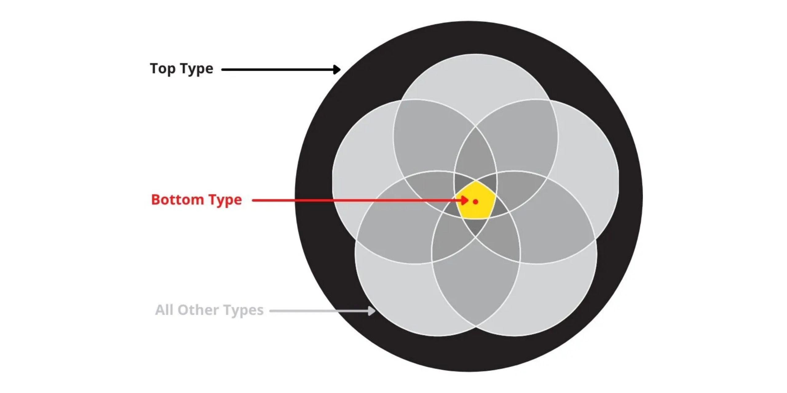

# 9장 타입 제한자

## 9.1 top 타입



top 타입은 시스템에서 가능한 모든 값을 나타낸다. 모든 타입은 top 타입에 할당할 수 있다.

### 9.1.1 any 다시 보기

any 타입은 top 타입처럼 작동할 수 있다. any는 일반적으로 `console.log`의 매개변수와 같이 모든 타입의 데이터를 받는 위치에서 사용한다.

any는 타입스크립트가 해당 값에 대한 할당 가능성 또는 멤버에 대해 타입 검사를 수행하지 않도록 명시적으로 지시하는 문제점을 갖고 있다. 이러한 안정성 부족은 타입 검사기를 건너뛰려고 할 때 유용하지만 타입 검사를 비활성화하면 해당 값에 대한 타입스크립트의 유용성이 줄어든다.

어떤 값이든 될 수 있음을 나타내기 위해서는 unknown 타입이 안전하다.

### 9.1.2 unknown

unknown 타입과 any 타입의 주요 차이점은 unknown 타입의 값을 훨씬 더 제한적으로 취급한다는 점이다.

- 타입스크립트는 unknown 타입 값의 속성에 직접 접근할 수 없다.
- unknown 타입은 top 타입이 아닌 타입에는 할당할 수 없다.

unknown 타입 값의 속성에 접근하려고 시도하면 타입 오류를 보고한다.

```ts
function greetComedian(name: unknown) {
  console.log(`Announcing ${name.toUpperCase()}!`);
  // ERROR: 'name'은(는) 'unknown' 형식입니다.
}
```

unknown 타입인 `name`에 접근할 수 있는 방법은 instanceof, typeof, 타입 어서션을 사용하는 것처럼 값의 타입이 제한된 경우이다.

unknown에서 string으로 타입을 좁히기 위해 typeof를 사용한다.

```ts
function greetComedianSafety(name: unknown) {
  if (typeof name == 'string') {
    console.log(`Announcing ${name.toUpperCase()}!`); // OK
  } else {
    console.log("Well, I'm off.");
  }
}

greetComedianSafety('Betty Whire'); // LOG: "Announcing BETTY WHIRE!"
greetComedianSafety({}); // LOG: "Well, I'm off."
```

## 9.2 타입 서술어

제한된 검사로 instanceof, typeof와 같은 자바스크립트 구문을 사용해 타입을 좁히는 방법을 직접 사용할 때는 괜찮지만 로직을 함수로 감싸면 타입을 좁힐 수 없게 된다.

```ts
function isNumberOrString(value: unknown) {
  return ['number', 'string'].includes(typeof value);
}

function logValueIfExists(value: number | string | null | undefined) {
  if (isNumberOrString(value)) {
    value.toString(); // ERROR: 'value'은(는) 'null' 또는 'undefined'일 수 있습니다.
  } else {
    console.log('Value does not exist: ', value);
  }
}
```

타입스크립트는 `isNumberOrString`이 boolean 값을 반환한다는 사실만 알 수 있고 인수의 타입을 좁히기 위함이라는 건 알 수 없다.

> **타입 서술어(사용자 정의 타입 가드)**: 인수가 특정 타입인지 여부를 나타내기 위해 boolean 값을 반환하는 함수를 위한 구문

타입 서술어는 일반적으로 매개변수로 전달된 인수가 매개변수의 타입보다 더 구체적인 타입인지 여부를 나타낼 때 사용한다. 타입 서술어의 반환 타입은 매개변수의 이름, is 키워드, 특정 타입으로 선언할 수 있다.

```ts
function typePredicate(input: WideType): input is NarrowType {
  // ...
}
```

`isNumberOrString` 함수에서 `value`를 `value is number | string`으로 명시적으로 변경하면 명시적 반환 타입을 가질 수 있다.

```ts
function isNumberOrString(value: unknown): value is number | string {
  return ['number', 'string'].includes(typeof value);
}

function logValueIfExists(value: number | string | null | undefined) {
  if (isNumberOrString2(value)) {
    value.toString(); // value: string | number
  } else {
    console.log('Value does not exist: ', value); // value: null | undefined
  }
}
```

타입 서술어는 한 인터페이스의 인스턴스로 알려진 객체가 더 구체적인 인터페이스의 인스턴스인지 여부를 검사할 때 자주 사용한다.

```ts
interface Comedian {
  funny: boolean;
}

interface StandupComedian extends Comedian {
  routine: string;
}

function isStandupComedian(value: Comedian): value is StandupComedian {
  return 'routine' in value;
}

function workWithComedian(value: Comedian) {
  if (isStandupComedian(value)) {
    console.log(value.routine); // value: StandupComedian
  }

  console.log(value.routine); // ERROR: 'Comedian' 형식에 'routine' 속성이 없습니다.
}
```

`isStandupComedian` 타입 가드는 `Comedian`이 구체적으로 `StandupComedian`인지 여부를 확인할 때 사용한다.

타입 서술어는 false 조건에서 타입을 좁히기 때문에 타입 서술어가 입력된 타입 이상을 검사하는 경우 예상치 못한 결과를 얻을 수 있다.

```ts
function isLongString(input: string | undefined): input is string {
  return !!(input && 7 <= input.length);
}

function workWithText(text: string | undefined) {
  if (isLongString(text)) {
    console.log('Long text: ', text.length); // text: string
  } else {
    console.log('Short text: ', text?.length); // ERROR: 'never' 형식에 'length' 속성이 없습니다.
  }
}
```

`isLongString` 타입 서술어는 `input` 매개변수가 undefined 또는 길이가 7보다 작은 string인 경우 false를 반환한다. else 문(false 조건)은 `text`를 undefined 타입으로 좁힌다.

타입 서술어는 속성이나 값의 타입을 확인하는 것 이상을 수행해 잘못 사용하기 쉬우므로 가능하면 피하는 것이 좋다. 대부분은 간단한 타입 서술어만으로도 충분하다.

## 9.3 타입 연산자

### 9.3.1 keyof

자바스크립트 객체는 일반적으로 string 타입인 동적값을 사용하여 검색된 멤버를 갖는다. string 같은 포괄적인 원시 타입을 사용하면 컨테이너 값에 대해 유효하지 않은 키가 허용된다.

```ts
interface Ratings {
  audience: number;
  critics: number;
}

function getRating(ratings: Ratings, key: string): number {
  return ratings[key];
  // ERRPR: 'string' 형식의 식을 'Ratings' 인덱스 형식에 사용할 수 없으므로 요소에 암시적으로 'any' 형식이 있습니다.
  // 'Ratings' 형식에서 'string' 형식의 매개 변수가 포함된 인덱스 시그니처를 찾을 수 없습니다.
}

const ratings: Ratings = { audience: 66, critics: 84 };

getRating(ratings, 'audience'); // OK
getRating(ratings, 'not valid'); // 허용되지만 사용하면 안 됨
```

타입 string은 `Ratings` 인터페이스에서 속성으로 허용되지 않는 값을 허용하고 `Ratings`는 string 키를 허용하는 인덱스 시그니처를 선언하지 않는다.

다른 옵션은 허용되는 키를 위한 리터럴 유니언 타입을 사용하는 것이다. 컨테이너 값에 존재하는 키만 적절하게 제한하는 것이 더 정확하다.

```ts
interface Ratings {
  audience: number;
  critics: number;
}

function getRating(ratings: Ratings, key: 'audience' | 'critics'): number {
  return ratings[key]; // OK
}

const ratings: Ratings = { audience: 66, critics: 84 };

getRating(ratings, 'audience'); // OK
getRating(ratings, 'not valid'); // ERROR: '"not valid"' 형식의 인수는 '"audience" | "critics"' 형식의 매개 변수에 할당될 수 없습니다.
```

인터페이스에 수십 개 이상의 멤버가 있다면 모두 입력하고 유지하기는 번거로울 수 있다.

> **keyof**: 기존에 존재하는 타입을 사용하고 해당 타입에 허용되는 모든 키의 조합을 반환하는 연산자

```ts
interface Ratings {
  audience: number;
  critics: number;
}

function getCountKeyof(ratings: Ratings, key: keyof Ratings): number {
  return ratings[key]; // OK
}

const ratings: Ratings = { audience: 66, critics: 84 };

getCountKeyof(ratings, 'audience'); // OK
getCountKeyof(ratings, 'not valid'); // ERROR: '"not valid"' 형식의 인수는 'keyof Ratings' 형식의 매개 변수에 할당될 수 없습니다.
```

keyof는 존재하는 타입의 키를 바탕으로 유니언 타입을 생성하는 기능이다.

### 9.3.2 typeof

> **typeof**: 제공되는 값의 타입을 반환하는 연산자

값의 타입을 수동으로 작성하는 것이 복잡할 때 사용하면 유용하다.

typeof 타입 연산자는 시각적으로 주어진 값이 어떤 타입인지를 반환할 때 사용하는 런타임 typeof 연산자처럼 보이지만 이 둘은 차이가 있다.

- 자바스크립트 typeof: 타입에 대한 문자열 이름을 반환하는 런타임 연산자
- 타입스크립트 typeof: 타입스크립트에서만 사용할 수 있으며 컴파일된 자바스크립트 코드에는 나타나지 않음

```ts
const ratings = {
  imdb: 8.4,
  metacritic: 82,
};

function logRating(key: keyof typeof ratings) {
  console.log(ratings[key]);
}

logRating('imdb'); // OK

logRating('invalid'); // ERROR: '"invalid"' 형식의 인수는 '"imdb" | "metacritic"' 형식의 매개 변수에 할당될 수 없습니다.
```

`logRating` 함수는 `ratings` 값의 키 중 하나를 받는다. 인터페이스를 생성하는 것 대신 keyof typeof를 사용해서 키가 `ratings` 값 타입의 키 중 하나임을 나타낸다.

## 9.4 타입 어서션

> **타입 어서션(타입 캐스트)**: 값의 타입에 대한 타입 시스템의 이해를 재정의하기 위한 구문

다른 타입을 의미하는 값의 타입 다음에 as 키워드를 배치한다.

```ts
const rawData = '["grace", "frankie"]';

JSON.parse(rawData);

JSON.parse(rawData) as string[];

JSON.parse(rawData) as [string, string];

JSON.parse(rawData) as ['grace', 'frankie'];
```

타입 어서션은 타입스크립트 타입 시스템에만 존재하며 자바스크립트로 컴파일될 때 다른 타입 시스템 구문과 함께 제거된다.

타입스크립트 모범 사례는 가능한 타입 어서션을 사용하지 않는 것이다. 코드가 완전히 타입화되고 어서션을 사용해 타입스크립트의 타입 이해를 방해할 필요가 없는 것이 가장 좋다. 그러나 타입 어서션이 유용하고 심지어 필요한 경우가 종종 있다.

### 9.4.1 포착된 오류 타입 어서션

try 블록의 코드가 예상과 다른 객체를 예기치 않게 발생할 수 있어서 catch 블록에서 포착된 오류가 어떤 타입인지 아는 것은 일반적으로 불가능하다. 자바스크립트의 모범 사례는 항상 Error 클래스의 인스턴스를 발생시키지만 일부 프로젝트에서는 문자열 리터럴 또는 다른 의외의 값을 발생시키기도 한다.

Error 클래스의 인스턴스를 발생시킬 거라 틀림없이 확신하면 타입 어서션을 사용해 포착된 어서션을 오류로 처리할 수 있다.

```ts
try {
  // 오류를 발생시키는 코드
} catch (error) {
  console.warn((error as Error).message);
}
```

발생된 오류가 예상된 오류 타입인지 확인하기 위해 instanceof 검사와 같은 타입 내로잉을 사용하는 것이 더 안전하다.

```ts
try {
  // 오류를 발생시키는 코드
} catch (error) {
  console.warn(error instanceof Error ? error.message : error);
}
```

catch 블록에서 발생한 error가 Error 클래스의 인스턴스인지를 검사해 콘솔에 Error의 message를 출력할지 error 자체를 출력할지 여부를 확인한다.

### 9.4.2 non-null 어서션

non-null 어서션은 타입이 null 또는 undefined가 아니라고 간주한다.

```ts
let maybeDate = Math.random() > 0.5 ? undefined : new Date(); // maybeDate: Date | undefined

maybeDate as Date; // maybeDate: Date | undefined

maybeDate!; // maybeDate: Date | undefined
```

non-null 어서션은 값을 반환하거나 존재하지 않는 경우 undefined를 반환하는 Map.get과 같은 API에서 유용하다.

### 9.4.3 타입 어서션 주의 사항

타입 시스템에 필요한 하나의 도피 수단이다. 가능한 한 사용하지 않는 것을 권장한다. 값의 타입에 대해 더 쉽게 어서션하는 것보다 코드를 나타내는 더 정확한 타입을 갖는 것이 좋다.

**어서션 vs 선언**

변수 타입을 선언하기 위해 타입 애너테이션을 사용하는 것과 초깃값으로 변수 타입을 변경하기 위해 타입 어서션을 사용하는 것 사이에는 차이가 있다. 변수의 타입 애너테이션과 초깃값이 모두 있을 때 타입스크립트의 타입 검사기는 변수의 타입 애너테이션에 대한 변수의 초깃값에 대해 할당 가능성 검사를 수행한다. 그러나 타입 어서션은 타입스크립트에 타입 검사 중 일부를 건너뛰도록 명시적으로 지시한다.

```ts
interface Entertainer {
  acts: string[];
  name: string;
}

const declared: Entertainer = {
  // ERROR: 'acts' 속성이 '{ name: string; }' 형식에 없지만 'Entertainer' 형식에서 필수입니다.
  name: 'Moms Mabley',
};

const asserted = {
  name: 'Moms Mabley',
} as Entertainer; // 런타임 오류 발생

// 런타임 오류: Cannot read properties of undefined (reading 'join')
console.log(declared.acts.join(', '));
console.log(asserted.acts.join(', '));
```

**어서션 할당 가능성**

타입 중 하나가 다른 타입에 할당 가능한 경우에만 두 타입 간의 타입 어서션을 허용한다. 완전히 서로 관련이 없는 두 타입 사이에 타입 어서션이 있는 경우 타입스크립트가 타입 오류를 감지하고 알려준다.

```ts
let myValue = 'Stella!' as number;
// ERROR: 'string' 형식을 'number' 형식으로 변환한 작업은 실수일 수 있습니다. 두 형식이 서로 충분히 겹치지 않기 때문입니다. 의도적으로 변환한 경우에는 먼저 'unknown'으로 식을 변환합니다.
```

하나의 타입에서 값을 완전히 관련 없는 타입으로 전환해야 하는 경우 이중 타입 어서션을 사용한다. 먼저 값을 any나 unknown 같은 top 타입으로 전환하고 그 결과를 관련 없는 타입으로 전환한다.

```ts
let myValueDouble = '1337' as unknown as number; // 허용하지만 이렇게 사용하면 안 됨
```

## 9.5 const 어서션

const 어서션은 배열, 원시 타입, 값, 별칭 등 모든 값을 상수로 취급해야 함을 나타내는 데 사용한다. as const는 수신하는 모든 타입에 다음 세 가지 규칙을 적용한다.

- 배열은 가변 배열이 아니라 읽기 전용 튜플로 취급된다.
- 리터럴은 일반적인 원시 타입과 동등하지 않고 리터럴로 취급된다.
- 객체의 속성은 읽기 전용으로 간주된다.

```ts
const arr = [0, '']; // (number | string)[]
```

```ts
const arr = [0, ''] as const; // readonly [0, ""]
```

### 9.5.1 리터럴에서 원시 타입으로

튜플을 반환하는 함수처럼 일반적인 원시 타입 대신 특정 리터럴을 생성한다고 알려진 함수에서 유용할 수 있다.

```ts
const getName = () => 'Maria Bamford'; // () => string

const getNameConst = () => 'Maria Bamford' as const; // () => "Maria Bamford"
```

### 9.5.2 읽기 전용 객체

변수의 초깃값으로 사용되는 것과 같은 객체 리터럴은 let 변수의 초깃값이 확장되는 것과 동일한 방식으로 속성 타입을 확장한다. 값의 일부 또는 전체를 나중에 특정 리터럴 타입이 필요한 위치에서 사용해야 할 때 잘 맞지 않을 수 있다.

as const를 사용해 값 리터럴을 어서션하면 유추된 타입이 가능한 한 구체적으로 전환된다. 모든 멤버 속성은 readonly가 되고 리터럴은 일반적인 원시 타입 대신 고유한 리터럴 타입으로 간주되며 배열은 읽기 전용 튜플이 된다. 값 리터럴에 const 어서션을 적용하면 해당 값 리터럴로 변경되지 않고 모든 멤버에 동일한 const 어서션 로직이 재귀적으로 적용된다.

```ts
function describePreference(preference: 'maybe' | 'no' | 'yes') {
  switch (preference) {
    case 'maybe':
      return 'I suppose...';
    case 'no':
      return 'No thanks.';
    case 'yes':
      return 'Yes please!';
  }
}

const preferencesMutable = {
  movie: 'maybe',
  standup: 'yes',
};

describePreference(preferencesMutable.movie);
// ERROR: 'string' 형식의 인수는 '"maybe" | "no" | "yes"' 형식의 매개 변수에 할당될 수 없습니다.

preferencesMutable.movie = 'no'; // OK

const preferencesReadonly = {
  movie: 'maybe',
  standup: 'yes',
} as const;

describePreference(preferencesReadonly.movie); // OK

preferencesReadonly.movie = 'no';
// ERROR: 읽기 전용 속성이므로 'movie'에 할당할 수 없습니다.
```

---

추가 참고 자료 📩

- [TypeScript Top Types. In mathematical logic, a top type is… | by Nupur Kinger | EQS Engineering Blog | Medium](https://medium.com/eqs-tech-blog/typescript-top-types-db174c0bc668)
