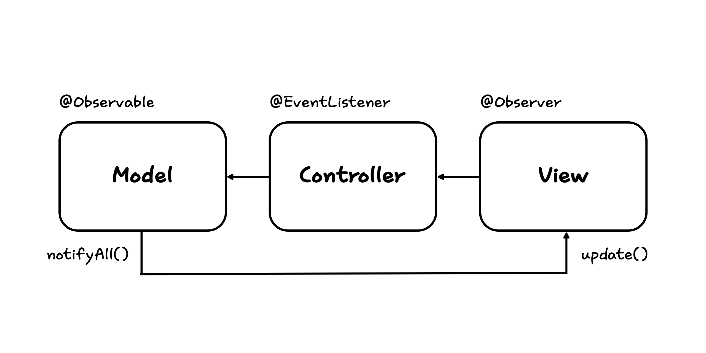
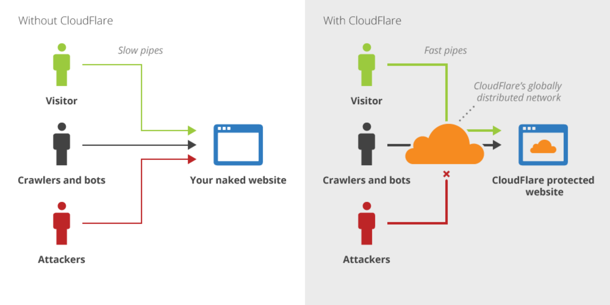
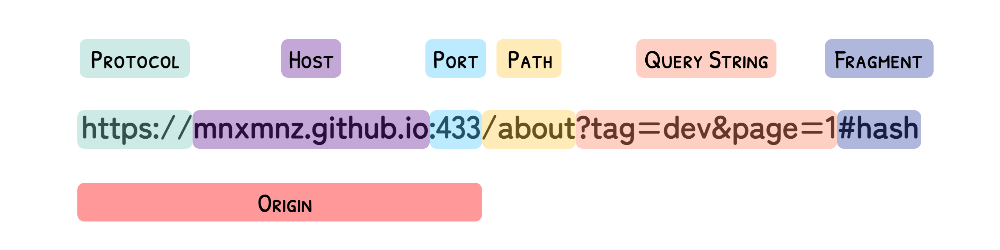

# 1장 디자인 패턴과 프로그래밍 패러다임

## 1.1 디자인 패턴

디자인 패턴이란 프로그램을 설계할 때 발생했던 문제점을 객체 간의 상호 관계 등을 이용하여 해결할 수 있도록 하나의 '규약' 형태로 만들어 놓은 것을 의미합니다.

### 1.1.1 싱글톤 패턴

싱글톤 패턴은 하나의 클래스에 오직 하나의 인스턴스만 가지는 패턴입니다. 데이터베이스 연결 모듈에 많이 쓰입니다. 하나의 인스턴스를 만들고 해당 인스턴스를 다른 모듈이 공유하며 사용하기 때문에 인스턴스를 생성할 때 드는 비용이 줄어드는 장점이 있습니다. 하지만 의존성이 높아진다는 단점이 있습니다.

리터럴 `{}` 또는 `new Object` 로 객체를 생성하면 다른 어떤 객체와도 같지 않기 때문에 이 자체만으로 싱글톤 패턴을 구현할 수 있습니다.

```js
const obj1 = { a: 27 };
const obj2 = { a: 27 };

console.log(obj1 === obj2); // false
```

실제 싱글톤 패턴은 다음과 같은 코드로 구성됩니다.

```js
class Singleton {
  constructor() {
    if (!Singleton.instance) {
      Singleton.instance = this;
    }
    return Singleton.instance;
  }

  getInstance() {
    return this.instance;
  }
}

const a = new Singleton();
const b = new Singleton();

console.log(a === b); // true
```

`Singleton.instance` 라는 하나의 인스턴스를 가지는 `Singleton` 클래스를 구현한 모습입니다.

#### 1.1.1.1 싱글톤 패턴의 단점

싱글톤 패턴은 TDD를 할 때 걸림돌이 됩니다. TDD를 할 때 주로 단위 테스트를 하는데, 단위 테스트는 테스트가 서로 독립적이어야 하며 테스트를 어떤 순서로든 실행할 수 있어야 합니다.

하지만 싱글톤 패턴은 미리 생성된 하나의 인스턴스를 기반으로 구현하는 패턴이므로 테스트마다 '독립적인' 인스턴스를 만들기 어렵습니다.

#### 1.1.1.2 의존성 주입

싱글톤 패턴은 사용하기가 쉽고 굉장히 실용적이지만 모듈 간의 결합을 강하게 만들 수 있다는 단점이 있습니다. 이때 의존성 주입(DI, Dependency Injection)을 통해 모듈 간의 결합을 조금 느슨하게 만들어 해결할 수 있습니다.

메인 모듈이 다른 하위 모듈에 대한 의존성을 '직접' 주지 않고 '간접'적으로 주입하는 방식입니다. 이를 통해 메인 모듈은 하위 모듈에 대한 의존성이 떨어지게 됩니다. 참고로 이를 '디커플링 된다'라고도 합니다.

#### 1.1.1.3 의존성 주입의 장점

모듈을 쉽게 교체할 수 있는 구조가 되어 테스팅과 마이그레이션을 진행하기 수월해집니다. 또한, 구현할 때 추상화 레이어를 넣고 이를 기반으로 구현체를 넣어 주기 때문에 애플리케이션 의존성 방향이 일관되고, 애플리케이션을 쉽게 추론할 수 있으며, 모듈 간의 관계들이 조금 더 명확해집니다.

#### 1.1.1.4 의존성 주입의 단점

모듈이 더욱 분리되므로 클래스 수가 늘어나 복잡성이 증가할 수 있으며 런타임 페널티가 생기기도 합니다.

#### 1.1.1.5 의존성 주입 원칙

상위 모듈은 하위 모듈에서 어떠한 것도 가져오지 않아야 합니다. 또한, 둘 다 추상화에 의존해야 하며, 이때 추상화는 세부 사항에 의존하지 말아야 합니다.

### 1.1.2 팩토리 패턴

팩토리 패턴은 객체를 사용하는 코드에서 객체 생성 부분을 떼어내 추상화한 패턴이자 상속 관계에 있는 두 클래스에서 상위 클래스가 중요한 뼈대를 결정하고, 하위 클래스에서 객체 생성에 관한 구체적인 내용을 결정하는 패턴입니다.

상위 클래스와 하위 클래스가 분리되어 있기 때문에 느슨한 결합 상태를 가지며 상위 클래스는 더 많은 유연성을 갖게 됩니다. 객체 생성 로직이 분리되어 있어 리팩토링할 때 유지보수성이 증가합니다.

#### 1.1.2.1 자바스크립트의 팩토리 패턴

자바스크립트에서 팩토리 패턴을 구현한다면 간단하게 `new Object()` 로 구현할 수 있습니다.

```js
const num = new Object(42);
const str = new Object('abc');

num.constructor.name; // Number
str.constructor.name; // String
```

숫자를 전달하거나 문자열을 전달함에 따라 다른 타입의 객체를 생성하는 것을 볼 수 있습니다. 즉, 전달받은 값에 따라 다른 객체를 생성하며 인스턴스의 타입 등을 정합니다.

### 1.1.3 전략 패턴

전략 패턴은 정책 패턴이라고도 하며, 객체의 행위를 바꾸고 싶은 경우 직접 수정하지 않고 캡슐화한 알고리즘을 맥락 안에서 바꿔주면서 상호 교체가 가능하게 만드는 패턴입니다.

### 1.1.4 옵저버 패턴

옵저버 패턴에서는 주체가 특정 객체의 상태 변화를 관찰합니다. 변화가 발생하면 메서드 등을 통해 옵저버 목록에 있는 옵저버에게 변화를 공지합니다. 여기서 주체란 객체의 상태 변화를 보고 있는 관찰자입니다. 옵저버란 객체의 상태 변화에 따라 전달되는 메서드 등을 기반으로 추가 변경 사항이 생기는 객체를 의미합니다. 또한, 주체와 객체를 따로 설정하지 않고 상태가 변경되는 객체를 기반으로 구축하기도 합니다.



옵저버 패턴은 주로 이벤트 기반 시스템에 사용하며 MVC(Model-View-Controller) 패턴에도 사용됩니다.

주체라고 볼 수 있는 모델에서 변경 사항이 생기면 `update()` 메서드로 옵저버인 뷰에 알려주고 이를 기반으로 컨트롤러 등이 작동합니다.

옵저버 패턴은 프록시 객체를 통해 구현할 수 있습니다.

<details>

<summary>프록시 객체</summary>

프록시(proxy) 객체는 어떠한 대상의 기본적인 동작(속성 접근, 할당, 순회, 열거, 함수 호출 등)의 작업을 가로챌 수 있는 객체를 뜻하며, 자바스크립트에서 프록시 객체는 두 개의 매개변수를 가진다.

- **target**: 프록시할 대상
- **handler**: 프록시 객체의 target 동작을 가로채서 정의할 동작이 정해져 있는 함수

</details>

### 1.1.5 프록시 패턴과 프록시 서버

#### 1.1.5.1 프록시 패턴

프록시 패턴은 대상 객체에 접근하기 전 그 접근에 대한 흐름을 가로채 대상 객체 앞단의 인터페이스 역할을 하는 디자인 패턴입니다.

이를 통해 객체의 속성, 변환 등을 보완하며 보안, 데이터 검증, 캐싱, 로깅에 사용합니다. 이는 앞서 설명한 프록시 객체로 쓰이기도 하지만 프록시 서버로도 활용됩니다.

<details>

<summary>프록시 서버에서의 캐싱</summary>

캐시 안에 정보를 담아두고, 캐시 안에 있는 정보를 요구하는 요청에 대해 다시 원격 서버에 요청하지 않고 캐시 안에 있는 데이터를 활용하는 것을 말한다. 불필요한 외부 연결을 하지 않아 트래픽을 줄일 수 있다는 장점이 있다.

</details>

#### 1.1.5.2 프록시 서버

프록시 서버는 서버와 클라이언트 사이에서 클라이언트가 자신을 통해 다른 네트워크 서비스에 간접적으로 접속할 수 있게 해주는 컴퓨터 시스템이나 응용 프로그램을 가리킵니다.

##### 1.1.5.2.1 프록시 서버로 쓰는 Nginx

Nginx는 비동기 이벤트 기반의 구조와 다수의 연결을 효과적으로 처리 가능한 웹 서버이며, 주로 Node.js 서버 앞단의 프록시 서버로 활용됩니다.

Node.js의 창시자 라이언 달(Ryan Dahl)은 다음과 같이 말했습니다. "Node.js의 버퍼 오버플로우 취약점을 예방하기 위해서는 Nginx를 프록시 서버로 앞단에 놓고 Node.js를 뒤쪽에 놓는 것이 좋다."

이러한 말은 Node.js 서버를 운영할 때 교과서처럼 참고되고 있습니다. Node.js 서버를 구축할 때 앞단에 Nginx를 두는 것입니다. 이를 통해 익명 사용자의 직접적인 서버로의 접근을 차단하고 간접적으로 한 단계를 더 거침으로써 보안성을 더욱 강화할 수 있습니다. 실제 포트를 숨길 수 있고 정적 자원을 gzip 압축할 수 있습니다.

<details>

<summary>버퍼 오버플로우</summary>

버퍼는 데이터가 저장되는 메모리 공간으로, 버퍼 오버플로우는 메모리 공간을 벗어나는 경우를 말한다. 이때 사용되지 않아야 할 영역에 데이터가 덮어씌워져 주소, 값을 바꾸는 공격이 발생하기도 한다.

</details>

<details>

<summary>gzip 압축</summary>

LZ77과 Huffman 코딩의 조합인 DEFLATE 알고리즘을 기반으로 한 압축 기술이다. gzip 압축하면 데이터 전송량을 줄일 수 있지만, 압축을 해제했을 때 서버에서의 CPU 오버헤드도 고려해서 gzip 압축 사용 유무를 결정해야 한다.

</details>

##### 1.1.5.2.2 프록시 서버로 쓰는 CloudFlare

CloudFlare는 전 세계적으로 분산된 서버가 있고 이를 통해 어떠한 시스템의 콘텐츠 전달을 빠르게 할 수 있는 CDN 서비스입니다.

CDN 이외에도 CloudFlare를 통해 누릴 수 있는 이점은 많습니다. 대표적으로 DDOS 공격 방어, HTTPS 구축이 있습니다. 이 모든 것은 웹 서버 앞단에 두어 프록시 서버로 사용하기 때문에 가능한 것입니다.



사용자, 크롤러와 봇, 공격자가 웹 사이트를 접속할 때 CloudFlare를 통해 공격자로부터 보호할 수 있습니다.

> DDOS 공격 방어

- DDOS는 짧은 기간 동안 네트워크에 많은 요청을 보내 네트워크를 마비시켜 웹 사이트의 가용성을 방해하는 사이버 공격 유형입니다. CloudFlare는 의심스러운 트래픽, 특히 사용자가 접속하는 것이 아닌 시스템을 통해 오는 트래픽을 자동으로 차단해서 DDOS 공격으로부터 보호합니다. CloudFlare의 거대한 네트워크 용량과 캐싱 전략으로 소규모 DDOS 공격은 쉽게 막아낼 수 있으며 이러한 공격에 대한 방화벽 대시보드도 제공합니다.

> HTTPS 구축

- 서버에서 HTTPS를 구축할 때 인증서를 기반으로 구축할 수 있습니다. 하지만 CloudFlare를 사용하면 별도의 인증서 설치 없이 손쉽게 HTTPS를 구축할 수 있습니다.

<details>

<summary>CDN(Content Delivery Network)</summary>

각 사용자가 인터넷에 접속하는 곳과 가까운 곳에서 콘텐츠를 캐싱 또는 배포하는 서버 네트워크를 말한다. 이를 통해 사용자가 웹 서버로부터 콘텐츠를 다운로드하는 시간을 줄일 수 있다.

</details>

##### 1.1.5.2.3 CORS와 프론트엔드의 프록시 서버

CORS(Cross-Origin Resource Sharing)는 서버가 웹 브라우저에서 리소스를 로드할 때 다른 Origin을 통해 로드하지 못하게 하는 HTTP 헤더 기반 메커니즘입니다.

프론트엔드를 개발하며 서버와 통신할 때 주로 CORS 에러를 마주치는데, 이를 해결하기 위해 프론트엔드에서 프록시 서버를 만들기도 합니다.

<details>

<summary>Origin</summary>



프로토콜과 호스트 이름, 포트의 조합을 말한다.

</details>

### 1.1.6 이터레이터 패턴

### 1.1.7 노출모듈 패턴

### 1.1.8 MVC 패턴

### 1.1.9 MVP 패턴

### 1.1.10 MVVM 패턴

## 1.2 프로그래밍 패러다임

### 1.2.1 선언형과 함수형 프로그래밍

### 1.2.2 객체지향 프로그래밍

### 1.2.3 절차형 프로그래밍

### 1.2.4 패러다임의 혼합

<br />

<hr />

사진 출처 📷

- [Cloudflare - Help Center](https://servebolt.com/help/feature/cloudflare-support)
