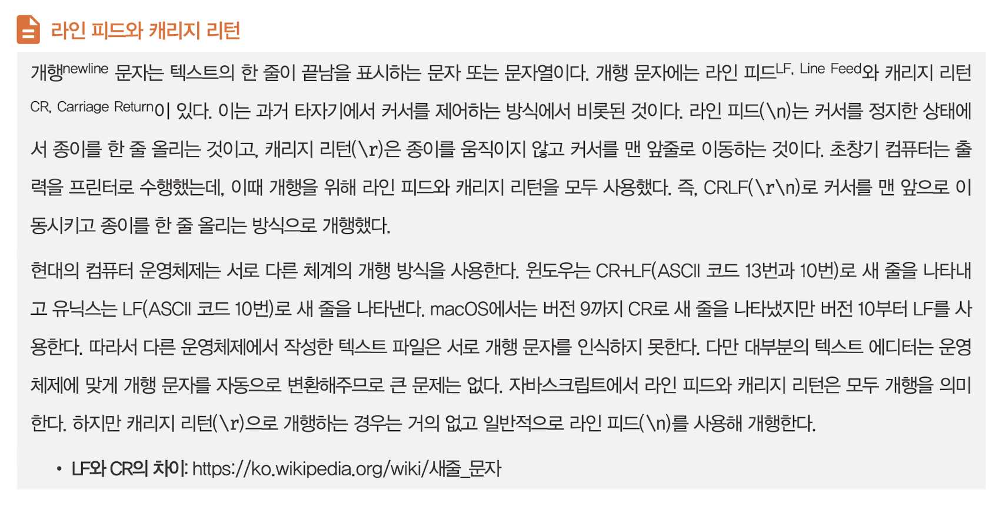
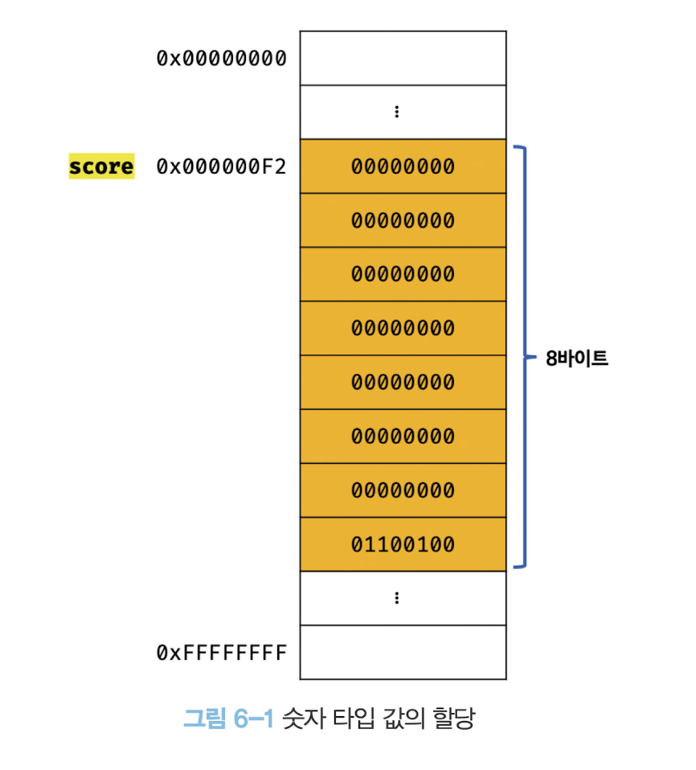
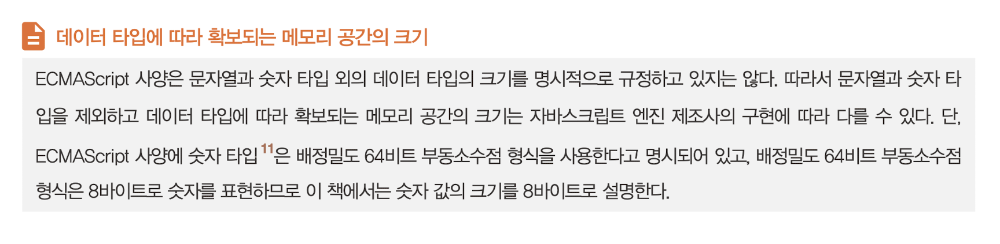

# 6장 데이터 타입

자바스크립트(ES6)는 7개의 데이터 타입을 제공한다.


## 6.1 숫자 타입

ECMAScript 사양에 따르면 숫자 타입의 값은 배정밀도 64비트 부동소수점 형식을 따른다. 즉, 모든 수를 실수로 처리하며, 정수만 표현하기 위한 데이터 타입이 별도로 존재하지 않는다.

```js
var binary = 0b01000001; // 2진수
var octal = 0o101; // 8진수
var hex = 0x41; // 16진수

// 표기법만 다를 뿐 모두 같은 값이다.
console.log(binary); // 65
console.log(octal); // 65
console.log(hex); // 65
console.log(binary === octal); // true
console.log(octal === hex); // true
```

```js
// 숫자 타입은 모두 실수로 처리된다.
console.log(1 === 1.0); // true
console.log(4 / 2); // 2
console.log(3 / 2); // 1.5
```

```js
// 숫자 타입의 세 가지 특별한 값
console.log(10 / 0); // Infinity
console.log(10 / -0); // -Infinity
console.log(1 * 'String'); // NaN
```

## 6.2 문자열 타입

문자열은 0개 이상의 16비트 유니코드 문자의 집합으로 전 세계 대부분의 문자를 표현할 수 있다.

자바스크립트의 문자열은 원시 타입이며, 변경 불가능한 값이다. 이것은 문자열이 생성되면 그 문자열을 변경할 수 없다는 것을 의미한다.

## 6.3 템플릿 리터럴

템플릿 리터럴은 멀티라인 문자열, 표현식 삽입, 태그드 템플릿 등 편리한 문자열 처리 기능을 제공한다. 템플릿 리터럴은 런타임에 일반 문자열로 변환되어 처리된다.



### 6.3.1 멀티라인 문자열

일반 문자열과 달리 템플릿 리터럴 내에서는 이스케이프 시퀀스를 사용하지 않고도 줄바꿈이 허용되며, 모든 공백도 있는 그대로 적용된다.

### 6.3.2 표현식 삽입

```js
var first = 'Ung-mo';
var last = 'Lee';

// ES6: 표현식 삽입
console.log(`My name is ${first} ${last}.`); // My name is Ung-mo Lee.
```

## 6.4 불리언 타입

```js
var foo = true;
console.log(foo); // true

foo = false;
console.log(foo); // false
```

## 6.5 undefined 타입

`undefined`는 개발자가 의도적으로 할당하기 위한 값이 아니라 자바스크립트 엔진이 변수를 초기화 할 때 사용하는 값이다. 변수를 참조했을 때 `undefined`가 반환된다면 참조한 변수가 선언 이후 값이 할당된 적이 없는, 즉 초기화되지 않은 변수라는 것이다.

자바스크립트 엔진이 변수를 초기화하는 데 사용하는 `undefined`를 개발자가 의도적으로 변수에 할당한다면 `undefined`의 본래 취지와 어긋날뿐더러 혼란을 줄 수 있으므로 권장하지 않는다.

변수에 값이 없다는 것을 명시하고 싶을 때는 어떻게 하면 좋을까? 그런 경우에는 `undefined`를 할당하는 것이 아니라 `null`을 할당한다.


## 6.6 null 타입

프로그래밍 언어에서 `null`은 변수에 값이 없다는 것을 의도적으로 명시할 때 사용한다. 변수에 `null`을 할당하는 것은 변수가 이전에 참조하던 값을 더 이상 참조하지 않겠다는 의미다. 이는 이전에 할당되어 있던 값에 대한 참조를 명시적으로 제거하는 것을 의미하며, 자바스크립트 엔진은 누구도 참조하지 않는 메모리 공간에 대해 가비지 콜렉션을 수행할 것이다.

```js
var foo = 'Lee';

// 이전에 할당되어 있던 값에 대한 참조를 제거. foo 변수는 더 이상 'Lee'를 참조하지 않는다.
// 유용해 보이지는 않는다. 변수의 스코프를 좁게 만들어 변수 자체를 재빨리 소멸시키는 편이 낫다.
foo = null;
```

함수가 유효한 값을 반환할 수 없는 경우 명시적으로 `null`을 반환하기도 한다. 예를 들어, HTML 요소를 검색해 반환하는 `document.querySelector` 메서드는 조건에 부합하는 HTML 요소를 검색할 수 없는 경우 에러 대신 `null`을 반환한다.

## 6.7 심벌 타입

심벌은 ES6에서 추가된 7번째 타입으로, 변경 불가능한 원시 타입의 값이다. 심벌 값은 다른 값과 중복되지 않는 유일무이한 값이다. 따라서 주로 이름이 충돌할 위험이 없는 객체의 유일한 프로퍼티 키를 만들기 위해 사용한다.

심벌 이외의 원시 값은 리터럴을 통해 생성하지만 심벌은 `Symbol` 함수를 호출해 생성한다. 이때 생성된 심벌 값은 외부에 노출되지 않으며, 다른 값과 절대 중복되지 않는 유일무이한 값이다.

```js
// 심벌 값 생성
var key = Symbol('key');
console.log(typeof key); // symbol

// 객체 생성
var obj = {};

// 이름이 충돌할 위험이 없는 유일무이한 값인 심벌을 프로퍼티 키로 사용한다.
obj[key] = 'value';
console.log(obj[key]); // value
```

## 6.8 객체 타입

자바스크립트는 객체 기반의 언어이며, **자바스크립트를 이루고 있는 거의 모든 것은 객체**이다.

## 6.9 데이터 타입의 필요성

### 6.9.1 데이터 타입에 의한 메모리 공간의 확보와 참조

자바스크립트 엔진은 데이터 타입, 즉 값의 종류에 따라 정해진 크기의 메모리 공간을 확보한다. 즉, 변수에 할당되는 값의 데이터 타입에 따라 확보해야 할 메모리 공간의 크기가 결정된다.



자바스크립트는 숫자 타입의 값을 생성할 때 배정밀도 64비트 부동소수점 형식을 사용한다. 따라서 실제로 메모리에 저장되는 2진수 값은 위 그림과 다르다.



값을 참조하려면 한 번에 읽어 들여야 할 메모리 공간의 크기, 즉 메모리 셀의 개수(바이트 수)를 알아야 한다. `score` 변수의 경우, 저장되어 있는 값이 숫자 타입이므로 8바이트 단위로 읽어 들이지 않으면 값이 훼손된다.

`score` 변수에는 숫자 타입의 값이 할당되어 있으므로 자바스크립트 엔진은 `score` 변수를 숫자 타입으로 인식한다. 숫자 타입은 8바이트 단위로 저장되므로 `score` 변수를 참조하면 8바이트 단위로 메모리 공간에 저장된 값을 읽어 들인다.


### 6.9.2 데이터 타입에 의한 값의 해석

데이터 타입이 필요한 이유는 다음과 같다.

- 값을 저장할 때 확보해야 하는 **메모리 공간의 크기**를 결정하기 위해
- 값을 참조할 때 한 번에 읽어 들여야 할 **메모리 공간의 크기**를 결정하기 위해
- 메모리에서 읽어 들인 **2진수를 어떻게 해석**할지 결정하기 위해

## 6.10 동적 타이핑

### 6.10.1 동적 타입 언어와 정적 타입 언어

**정적 타입 언어**는 변수를 선언할 때 변수에 할당할 수 있는 값의 종류, 즉 데이터 타입을 사전에 선언해야 한다. 이를 명시적 타입 선언이라 한다. 정적 타입 언어는 변수의 타입을 변경할 수 없으며, 변수에 선언한 타입에 맞는 값만 할당할 수 있다. 정적 타입 언어는 컴파일 시점에 **타입 체크**를 수행한다. 만약 타입 체크를 통과하지 못했다면 에러를 발생시키고 프로그램의 실행 자체를 막는다. 이를 통해 타입의 일관성을 강제함으로써 더욱 안정적인 코드의 구현을 통해 런타임에 발생하는 에러를 줄인다.

자바스크립트는 정적 타입 언어와 다르게 변수를 선언할 때 타입을 선언하지 않는다. 자바스크립트의 변수는 어떠한 데이터 타입의 값이라도 자유롭게 할당할 수 있다.

자바스크립트의 변수에는 어떤 데이터 타입의 값이라도 자유롭게 할당할 수 있으므로 정적 타입 언어에서 말하는 데이터 타입과 개념이 다르다. 정적 타입 언어는 변수 선언 시점에 변수의 타입이 결정되고 변수의 타입을 변경할 수 없다. 자바스크립트에서는 값을 할당하는 시점에 변수의 타입이 동적으로 결정되고 변수의 타입을 언제든지 자유롭게 변경할 수 있다.

**자바스크립트의 변수는 선언이 아닌 할당에 의해 타입이 결정(타입 추론)된다. 그리고 재할당에 의해 변수의 타입은 언제든지 동적으로 변할 수 있다.** 이러한 특징을 **동적 타이핑**이라 하며, 자바스크립트를 정적 타입 언어와 구별하기 위해 **동적 타입 언어**라 한다.

변수는 타입을 가질까? 기본적으로 변수는 타입을 갖지 않는다. 하지만 값은 타입을 갖는다. 따라서 현재 변수에 할당되어 있는 값에 의해 변수의 타입이 동적으로 결정된다고 표현하는 것이 더 적절하다.

### 6.10.2 동적 타입 언어와 변수

변수 값은 언제든지 변경될 수 있기 때문에 복잡한 프로그램에서는 변화하는 변수 값을 추적하기 어려울 수 있다. 그뿐만 아니라 변수의 타입이 고정되어 있지 않고 동적으로 변하는 동적 타입 언어의 변수는 값의 변경에 의해 타입도 언제든지 변경될 수 있다. 따라서 동적 타입 언어의 변수는 값을 확인하기 전에는 타입을 확신할 수 없다.

더욱이 자바스크립트는 개발자의 의도와는 상관없이 자바스크립트 엔진에 의해 암묵적으로 타입이 자동으로 변환되기도 한다. 즉, 숫자 타입의 변수일 것이라고 예측했지만 사실은 문자열 타입의 변수일 수도 있다는 말이다. 동적 타입 언어는 유연성은 높지만 신뢰성은 떨어진다.

변수를 사용할 때 주의할 사항은 다음과 같다.

- 변수는 꼭 필요한 경우에 한해 제한적으로 사용한다. 변수 값은 재할당에 의해 언제든지 변경될 수 있다. 이로 인해 동적 타입 언어인 자바스크립트는 타입을 잘못 예측해 오류가 발생할 가능성이 크다. 변수의 개수가 많으면 많을수록 오류가 발생할 확률도 높아진다. 따라서 변수의 무분별한 남발은 금물이며, 필요한 만큼 최소한으로 유지하도록 주의해야 한다.
- 변수의 유효 범위(스코프)는 최대한 좁게 만들어 변수의 부작용을 억제해야 한다. 변수의 유효 범위가 넓으면 넓을수록 변수로 인해 오류가 발생할 확률이 높아진다.
- 전역 변수는 최대한 사용하지 않도록 한다. 어디서든지 참조/변경 가능한 전역 변수는 의도치 않게 값이 변경될 가능성이 높고 다른 코드에 영향을 줄 가능성도 높다. 따라서 전역 변수는 프로그램의 복잡성을 증가시키고 처리 흐름을 추적하기 어렵게 만들고, 오류가 발생할 경우 오류의 원인을 특정하기 어렵게 만든다.
- 변수보다는 상수를 사용해 값의 변경을 억제한다.
- 변수 이름은 변수의 목적이나 의미를 파악할 수 있도록 네이밍한다. 변수 이름뿐 아니라 모든 식별자(변수, 함수, 클래스 이름 등)는 존재 이유를 파악할 수 있는 적절한 이름으로 지어야 한다. 특히 식별자의 유효 범위가 넓을수록 명확한 이름을 명명하도록 노력하자. 개발자의 의도를 나타내는 명확한 네이밍은 코드를 이해하기 쉽게 만들고, 이는 협업과 생산성 향상에 도움을 준다.
