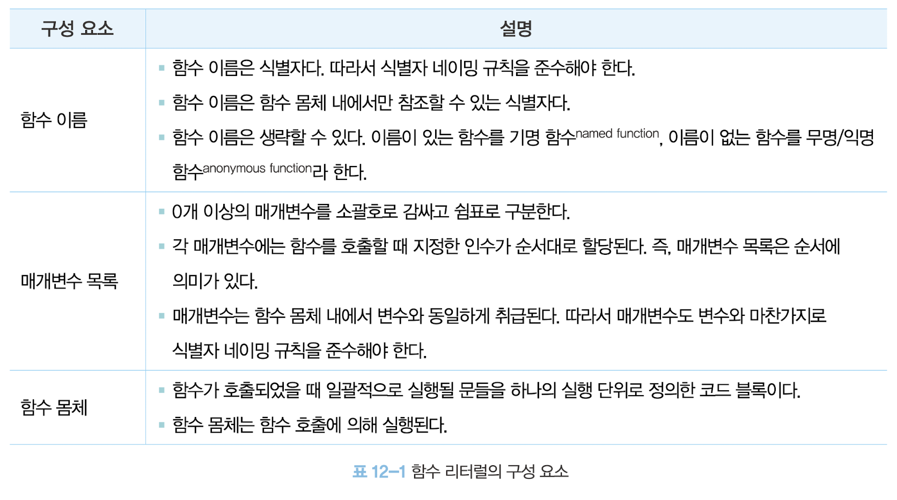
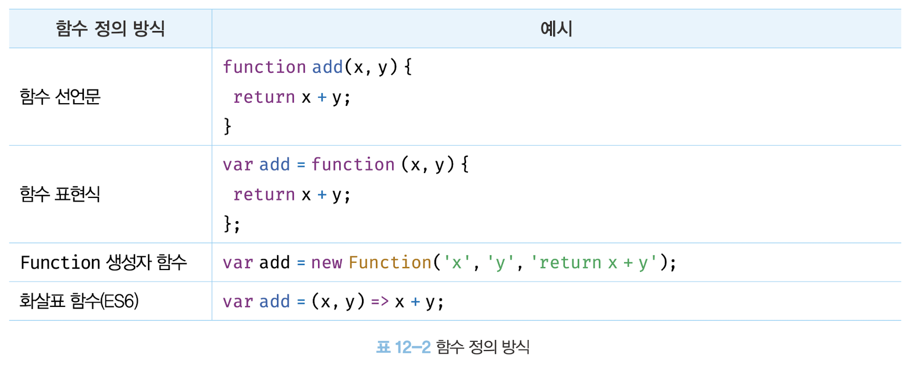
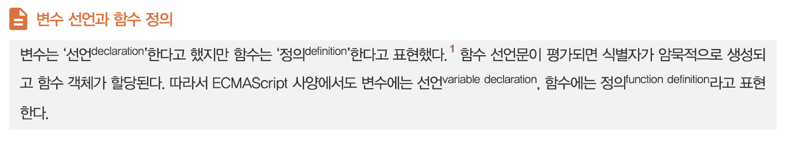
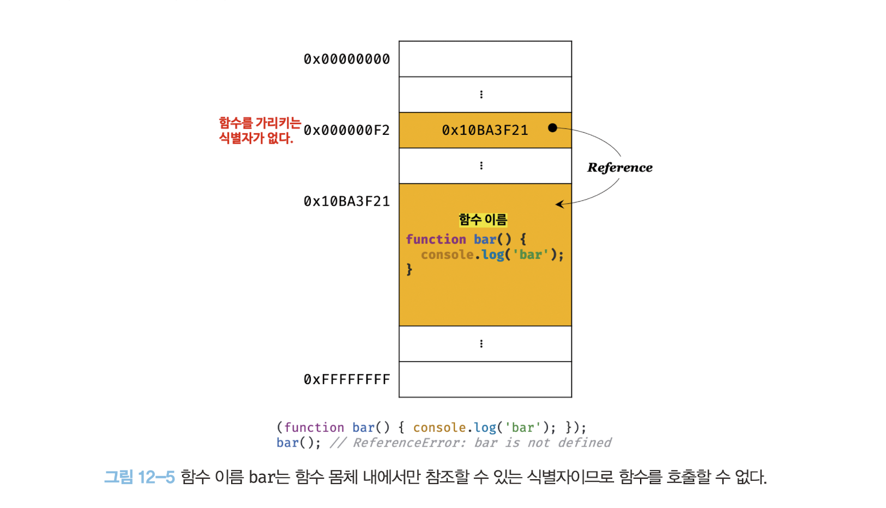
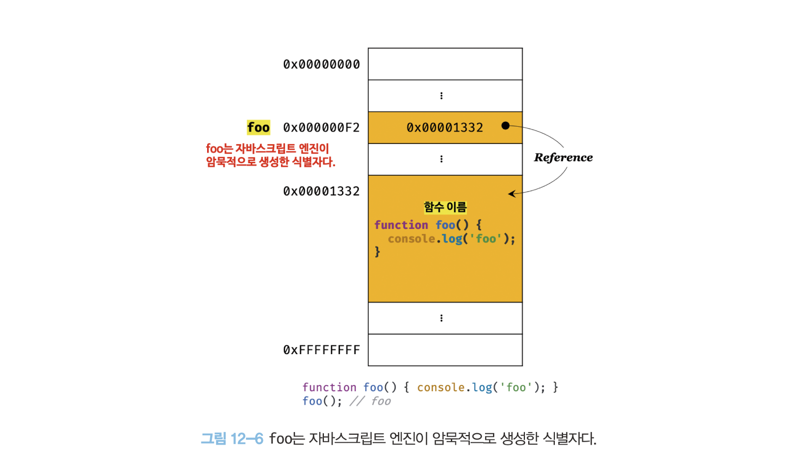
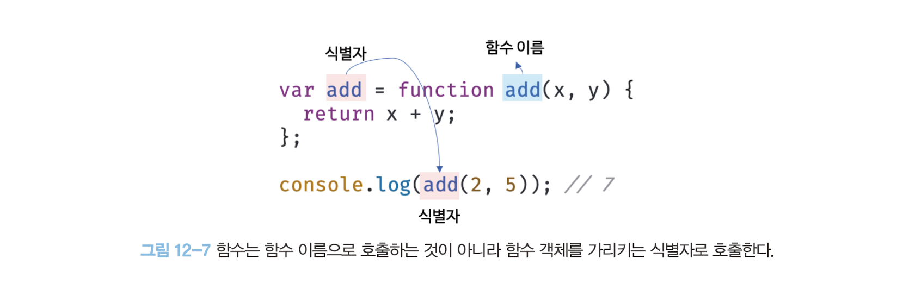
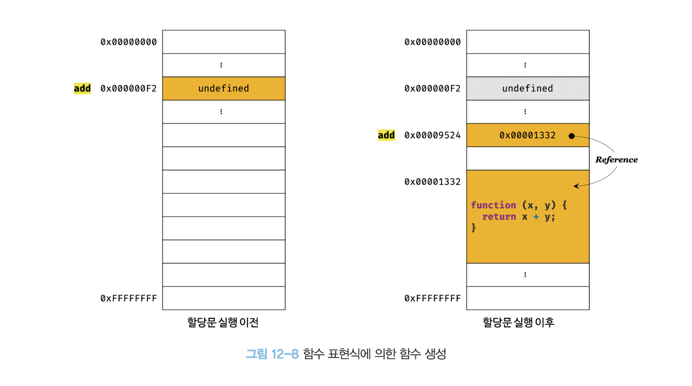

# 12장 함수

## 12.1 함수란?

프로그래밍 언어의 **함수는 일련의 과정을 문(statement)으로 구현하고 코드 블록으로 감싸서 하나의 실행 단위로 정의한 것이다.**

함수 내부로 입력을 전달받는 변수를 **매개변수**, 입력을 **인수**, 출력을 **반환값**이라 한다.

## 12.2 함수를 사용하는 이유

동일한 작업을 반복적으로 수행해야 한다면 같은 코드를 중복해서 여러 번 작성하는 것이 아니라 미리 정의된 함수를 재사용하는 것이 효율적이다. 함수는 몇 번이든 호출할 수 있으므로 **코드의 재사용**이라는 측면에서 매우 유용하다.

코드의 중복을 억제하고 재사용성을 높이는 함수는 **유지보수의 편의성**을 높이고 실수를 줄여 **코드의 신뢰성**을 높이는 효과가 있다.

적절한 함수 이름은 함수의 내부 코드를 이해하지 않고도 함수의 역할을 파악할 수 있게 돕는다. 이는 **코드의 가독성**을 향상시킨다.

코드는 동작하는 것만이 존재 목적은 아니다. 코드는 개발자를 위한 문서이기도 하다. 따라서 사람이 이해할 수 있는 코드, 즉 가독성이 좋은 코드가 좋은 코드다.

## 12.3 함수 리터럴

함수 리터럴의 구성 요소는 다음과 같다.



함수는 객체지만 일반 객체와는 다르다. **일반 객체는 호출할 수 없지만 함수는 호출할 수 있다.** 그리고 일반 객체에는 없는 함수 객체만의 고유한 프로퍼티를 갖는다.

## 12.4 함수 정의





### 12.4.1 함수 선언문

```js
// 함수 선언문
function add(x, y) {
  return x + y;
}

// 함수 참조
// console.dir은 console.log와는 달리 함수 객체의 프로퍼티까지 출력한다.
// 단, Node.js 환경에서는 console.log와 같은 결과가 출력된다.
console.dir(add); // ƒ add(x, y)

// 함수 호출
console.log(add(2, 5)); // 7
```

함수 리터럴은 함수 이름을 생략할 수 있으나 **함수 선언문은 함수 이름을 생략할 수 없다.**

```js
// 함수 선언문은 함수 이름을 생략할 수 없다.
function (x, y) {
  return x + y;
}
// SyntaxError: Function statements require a function name
```

**함수 선언문은 표현식이 아닌 문이다.** 크롬 개발자 도구의 콘솔에서 함수 선언문을 실행하면 완료 값 `undefined`가 출력된다.

표현식이 아닌 문은 변수에 할당할 수 없다. 함수 선언문도 표현식이 아닌 문이므로 변수에 할당할 수 없다. 하지만 다음 예제를 실행해보면 함수 선언문이 변수에 할당되는 것처럼 보인다.

```js
// 함수 선언문은 표현식이 아닌 문이므로 변수에 할당할 수 없다.
// 하지만 함수 선언문이 변수에 할당되는 것처럼 보인다.
var add = function add(x, y) {
  return x + y;
};

// 함수 호출
console.log(add(2, 5)); // 7
```

이렇게 동작하는 이유는 자바스크립트 엔진이 코드의 문맥에 따라 동일한 함수 리터럴을 표현식이 아닌 문인 함수 선언문으로 해석하는 경우와 표현식인 문인 함수 리터럴 표현식으로 해석하는 경우가 있기 때문이다. 함수 선언문은 함수 이름을 생략할 수 없다는 점을 제외하면 함수 리터럴과 형태가 동일하다. 이는 함수 이름이 있는 기명 함수 리터럴은 함수 선언문 또는 함수 리터럴 표현식으로 해석될 가능성이 있다는 의미다.

기명 함수 리터럴은 중의적 표현이다. 따라서 코드의 문맥에 따라 해석이 달라질 수 있다. 자바스크립트 엔진은 함수 이름이 있는 함수 리터럴을 단독으로 사용(값으로 평가되어야 하는 문맥에서 함수 리터럴을 사용하지 않는 경우, 다시 말해 함수 리터럴을 피연산자로 사용하지 않는 경우)하면 함수 선언문으로 해석하고, 함수 리터럴이 값으로 평가되어야 하는 문맥, 예를 들어 함수 리터럴을 변수에 할당하거나 피연산자로 사용하면 함수 리터럴 표현식으로 해석한다. 이때 함수 선언문이든 함수 리터럴 표현식이든 함수가 생성되는 것은 동일하다. 하지만 함수를 생성하는 내부 동작에는 차이가 있다. 다음 예제를 살펴보자.

```js
// 기명 함수 리터럴을 단독으로 사용하면 함수 선언문으로 해석된다.
// 함수 선언문에서는 함수 이름을 생략할 수 없다.
function foo() {
  console.log('foo');
}
foo(); // foo

// 함수 리터럴을 피연산자로 사용하면 함수 선언문이 아니라 함수 리터럴 표현식으로 해석된다.
// 함수 리터럴에서는 함수 이름을 생략할 수 있다.
(function bar() {
  console.log('bar');
});
bar(); // ReferenceError: bar is not defined
```

위 예제에서 단독으로 사용된 함수 리터럴(`foo`)은 함수 선언문으로 해석된다. 하지만 그룹 연산자 () 내에 있는 함수 리터럴(`bar`)은 함수 선언문으로 해석되지 않고 함수 리터럴 표현식으로 해석된다. 그룹 연산자의 피연산자는 값으로 평가될 수 있는 표현식이어야 한다. 따라서 표현식이 아닌 문인 함수 선언문은 피연산자로 사용할 수 없다.

이처럼 이름이 있는 기명 함수 리터럴은 코드의 문맥에 따라 함수 선언문 또는 함수 리터럴 표현식으로 해석된다. 함수 선언문과 함수 리터럴 표현식은 함수 객체를 생성한다는 점에서 동일하지만 호출에 차이가 있다. 위 예제에서 함수 선언문으로 생성된 `foo`는 호출할 수 있으나 함수 리터럴 표현식으로 생성된 `bar`는 호출할 수 없다. 그 이유를 살펴보자.

앞에서 살펴본 12.3절 "함수 리터럴"에서 "함수 이름은 함수 몸체 내에서만 참조할 수 있는 식별자다"라고 했다. 이는 함수 몸체 외부에서는 함수 이름으로 함수를 참조할 수 없으므로 함수 몸체 외부에서는 함수 이름으로 함수를 호출할 수 없다는 의미다. 즉, 함수를 가리키는 식별자가 없다는 것과 마찬가지다. 따라서 위 예제의 `bar`함수는 호출할 수 없다.



하지만 위 예제에서 함수 선언문으로 정의된 함수는 `foo`라는 이름으로 호출할 수 있었다. `foo`는 함수 몸체 내부에서만 유효한 식별자인 함수 이름이므로 `foo`로 함수를 호출할 수 없어야 한다. `foo`라는 이름으로 함수를 호출하려면 `foo`는 함수 이름이 아니라 함수 객체를 가리키는 식별자여야 한다. 그런데 위 예제에서는 식별자 `foo`를 선언한 적도 없고 할당한 적도 없다. `foo`는 자바스크립트 엔진이 암묵적으로 생성한 식별자다.



자바스크립트 엔진은 함수 선언문을 해석해 함수 객체를 생성한다. 이때 함수 이름은 함수 몸체 내부에서만 유효한 식별자이므로 함수 이름과는 별도로 생성된 함수 객체를 가리키는 식별자가 필요하다. 함수 객체를 가리키는 식별자가 없으면 생성된 함수 객체를 참조할 수 없으므로 호출할 수도 없다. 따라서 **자바스크립트 엔진은 생성된 함수를 호출하기 위해 함수 이름과 동일한 이름의 식별자를 암묵적으로 생성하고, 거기에 함수 객체를 할당한다.**

지금까지 살펴본 함수 선언문을 의사 코드로 표현하면 다음과 같다.

```js
var add = function add(x, y) {
  return x + y;
};

console.log(add(2, 5)); // 7
```

**함수는 함수 이름으로 호출하는 것이 아니라 함수 객체를 가리키는 식별자로 호출한다.** 즉, 함수 선언문으로 생성한 함수를 호출한 것은 함수 이름 `add`가 아니라 자바스크립트 엔진이 암묵적으로 생성한 식별자 `add`인 것이다. 함수 이름과 변수 이름이 일치하므로 함수 이름으로 호출되는 듯하지만 사실은 식별자로 호출된 것이다.



위 의사 코드가 바로 함수 표현식이다. 결론적으로 자바스크립트 엔진은 함수 선언문을 함수 표현식으로 변환해 함수 객체를 생성한다고 생각할 수 있다. 단, 함수 선언문과 함수 표현식이 정확히 동일하게 동작하는 것은 아니다.

### 12.4.2 함수 표현식

자바스크립트의 함수는 객체 타입의 값이다. 자바스크립트의 함수는 값처럼 변수에 할당할 수도 있고 프로퍼티 값이 될 수도 있으며 배열의 요소가 될 수도 있다. 이처럼 값의 성질을 갖는 객체를 **일급 객체**라 한다. **자바스크립트의 함수는 일급 객체다.** 함수가 일급 객체라는 것은 함수를 값처럼 자유롭게 사용할 수 있다는 의미다.

함수는 일급 객체이므로 함수 리터럴로 생성한 함수 객체를 변수에 할당할 수 있다. 이러한 함수 정의 방식을 함수 표현식이라 한다.

```js
// 함수 표현식
var add = function (x, y) {
  return x + y;
};

console.log(add(2, 5)); // 7
```

함수를 호출할 때는 함수 이름이 아니라 함수 객체를 가리키는 식별자를 사용해야 한다. 함수 이름은 함수 몸체 내부에서만 유효한 식별자이므로 함수 이름으로 함수를 호출할 수 없다.

```js
// 기명 함수 표현식
var add = function foo(x, y) {
  return x + y;
};

// 함수 객체를 가리키는 식별자로 호출
console.log(add(2, 5)); // 7

// 함수 이름으로 호출하면 ReferenceError가 발생한다.
// 함수 이름은 함수 몸체 내부에서만 유효한 식별자다.
console.log(foo(2, 5)); // ReferenceError: foo is not defined
```

자바스크립트 엔진은 함수 선언문의 함수 이름으로 식별자를 암묵적 생성하고 생성된 함수 객체를 할당하므로 함수 표현식과 유사하게 동작하는 것처럼 보인다. 하지만 함수 선언문과 함수 표현식이 정확히 동일하게 동작하지는 않는다.

함수 선언문은 "표현식이 아닌 문"이고 함수 표현식은 "표현식인 문"이다. 따라서 미묘하지만 중요한 차이가 있다.

### 12.4.3 함수 생성 시점과 함수 호이스팅

```js
// 함수 참조
console.dir(add); // ƒ add(x, y)
console.dir(sub); // undefined

// 함수 호출
console.log(add(2, 5)); // 7
console.log(sub(2, 5)); // TypeError: sub is not a function

// 함수 선언문
function add(x, y) {
  return x + y;
}

// 함수 표현식
var sub = function (x, y) {
  return x - y;
};
```

위 예제와 같이 함수 선언문으로 정의한 함수는 함수 선언문 이전에 호출할 수 있다. 그러나 함수 표현식으로 정의한 함수는 함수 표현식 이전에 호출할 수 없다. 이는 **함수 선언문으로 정의한 함수와 함수 표현식으로 정의한 함수의 생성 시점이 다르기 때문이다.**

모든 선언문이 그렇듯 함수 선언문도 코드가 한 줄씩 순차적으로 실행되는 시점인 런타임 이전에 자바스크립트 엔진에 의해 먼저 실행된다. 다시 말해, 함수 선언문으로 함수를 정의하면 런타임 이전에 함수 객체가 먼저 생성된다. 그리고 자바스크립트 엔진은 함수 이름과 동일한 이름의 식별자를 암묵적으로 생성하고 생성된 함수 객체를 할당한다.

즉, 코드가 한 줄씩 순차적으로 실행되기 시작하는 런타임에는 이미 함수 객체가 생성되어 있고 함수 이름과 동일한 식별자에 할당까지 완료된 상태다. 따라서 함수 선언문 이전에 함수를 참조할 수 있으며 호출할 수도 있다. 이처럼 **함수 선언문이 코드의 선두로 끌어 올려진 것처럼 동작하는 자바스크립트 고유의 특징을 함수 호이스팅이라 한다.**

함수 호이스팅과 변수 호이스팅은 미묘한 차이가 있으므로 주의하기 바란다. `var` 키워드를 사용한 변수 선언문과 함수 선언문은 런타임 이전에 자바스크립트 엔진에 의해 먼저 실행되어 식별자를 생성한다는 점에서 동일하다. 하지만 `var` 키워드로 선언된 변수는 `undefined`로 초기화되고, 함수 선언문을 통해 암묵적으로 생성된 식별자는 함수 객체로 초기화된다. 따라서 `var` 키워드를 사용한 변수 선언문 이전에 변수를 참조하면 변수 호이스팅에 의해 `undefined`로 평가되지만 함수 선언문으로 정의한 함수를 함수 선언문 이전에 호출하면 함수 호이스팅에 의해 호출이 가능하다.

함수 표현식은 변수에 할당되는 값이 함수 리터럴인 문이다. 따라서 함수 표현식은 변수 선언문과 변수 할당문을 한 번에 기술한 축약 표현과 동일하게 동작한다. 변수 선언은 런타임 이전에 평가되어 `undefined`로 초기화되지만 **변수 할당문의 값은 할당문이 실행되는 시점, 즉 런타임에 평가되므로 함수 표현식의 함수 리터럴도 할당문이 실행되는 시점에 평가되어 함수 객체가 된다.**

따라서 **함수 표현식으로 함수를 정의하면 함수 호이스팅이 발생하는 것이 아니라 변수 호이스팅이 발생한다.**



함수 표현식 이전에 함수를 참조하면 `undefiend`로 평가된다. 따라서 이때 함수를 호출하면 `undefined`를 호출하는 것과 마찬가지이므로 타입 에러가 발생한다. 따라서 함수 표현식으로 정의한 함수는 반드시 함수 표현식 이후에 참조 또는 호출해야 한다.

함수 호이스팅은 함수를 호출하기 전에 반드시 함수를 선언해야 한다는 당연한 규칙을 무시한다. 이 같은 문제 때문에 JSON을 창안한 더글라스 크락포드는 함수 선언문 대신 함수 표현식을 사용할 것을 권장한다.
