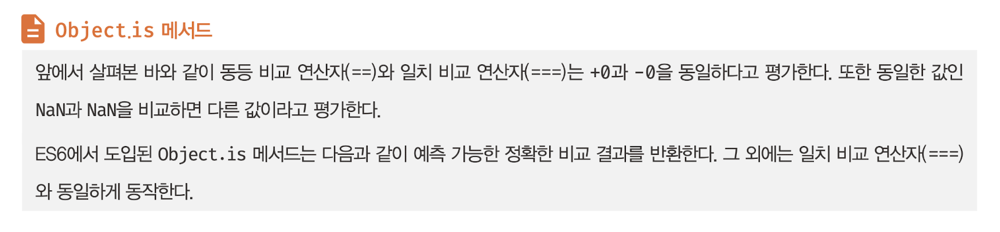
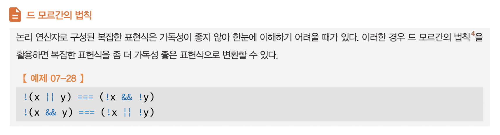
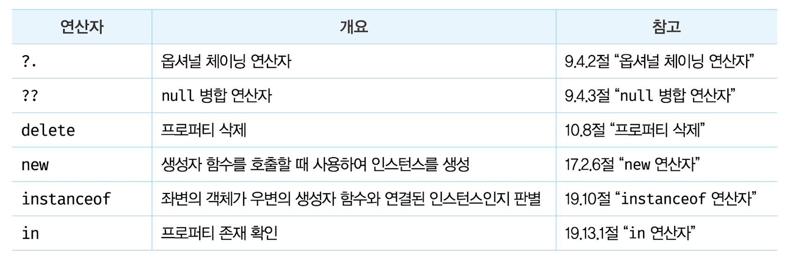
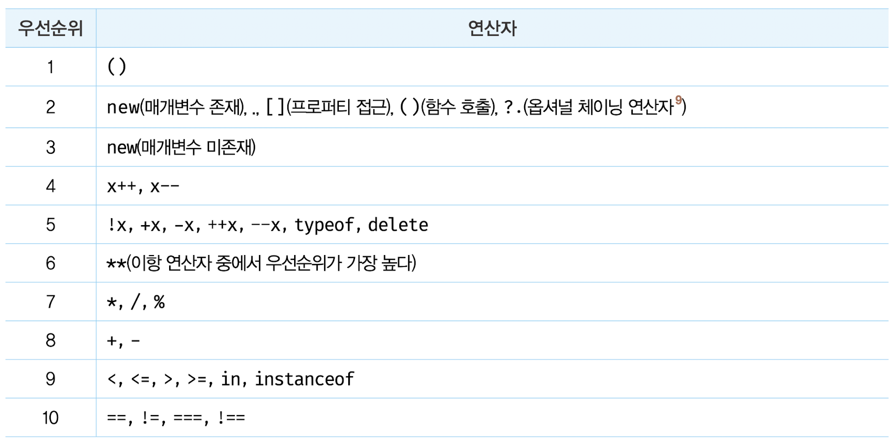
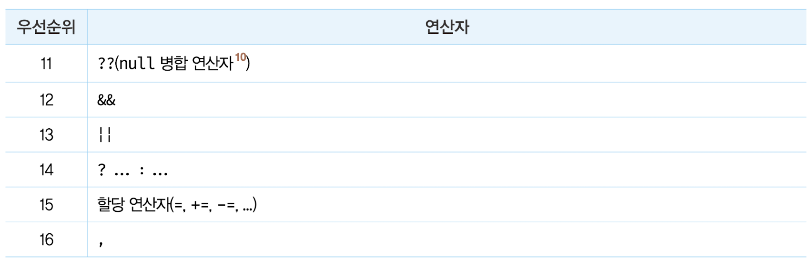
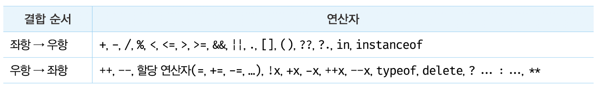

# 7장 연산자

## 7.1 산술 연산자

산술 연산이 불가능한 경우, `NaN`을 반환한다.

### 7.1.1 이항 산술 연산자

모든 이항 산술 연산자는 피연산자의 값을 변경하는 부수 효과가 없다. 다시 말해, 어떤 산술 연산을 해도 피연산자의 값이 바뀌는 경우는 없고 언제나 새로운 값을 만들 뿐이다.

### 7.1.2 단항 산술 연산자

**증가/감소(++/--) 연산자는 피연산자의 값을 변경하는 부수 효과가 있다.** 다시 말해, 증가/감소 연산을 하면 피연산자의 값을 변경하는 암묵적 할당이 이뤄진다.

```js
var x = 1;

// ++ 연산자는 피연산자의 값을 변경하는 암묵적 할당이 이뤄진다.
x++; // x = x + 1;
console.log(x); // 2

// -- 연산자는 피연산자의 값을 변경하는 암묵적 할당이 이뤄진다.
x--; // x = x - 1;
console.log(x); // 1
```

### 7.1.3 문자열 연결 연산자

**+ 연산자는 피연산자 중 하나 이상이 문자열인 경우 문자열 연결 연산자로 동작한다.**

```js
// 문자열 연결 연산자
'1' + 2; // -> '12'
1 + '2'; // -> '12'

// 산술 연산자
1 + 2; // -> 3

// true는 1로 타입 변환된다.
1 + true; // -> 2

// false는 0으로 타입 변환된다.
1 + false; // -> 1

// null은 0으로 타입 변환된다.
1 + null; // -> 1

// undefined는 숫자로 타입 변환되지 않는다.
+undefined; // -> NaN
1 + undefined; // -> NaN
```

개발자의 의도와는 상관없이 자바스크립트 엔진에 의해 암묵적으로 타입이 자동 변환되기도 한다. 위 예제에서 `1 + true`를 연산하면 자바스크립트 엔진은 암묵적으로 불리언 타입의 값인 `true`를 숫자 타입인 1로 타입을 강제로 변환한 후 연산을 수행한다. 이를 **암묵적 타입 변환** 또는 **타입 강제 변환**이라고 한다.

## 7.2 할당 연산자

```js
var x;

// 할당문은 표현식인 문이다.
console.log((x = 10)); // 10
```

**할당문은 값으로 평가되는 표현식인 문으로서 할당된 값으로 평가된다.** 위 예제의 할당문 `x = 10`은 `x`에 할당된 숫자 값 10으로 평가된다.

## 7.3 비교 연산자

### 7.3.1 동등 연산자

**동등 비교(==) 연산자는 좌항과 우항의 피연산자를 비교할 때 먼저 암묵적 타입 변환을 통해 타입을 일치시킨 후 같은 값인지 비교한다.**

```js
// 동등 비교. 결과를 예측하기 어렵다.
'0' == ''; // -> false
0 == ''; // -> true
0 == '0'; // -> true
false == 'false'; // -> false
false == '0'; // -> true
false == null; // -> false
false == undefined; // -> false
```

`NaN`은 자신과 일치하지 않는 유일한 값이다. 따라서 숫자가 `NaN`인지 조사하려면 빌트인 함수 `Number.isNaN`을 사용한다.

```js
// Number.isNaN 함수는 지정한 값이 NaN인지 확인하고 그 결과를 불리언 값으로 반환한다.
Number.isNaN(NaN); // -> true
Number.isNaN(10); // -> false
Number.isNaN(1 + undefined); // -> true
```



```js
-0 === +0; // -> true
Object.is(-0, +0); // -> false

NaN === NaN; // -> false
Object.is(NaN, NaN); // -> true
```

### 7.3.2 대소 관계 비교 연산자

```js
// 대소 관계 비교
5 > 0; // -> true
5 > 5; // -> false
5 >= 5; // -> true
5 <= 5; // -> true
```

## 7.4 삼항 조건 연산자


```js
var x = 2;

// 2 % 2는 0이고 0은 false로 암묵적 타입 변환된다.
var result = x % 2 ? '홀수' : '짝수';

console.log(result); // 짝수
```

```js
var x = 10;

// if...else 문은 표현식이 아닌 문이다. 따라서 값처럼 사용할 수 없다.
var result = if (x % 2) { result = '홀수'; } else { result = '짝수'; };
// SyntaxError: Unexpected token if
```

```js
var x = 10;

// 삼항 조건 연산자 표현식은 표현식인 문이다. 따라서 값처럼 사용할 수 있다.
var result = x % 2 ? '홀수' : '짝수';
console.log(result); // 짝수
```

## 7.5 논리 연산자

```js
// 논리합(||) 연산자
true || true; // -> true
true || false; // -> true
false || true; // -> true
false || false; // -> false

// 논리곱(&&) 연산자
true && true; // -> true
true && false; // -> false
false && true; // -> false
false && false; // -> false

// 논리 부정(!) 연산자
!true; // -> false
!false; // -> true
```

```js
// 암묵적 타입 변환
!0; // -> true
!'Hello'; // -> false
```



## 7.6 쉼표 연산자

쉼표(,) 연산자는 왼쪽 피연산자부터 차례대로 피연산자를 평가하고 마지막 피연산자의 평가가 끝나면 마지막 피연산자의 평가 결과를 반환한다.

```js
var x, y, z;

(x = 1), (y = 2), (z = 3); // 3
```

## 7.7 그룹 연산자

```js
10 * 2 + 3; // -> 23

// 그룹 연산자를 사용하여 우선순위를 조절
10 * (2 + 3); // -> 50
```

## 7.8 typeof 연산자

```js
typeof ''; // -> "string"
typeof 1; // -> "number"
typeof NaN; // -> "number"
typeof true; // -> "boolean"
typeof undefined; // -> "undefined"
typeof Symbol(); // -> "symbol"
typeof null; // -> "object"
typeof []; // -> "object"
typeof {}; // -> "object"
typeof new Date(); // -> "object"
typeof /test/gi; // -> "object"
typeof function () {}; // -> "function"
```

`typeof` 연산자로 `null` 값을 연산해 보면 "null"이 아닌 "object"를 반환한다는 데 주의하자. 이것은 자바스크립트의 첫 번째 버전의 버그다. 하지만 기존 코드에 영향을 줄 수 있기 때문에 아직까지 수정되지 못하고 있다.

따라서 값이 `null` 타입인지 확인할 때는 `typeof` 연산자를 사용하지 말고 일치 연산자(===)를 사용하자.

```js
var foo = null;

typeof foo === null; // -> false
foo === null; // -> true
```

선언하지 않은 식별자를 `typeof` 연산자로 연산해 보면 `ReferenceError`가 발생하지 않고 `undefined`를 반환한다.

```js
// undeclared 식별자를 선언한 적이 없다.
typeof undeclared; // -> undefined
```

## 7.9 지수 연산자

```js
2 ** 2; // -> 4
2 ** 2.5; // -> 5.65685424949238
2 ** 0; // -> 1
2 ** -2; // -> 0.25
```

```js
-5 ** 2;
// SyntaxError: Unary operator used immediately before exponentiation expression.
// Parenthesis must be used to disambiguate operator precedence

(-5) ** 2; // -> 25
```

```js
var num = 5;
num **= 2; // -> 25
```

```js
2 * 5 ** 2; // -> 50
```

## 7.10 그 외의 연산자



## 7.11 연산자의 부수 효과

```js
var x;

// 할당 연산자는 변수 값이 변하는 부수 효과가 있다.
// 이는 x 변수를 사용하는 다른 코드에 영향을 준다.
x = 1;
console.log(x); // 1

// 증가/감소 연산자(++/--)는 피연산자의 값을 변경하는 부수 효과가 있다.
// 피연산자 x의 값이 재할당되어 변경된다. 이는 x 변수를 사용하는 다른 코드에 영향을 준다.
x++;
console.log(x); // 2

var o = { a: 1 };

// delete 연산자는 객체의 프로퍼티를 삭제하는 부수 효과가 있다.
// 이는 o 객체를 사용하는 다른 코드에 영향을 준다.
delete o.a;
console.log(o); // {}
```

## 7.12 연산자 우선순위

연산자 우선순위가 가장 높은 그룹 연산자를 사용하여 우선순위를 명시적으로 조절하는 것을 권장한다.





```js
// 그룹 연산자를 사용하여 우선순위를 명시적으로 조절
10 * (2 + 3); // -> 50
```

## 7.13 연산자 결합 순서


