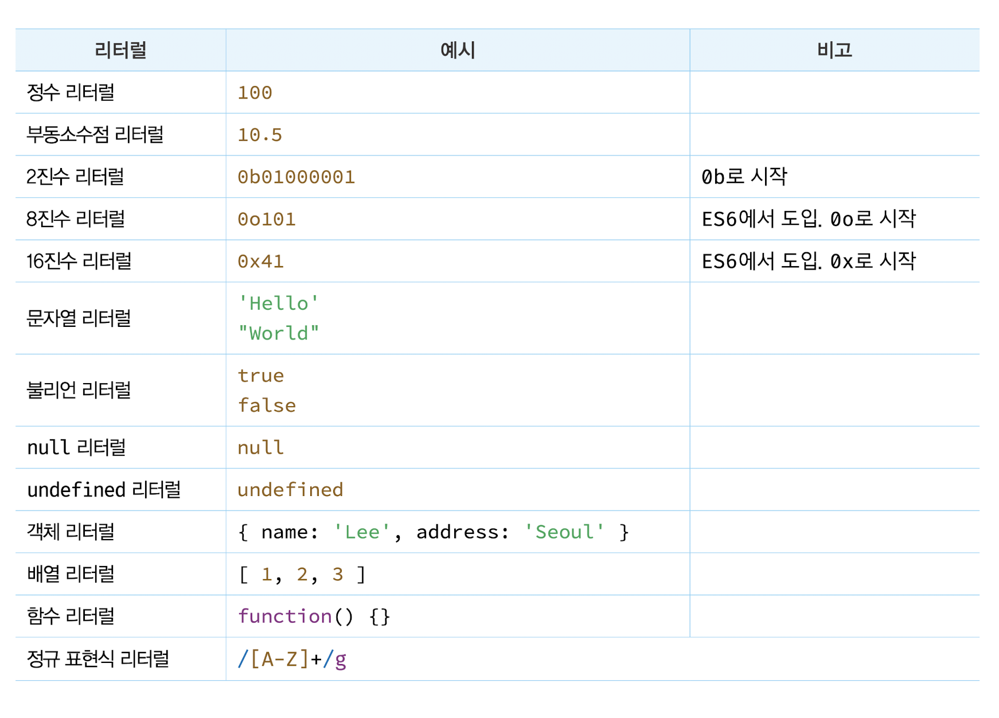

# 5장 표현식과 문

## 5.1 값

**값은 식이 평가되어 생성된 결과를 말한다.** 평가란 식을 해석해서 값을 생성하거나 참조하는 것을 의미한다.

모든 값은 데이터 타입을 가지며, 메모리에 2진수, 즉 비트의 나열로 저장된다. 메모리에 저장된 값은 데이터 타입에 따라 다르게 해석될 수 있다. 예를 들어, 메모리에 저장된 값 0100 0001을 숫자로 해석하면 65지만 문자로 해석하면 'A'다.

## 5.2 리터럴

**리터럴은 사람이 이해할 수 있는 문자 또는 약속된 기호를 사용해 값을 생성하는 표기법을 말한다.**

사람이 이해할 수 있는 아라비아 숫자를 사용해 숫자 리터럴 3을 코드에 기술하면 자바스크립트 엔진은 이를 평가해 숫자 값 3을 생성한다.


자바스크립트 엔진은 코드가 실행되는 시점인 런타임에 리터럴을 평가해 값을 생성한다. 즉, 리터럴은 값을 생성하기 위해 미리 약속한 표기법이라고 할 수 있다.



## 5.3 표현식

**표현식은 값으로 평가될 수 있는 문이다. 즉, 표현식이 평가되면 새로운 값을 생성하거나 기존 값을 참조한다.**

표현식은 리터럴, 식별자(변수, 함수 등의 이름), 연산자, 함수 호출 등의 조합으로 이뤄질 수 있다. 다음과 같이 다양한 표현식이 있지만 값으로 평가된다는 점에서 모두 동일하다. 즉, **값으로 평가될 수 있는 문은 모두 표현식이다.**

```js
// 리터럴 표현식
10;

// 식별자 표현식(선언이 이미 존재한다고 가정)
sum;
person.name;
arr[1];

// 연산자 표현식
10 + 20;
sum = 10;
sum !== 10;

// 함수/메서드 호출 표현식(선언이 이미 존재한다고 가정)
square();
person.getName();
```

표현식은 값으로 평가된다. 이때 표현식과 표현식이 평가된 값은 동등한 관계, 즉 동치다.

```js
var x = 1 + 2;

// 식별자 표현식 x는 3으로 평가된다.
x + 3; // -> 6
```

위 예제의 `x + 3`은 표현식이다. `+` 연산자는 좌항과 우항의 값을 산술 연산하는 연산자이므로 좌항과 우항에는 숫자 값이 위치해야 한다. 이때 좌항 `x`는 식별자 표현식이다. 즉, `x`는 할당되어 있는 숫자 값 `3`으로 평가된다. 이처럼 표현식은 다른 표현식의 일부가 되어 새로운 값을 만들어낼 수 있다.

## 5.4 문

**문은 프로그램을 구성하는 기본 단위이자 최소 실행 단위다.** 문의 집합으로 이뤄진 것이 바로 프로그램이며, 문을 작성하고 순서에 맞게 나열하는 것이 프로그래밍이다.

문은 여러 토큰으로 구성된다. **토큰이란 문법적인 의미를 가지며, 문법적으로 더 이상 나눌 수 없는 코드의 기본 요소를 의미한다.**

문을 명령문이라고도 부른다.

문은 선언문, 할당문, 조건문, 반복문 등으로 구분할 수 있다.

## 5.5 세미콜론과 세미콜론 자동 삽입 기능

0개 이상의 문을 중괄호로 묶은 코드 블록({ ... }) 뒤에는 세미콜론을 붙이지 않는다. 이러한 코드 블록은 언제나 문의 종료를 의미하는 자체 종결성을 갖기 때문이다.

자바스크립트 엔진은 소스코드를 해석할 때 문의 끝이라고 예측되는 지점에 세미콜론을 자동으로 붙여주는 **세미콜론 자동 삽입 기능(ASI)**이 암묵적으로 수행된다.

## 5.6 표현식인 문과 표현식이 아닌 문

표현식인 문은 값으로 평가될 수 있는 문이며, 표현식이 아닌 문은 값으로 평가될 수 없는 문을 말한다. 예를 들어, 변수 선언문은 값으로 평가될 수 없다. 따라서 표현식이 아닌 문이다. 하지만 할당문은 값으로 평가될 수 있다. 따라서 표현식인 문이다.

**표현식인 문과 표현식이 아닌 문을 구별하는 가장 간단하고 명료한 방법은 변수에 할당해 보는 것이다.** 표현식인 문은 값으로 평가되므로 변수에 할당할 수 있다. 하지만 표현식이 아닌 문은 값으로 평가할 수 없으므로 변수에 할당하면 에러가 발생한다.

```js
// 표현식이 아닌 문은 값처럼 사용할 수 없다.
var foo = var x; // SyntaxError: Unexpected token var
```

```js
// 변수 선언문은 표현식이 아닌 문이다.
var x;

// 할당문은 그 자체가 표현식이지만 완전한 문이기도 하다. 즉, 할당문은 표현식인 문이다.
x = 100;
```


