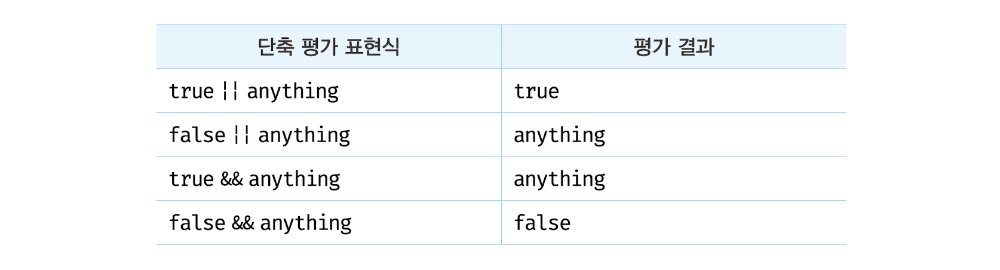

# 9장 타입 변환과 단축 평가

## 9.1 타입 변환이란?

개발자가 의도적으로 값의 타입을 변환하는 것을 **명시적 타입 변환** 또는 **타입 캐스팅**이라 한다.

```js
var x = 10;

// 명시적 타입 변환
// 숫자를 문자열로 타입 캐스팅한다.
var str = x.toString();
console.log(typeof str, str); // string 10

// x 변수의 값이 변경된 것은 아니다.
console.log(typeof x, x); // number 10
```

개발자의 의도와는 상관없이 표현식을 평가하는 도중에 자바스크립트 엔진에 의해 암묵적으로 타입이 자동 변환되기도 한다. 이를 **암묵적 타입 변환** 또는 **타입 강제 변환**이라 한다.

```js
var x = 10;

// 암묵적 타입 변환
// 문자열 연결 연산자는 숫자 타입 x의 값을 바탕으로 새로운 문자열을 생성한다.
var str = x + '';
console.log(typeof str, str); // string 10

// x 변수의 값이 변경된 것은 아니다.
console.log(typeof x, x); // number 10
```

자신이 작성한 코드에서 암묵적 타입 변환이 발생하는지, 발생한다면 어떤 타입의 어떤 값으로 변환되는지, 그리고 타입 변환된 값으로 표현식이 어떻게 평가될 것인지 예측 가능해야 한다. 만약 타입 변환 결과를 예측하지 못하거나 예측이 결과와 일치하지 않는다면 오류를 생산할 가능성이 높아진다.

때로는 명시적 타입 변환보다 암묵적 타입 변환이 가독성 측면에서 더 좋을 수도 있다. 예를 들어, 자바스크립트 문법을 잘 이해하고 있는 개발자에게는 `(10).toString()` 보다 `10 + ''`이 더욱 간결하고 이해하기 쉽다.

중요한 것은 코드를 예측할 수 있어야 한다는 것이다. 동료가 작성한 코드를 정확히 이해할 수 있어야 하고 자신이 작성한 코드도 동료가 쉽게 이해할 수 있어야 한다.

## 9.2 암묵적 타입 변환

프로그래밍 언어에 따라 에러를 발생시키기도 하지만 자바스크립트는 가급적 에러를 발생시키지 않도록 암묵적 타입 변환을 통해 표현식을 평가한다.

암묵적 타입 변환이 발생하면 문자열, 숫자, 불리언과 같은 원시 타입 중 하나로 타입을 자동 변환한다.

### 9.2.1 문자열 타입으로 변환

ES6에서 도입된 템플릿 리터럴의 표현식 삽입은 표현식의 평가 결과를 문자열 타입으로 암묵적 타입 변환한다.

```js
`1 + 1 = ${1 + 1}`; // -> "1 + 1 = 2"
```

자바스크립트 엔진은 문자열 타입 아닌 값을 문자열 타입으로 암묵적 타입 변환을 수행할 때 다음과 같이 동작한다.

```js
// 숫자 타입
0 + ''         // -> "0"
-0 + ''        // -> "0"
1 + ''         // -> "1"
-1 + ''        // -> "-1"
NaN + ''       // -> "NaN"
Infinity + ''  // -> "Infinity"
-Infinity + '' // -> "-Infinity"

// 불리언 타입
true + ''  // -> "true"
false + '' // -> "false"

// null 타입
null + '' // -> "null"

// undefined 타입
undefined + '' // -> "undefined"

// 심벌 타입
(Symbol()) + '' // -> TypeError: Cannot convert a Symbol value to a string

// 객체 타입
({}) + ''           // -> "[object Object]"
Math + ''           // -> "[object Math]"
[] + ''             // -> ""
[10, 20] + ''       // -> "10,20"
(function(){}) + '' // -> "function(){}"
Array + ''          // -> "function Array() { [native code] }"
```

### 9.2.2 숫자 타입으로 변환

피연산자를 숫자 타입으로 변환할 수 없는 경우는 산술 연산을 수행할 수 없으므로 표현식의 평가 결과는 `NaN`이 된다.

빈 문자열(''), 빈 배열([]), `null`, `false`는 0으로, `true`는 1로 변환된다. 객체와 빈 배열이 아닌 배열, `undefined`는 변환되지 않아 `NaN`이 된다는 것에 주의하자.

### 9.2.3 불리언 타입으로 변환

```js
if ('') console.log('1');
if (true) console.log('2');
if (0) console.log('3');
if ('str') console.log('4');
if (null) console.log('5');

// 2 4
```

**자바스크립트 엔진은 불리언 타입이 아닌 값을 Truthy 값(참으로 평가되는 값) 또는 Falsy 값(거짓으로 평가되는 값)으로 구분한다.** 즉, 제어문의 조건식과 같이 불리언 값으로 평가되어야 할 문맥에서 Truthy 값은 `true`로, Falsy 값은 `false`로 암묵적 타입 변환된다.

아래 값들은 `false`로 평가되는 Falsy 값이다.

- false
- undefined
- null
- 0, -0
- NaN
- ' '(빈 문자열)

Falsy 값 외의 모든 값은 모두 `true`로 평가되는 Truthy 값이다.

```js
// 전달받은 인수가 Falsy 값이면 true, Truthy 값이면 false를 반환한다.
function isFalsy(v) {
	return !v;
}

// 전달받은 인수가 Truthy 값이면 true, Falsy 값이면 false를 반환한다.
function isTruthy(v) {
	return !!v;
}

// 모두 true를 반환한다.
isFalsy(false);
isFalsy(undefined);
isFalsy(null);
isFalsy(0);
isFalsy(NaN);
isFalsy('');

// 모두 true를 반환한다.
isTruthy(true);
isTruthy('0'); // 빈 문자열이 아닌 문자열은 Truthy 값이다.
isTruthy({});
isTruthy([]);
```

## 9.3 명시적 타입 변환

개발자의 의도에 따라 명시적으로 타입을 변경하는 방법은 다양하다. 표준 빌트인 생성자 함수(`String`, `Number`, `Boolean`)를 `new` 연산자 없이 호출하는 방법과 빌트인 메서드를 사용하는 방법, 그리고 앞에서 살펴본 암묵적 타입 변환을 이용하는 방법이 있다.


### 9.3.1 문자열 타입으로 변환

```js
// 1. String 생성자 함수를 new 연산자 없이 호출하는 방법
// 숫자 타입 => 문자열 타입
String(1); // -> "1"
String(NaN); // -> "NaN"
String(Infinity); // -> "Infinity"
// 불리언 타입 => 문자열 타입
String(true); // -> "true"
String(false); // -> "false"

// 2. Object.prototype.toString 메서드를 사용하는 방법
// 숫자 타입 => 문자열 타입
(1).toString(); // -> "1"
NaN.toString(); // -> "NaN"
Infinity.toString(); // -> "Infinity"
// 불리언 타입 => 문자열 타입
true.toString(); // -> "true"
false.toString(); // -> "false"

// 3. 문자열 연결 연산자를 이용하는 방법
// 숫자 타입 => 문자열 타입
1 + ''; // -> "1"
NaN + ''; // -> "NaN"
Infinity + ''; // -> "Infinity"
// 불리언 타입 => 문자열 타입
true + ''; // -> "true"
false + ''; // -> "false"
```

### 9.3.2 숫자 타입으로 변환

```js
// 1. Number 생성자 함수를 new 연산자 없이 호출하는 방법
// 문자열 타입 => 숫자 타입
Number('0'); // -> 0
Number('-1'); // -> -1
Number('10.53'); // -> 10.53
// 불리언 타입 => 숫자 타입
Number(true); // -> 1
Number(false); // -> 0

// 2. parseInt, parseFloat 함수를 사용하는 방법(문자열만 변환 가능)
// 문자열 타입 => 숫자 타입
parseInt('0'); // -> 0
parseInt('-1'); // -> -1
parseFloat('10.53'); // -> 10.53

// 3. + 단항 산술 연산자를 이용하는 방법
// 문자열 타입 => 숫자 타입
+'0'; // -> 0
+'-1'; // -> -1
+'10.53'; // -> 10.53
// 불리언 타입 => 숫자 타입
+true; // -> 1
+false; // -> 0

// 4. * 산술 연산자를 이용하는 방법
// 문자열 타입 => 숫자 타입
'0' * 1; // -> 0
'-1' * 1; // -> -1
'10.53' * 1; // -> 10.53
// 불리언 타입 => 숫자 타입
true * 1; // -> 1
false * 1; // -> 0
```

### 9.3.3 불리언 타입으로 변환

```js
// 1. Boolean 생성자 함수를 new 연산자 없이 호출하는 방법
// 문자열 타입 => 불리언 타입
Boolean('x'); // -> true
Boolean(''); // -> false
Boolean('false'); // -> true
// 숫자 타입 => 불리언 타입
Boolean(0); // -> false
Boolean(1); // -> true
Boolean(NaN); // -> false
Boolean(Infinity); // -> true
// null 타입 => 불리언 타입
Boolean(null); // -> false
// undefined 타입 => 불리언 타입
Boolean(undefined); // -> false
// 객체 타입 => 불리언 타입
Boolean({}); // -> true
Boolean([]); // -> true

// 2. ! 부정 논리 연산자를 두번 사용하는 방법
// 문자열 타입 => 불리언 타입
!!'x'; // -> true
!!''; // -> false
!!'false'; // -> true
// 숫자 타입 => 불리언 타입
!!0; // -> false
!!1; // -> true
!!NaN; // -> false
!!Infinity; // -> true
// null 타입 => 불리언 타입
!!null; // -> false
// undefined 타입 => 불리언 타입
!!undefined; // -> false
// 객체 타입 => 불리언 타입
!!{}; // -> true
!![]; // -> true
```

## 9.4 단축 평가

### 9.4.1 논리 연산자를 사용한 단축 평가

```js
'Cat' && 'Dog'; // -> "Dog"
```

```js
'Cat' || 'Dog'; // -> "Cat"
```

논리곱(&&) 연산자와 논리합(||) 연산자는 **논리 연산의 결과를 결정하는 피연산자를 타입 변환하지 않고 그대로 반환한다. 이를 단축 평가라 한다. 단축 평가는 표현식을 평가하는 도중에 평가 결과가 확정된 경우 나머지 평가 과정을 생략하는 것을 말한다.**



```js
// 논리합(||) 연산자
'Cat' || 'Dog'; // -> "Cat"
false || 'Dog'; // -> "Dog"
'Cat' || false; // -> "Cat"

// 논리곱(&&) 연산자
'Cat' && 'Dog'; // -> "Dog"
false && 'Dog'; // -> false
'Cat' && false; // -> false
```

단축 평가를 사용하면 `if`문을 대체할 수 있다. 어떤 조건이 Truthy 값(참으로 평가되는 값)일 때 무언가를 해야 한다면 논리곱(&&) 연산자 표현식으로 `if`문을 대체할 수 있다.

```js
var done = true;
var message = '';

// 주어진 조건이 true일 때
if (done) message = '완료';

// if 문은 단축 평가로 대체 가능하다.
// done이 true라면 message에 '완료'를 할당
message = done && '완료';
console.log(message); // 완료
```

조건이 Falsy 값(거짓으로 평가되는 값)일 때 무언가를 해야 한다면 논리합(||) 연산자 표현식으로 `if`문을 대체할 수 있다.

```js
var done = false;
var message = '';

// 주어진 조건이 false일 때
if (!done) message = '미완료';

// if 문은 단축 평가로 대체 가능하다.
// done이 false라면 message에 '미완료'를 할당
message = done || '미완료';
console.log(message); // 미완료
```

삼항 조건 연산자는 `if ... else`문을 대체할 수 있다.

```js
var done = true;
var message = '';

// if...else 문
if (done) message = '완료';
else message = '미완료';
console.log(message); // 완료

// if...else 문은 삼항 조건 연산자로 대체 가능하다.
message = done ? '완료' : '미완료';
console.log(message); // 완료
```

단축 평가는 다음과 같은 상황에서 유용하게 사용된다.

#### 객체를 가리키기를 기대하는 변수가 `null` 또는 `undefined`가 아닌지 확인하고 프로퍼티를 참조할 때

객체는 키와 값으로 구성된 프로퍼티의 집합이다. 만약 객체를 가리키기를 기대하는 변수의 값이 객체가 아니라 `null` 또는 `undefined`인 경우 객체의 프로퍼티를 참조하면 타입 에러가 발생한다.

```js
var elem = null;
var value = elem.value; // TypeError: Cannot read property 'value' of null
```

단축 평가를 사용하면 에러를 발생시키지 않는다.

```js
var elem = null;
// elem이 null이나 undefined와 같은 Falsy 값이면 elem으로 평가되고
// elem이 Truthy 값이면 elem.value로 평가된다.
var value = elem && elem.value; // -> null
```

#### 함수 매개변수에 기본값을 설정할 때

함수를 호출할 때 인수를 전달하지 않으면 매개변수에는 `undefined`가 할당된다. 이때 단축 평가를 사용해 매개변수의 기본값을 설정하면 `undefined`로 인해 발생할 수 있는 에러를 방지할 수 있다.

```js
// 단축 평가를 사용한 매개변수의 기본값 설정
function getStringLength(str) {
	str = str || '';
	return str.length;
}

getStringLength(); // -> 0
getStringLength('hi'); // -> 2

// ES6의 매개변수의 기본값 설정
function getStringLength(str = '') {
	return str.length;
}

getStringLength(); // -> 0
getStringLength('hi'); // -> 2
```

### 9.4.2 옵셔널 체이닝 연산자

```js
var elem = null;

// elem이 null 또는 undefined이면 undefined를 반환하고, 그렇지 않으면 우항의 프로퍼티 참조를 이어간다.
var value = elem?.value;
console.log(value); // undefined
```

옵셔널 체이닝 연산자 ?.가 도입되기 이전에는 논리 연산자 &&를 사용한 단축 평가를 통해 변수가 `null` 또는 `undefined`인지 확인했다.

```js
var elem = null;

// elem이 Falsy 값이면 elem으로 평가되고 elem이 Truthy 값이면 elem.value로 평가된다.
var value = elem && elem.value;
console.log(value); // null
```

논리 연산자 &&는 좌항 피연산자가 `false`로 평가되는 Falsy 값(`false`, `undefined`, `null`, 0, -0, `NaN`, '')이면 좌항 피연산자를 그대로 반환한다. 좌항 피연산자가 Falsy 값인 0이나 ''인 경우도 마찬가지다. 하지만 0이나 ''은 객체로 평가될 때도 있다.

```js
var str = '';

// 문자열의 길이(length)를 참조한다.
var length = str && str.length;

// 문자열의 길이(length)를 참조하지 못한다.
console.log(length); // ''
```

옵셔널 체이닝 연산자 ?.는 좌항 피연산자가 `false`로 평가되는 Falsy 값(`false`, `undefined`, `null`, 0, -0, `NaN`, '')이라도 `null` 또는 `undefined`가 아니면 우항의 프로퍼티 참조를 이어간다.

```js
var str = '';

// 문자열의 길이(length)를 참조한다. 이때 좌항 피연산자가 false로 평가되는 Falsy 값이라도
// null 또는 undefined가 아니면 우항의 프로퍼티 참조를 이어간다.
var length = str?.length;
console.log(length); // 0
```

### 9.4.3 `null` 병합 연산자

`null` 병합 연산자 ??는 좌항의 피연산자가 `null` 또는 `undefined`인 경우 우항의 피연산자를 반환하고, 그렇지 않으면 좌항의 피연산자를 반환한다. `null` 병합 연산자 ??는 변수에 기본값을 설정할 때 유용하다.

```js
// 좌항의 피연산자가 null 또는 undefined이면 우항의 피연산자를 반환하고,
// 그렇지 않으면 좌항의 피연산자를 반환한다.
var foo = null ?? 'default string';
console.log(foo); // "default string"
```

`null` 병합 연산자 ??가 도입되기 이전에는 논리 연산자 ||를 사용한 단축 평가를 통해 변수에 기본값을 설정했다. 논리 연산자 ||를 사용한 단축 평가의 경우 좌항의 피연산자가 `false`로 평가되는 Falsy 값(`false`, `undefined`, `null`, 0, -0, `NaN`, '')이면 우항의 피연산자를 반환한다. 만약 Falsy 값인 0이나 ''도 기본값으로서 유효하다면 예기치 않은 동작이 발생할 수 있다.

```js
// Falsy 값인 0이나 ''도 기본값으로서 유효하다면 예기치 않은 동작이 발생할 수 있다.
var foo = '' || 'default string';
console.log(foo); // "default string"
```

`null` 병합 연산자 ??는 좌항의 피연산자가 `false`로 평가되는 Falsy 값(`false`, `undefined`, `null`, 0, -0, `NaN`, '')이라도 `null` 또는 `undefined`가 아니면 좌항의 피연산자를 그대로 반환한다.

```js
// 좌항의 피연산자가 Falsy 값이라도 null 또는 undefined가 아니면 좌항의 피연산자를 반환한다.
var foo = '' ?? 'default string';
console.log(foo); // ""
```
