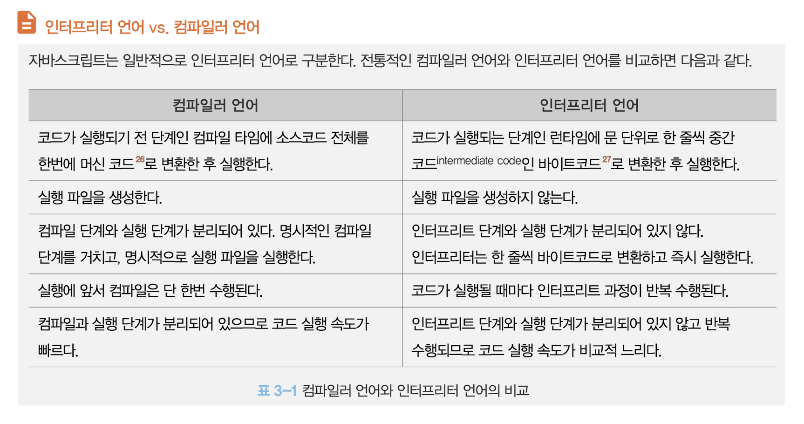

# 2장 자바스크립트란?

## 2.1 자바스크립트의 탄생

1995년, 약 90%의 시장 점유율로 웹 브라우저 시장을 지배하고 있던 넷스케이프 커뮤니케이션즈는 웹페이지의 보조적인 기능을 수행하기 위해 브라우저에서 동작하는 경량 프로그래밍 언어를 도입하기로 결정한다. 그래서 탄생한 것이 바로 브렌던 아이크가 개발한 자바스크립트다.

## 2.2 자바스크립트의 표준화

## 2.3 자바스크립트 성장과 역사

### 2.3.1 Ajax

1999년, 자바스크립트를 이용해 서버와 브라우저가 **비동기** 방식으로 데이터를 교환할 수 있는 통신 기능인 **Ajax**가 XMLHttpRequest라는 이름으로 등장했다.

Ajax의 등장은 이전의 패러다임을 획기적으로 전환했다. 즉, 웹페이지에서 변경할 필요가 없는 부분은 다시 렌더링하지 않고, 서버로부터 필요한 데이터만 전송받아 변경해야 하는 부분만 한정적으로 렌더링하는 방식이 가능해진 것이다.

### 2.3.2 jQuery

2006년, **jQuery**의 등장으로 다소 번거롭고 논란이 있던 DOM을 더욱 쉽게 제어할 수 있게 제어할 수 있게 되었고 크로스 브라우징 이슈도 어느 정도 해결되었다.

### 2.3.3 V8 자바스크립트 엔진

V8 자바스크립트 엔진의 등장으로 자바스크립트는 데스크톱 애플리케이션과 유사한 사용자 경험을 제공할 수 있는 웹 애플리케이션 프로그래밍 언어로 정착하게 되었다.

V8 자바스크립트 엔진으로 촉발된 자바스크립트의 발전으로 과거 웹 서버에서 수행되던 로직들이 대거 클라이언트(브라우저)로 이동했고, 이는 웹 애플리케이션 개발에서 프런트엔드 영역이 주목받는 계기로 작용했다.

### 2.3.4 Node.js

2009년, 라이언 달이 발표한 Node.js는 구글 V8 자바스크립트 엔진으로 빌드된 자바스크립트 런타임 환경이다.

Node.js의 등장으로 자바스크립트는 브라우저를 벗어나 서버 사이드 애플리케이션 개발에서도 사용할 수 있는 범용 프로그래밍 언어가 되었다.

### 2.3.5 SPA 프레임워크

CBD 방법론을 기반으로 하는 SPA가 대중화되면서 Angular, React, Vue.js, Svelte 등 다양한 SPA 프레임워크/라이브러리 또한 많은 사용층을 확보하고 있다.

## 2.4 자바스크립트와 ECMAScript

자바스크립트는 일반적으로 프로그래밍 언어로서 기본 뼈대를 이루는 ECMAScript와 브라우저가 별도 지원하는 **클라이언트 사이드 Web API**, 즉 DOM, BOM, Canvas, XMLHttpRequest, fetch, requestAnimationFrame, SVG, Web Storage, Web Component, Web Worker 등을 아우르는 개념이다.

클라이언트 사이드 Web API는 ECMAScript와는 별도로 월드 와이드 웹 콘소시엄(W3C)에서 별도의 사양으로 관리하고 있다.

## 2.5 자바스크립트 특징

자바스크립트는 개발자가 별도의 컴파일 작업을 수행하지 않는 인터프리터 언어다.

자바스크립트는 명령형, 함수형, 프로토타입 기반 객체지향 프로그래밍을 지원하는 **멀티 패러다임 프로그래밍 언어**다.

자바스크립트는 클래스 기반 객체지향 언어보다 효율적이면서 강력한 **프로토타입 기반의 객체지향 언어**다.

## 2.6 ES6 브라우저 지원 현황

브라우저에서 아직 지원하지 않는 최신 기능을 사용하거나 인터넷 익스플로러나 구형 브라우저를 고려해야 하는 상황이라면 바벨과 같은 트랜스파일러를 사용해 ES6 이상의 사양으로 구현한 소스코드를 ES5 이하의 사양으로 다운그레이드할 필요가 있다.
