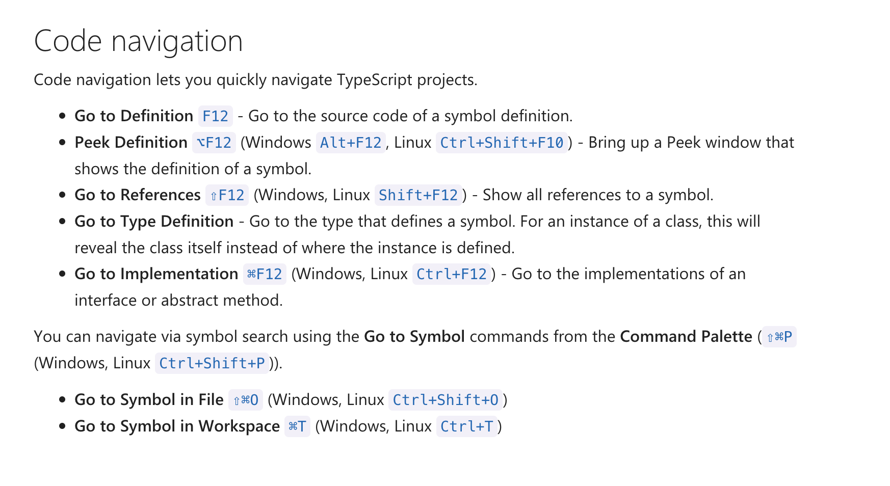
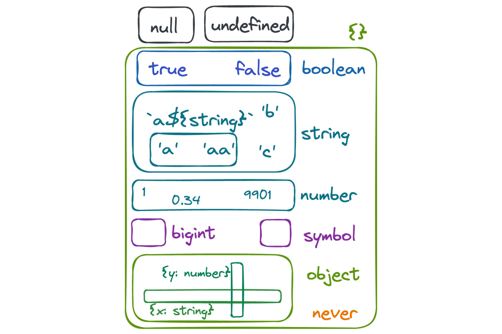

# 2장 타입스크립트의 타입 시스템

## 아이템 6 편집기를 사용하여 타입 시스템 탐색하기

타입스크립트를 설치하면 다음 두 가지를 실행할 수 있다.

- 타입스크립트 컴파일러 (tsc)
- 단독으로 실행할 수 있는 타입스크립트 서버 (tsserver)

편집기를 통해 타입스크립트가 언제 타입 추론을 수행하는지 개념을 잡을 수 있다. 이러한 개념을 잡으면 간결하고 읽기 쉬운 코드를 작성할 수 있다.

특정 시점에 타입스크립트가 값의 타입을 어떻게 이해하고 있는지 살펴보는 것은 “타입 넓히기”와 “타입 좁히기”의 개념을 위해 필요한 과정이다.

편집기의 타입 오류를 살펴보면서 타입 시스템의 성향을 파악할 수 있다.

```ts
function getElement(elOrId: string | HTMLElement | null): HTMLElement {
  if (typeof elOrId === 'object') {
    return elOrId;
    // ERROR: 'HTMLElement | null' 형식은 'HTMLElement' 형식에 할당할 수 없음
  } else if (elOrId === null) {
    return document.body;
  } else {
    const el = document.getElementById(elOrId);
    return el;
    // ERROR: 'HTMLElement | null' 형식은 'HTMLElement' 형식에 할당할 수 없음
  }
}
```

- 첫 번째 오류: 자바스크립트에서 `typeof null` 은 `object` 이므로, `elOrId` 는 `null` 가능성이 있다.
- 두 번째 오류: `document.getElementById` 가 `null` 을 반환할 가능성이 있다.

타입스크립트 언어 서비스는 라이브러리와 라이브러리의 타입 선언을 탐색할 때 유용하다.
편집기에서 “Go to Definition” 옵션을 사용해서 타입스크립트에 포함되어 있는 DOM 타입 선언인 `lib.dom.d.ts` 파일로 이동할 수 있다.

```ts
declare function fetch(input: RequestInfo, init?: RequestInit): Promise<Response>;
```

```ts
declare var Request: {
  prototype: Request;
  new (input: RequestInfo, init?: RequestInit): Request;
};
```

```ts
interface RequestInit {
  body?: BodyInit | null;
  cache?: RequestCache;
  credentials?: RequestCredentials;
  headers?: HeadersInit;
  // ...
}
```

:::note

**VS Code 에서 유용한 단축키 및 확장**



- [Editing TypeScript](https://code.visualstudio.com/docs/typescript/typescript-editing)
- [Quokka.js](https://marketplace.visualstudio.com/items?itemName=WallabyJs.quokka-vscode)

:::

### 요약

- 편집기에서 타입스크립트 언어 서비스를 적극 활용해야 한다.
- 편집기를 사용하면 어떻게 타입 시스템이 동작하는지, 그리고 타입스크립트가 어떻게 타입을 추론하는지 개념을 잡을 수 있다.
- 타입스크립트가 동작을 어떻게 모델링하는지 알기 위해 타입 선언 파일을 찾아보는 방법을 터득해야 한다.

## 아이템 7 타입이 값들의 집합이라고 생각하기

코드가 실행되기 전, 타입스크립트가 오류를 체크하는 순간에는 “타입”을 가지고 있다. “할당 가능한 값들의 집합”이 타입이라고 생각하면 된다. 이 집합은 타입의 “범위”라고 부르기도 한다.



- 출처: [Making sense of TypeScript using set theory](https://thoughtspile.github.io/2023/01/23/typescript-sets/)

가장 작은 집합은 아무 값도 포함하지 않는 공집합이며, 타입스크립트에서는 `never` 타입이다. `never` 타입으로 선언한 변수의 범위는 공집합이기 때문에 아무런 값도 할당할 수 없다.

그 다음으로 작은 집합은 타입스크립트에서 유닛(unit) 타입이라고 부르는 리터럴(literal) 타입이다.

두 개 혹은 세 개로 묶으려면 유니온(union) 타입을 사용한다.

```ts
type AB = 'A' | 'B';
type AB12 = 'A' | 'B' | 12;
```

타입스크립트 오류에서 “할당 가능한”이라는 문구를 볼 수 있다. 이 문구는 집합의 관점에서 “~의 원소(값과 타입의 관계)” 또는 “~의 부분 집합(두 타입의 관계)”을 의미한다.

구조적 타이핑 규칙은 어떠한 값이 다른 속성도 가질 수 있음을 의미한다. 함수 호출의 매개변수에서도 다른 속성을 가질 수 있다. 이러한 사실은 특정 상황에서만 추가 속성을 허용하지 않는 초과 속성 체크만 생각하면 간과하기 쉽다.

```ts
interface Identified {
  id: string;
}

interface Person {
  name: string;
}

interface Lifespan {
  birth: Date;
  death?: Date;
}

type PersonSpan = Person & Lifespan;
```

`&` 연산자는 두 타입의 인터섹션(교집합)을 계산한다.

```ts
type K = keyof (Person | Lifespan); // never
```

유니온 타입에 속하는 값은 어떠한 키도 없기 때문에, 유니온에 대한 `keyof` 는 공집합(`never`)이다.

```ts
keyof (A&B) = (keyof A) | (keyof B)
keyof (A|B) = (keyof A) & (keyof B)
```

“서브타입”은 어떤 집합이 다른 집합의 부분 집합이라는 의미이다.

```ts
interface Vector1D {
  x: number;
}

interface Vector2D extends Vector1D {
  y: number;
}

interface Vector3D extends Vector2D {
  z: number;
}
```

`Vector3D`는 `Vector2D`의 서브타입이고 `Vector2D`는 `Vector1D`의 서브타입이다.

`extends` 키워드는 제너릭 타입에서 한정자로도 사용한다. 이 문맥에서는 “~의 부분 집합”을 의미한다.

```ts
function getKey<K extends string>(val: any, key: K) {
  // ...
}
```

`string` 을 상속한다는 의미를 집합의 관점으로 생각하면 쉽게 이해할 수 있다. `string` 의 부분 집합 범위를 가지는 어떠한 타입이 된다. 이 타입은 `string` 리터럴 타입, `string` 리터럴 타입의 유니온, `string` 자신을 포함한다.

```ts
getKey({}, 'x'); // OK
getKey({}, Math.random() < 0.5 ? 'a' : 'b'); // OK
getKey({}, document.title); // OK
getKey({}, 12); // ERROR: 'number' 형식의 인수는 'string' 형식의 매개 변수에 할당할 수 없음
```

```ts
interface Point {
  x: number;
  y: number;
}

type PointKeys = keyof Point; // "x" | "y"

function sortBy<K extends keyof T, T>(vals: T[], key: K): T[] {
  vals.sort((a, b) => (a[key] === b[key] ? 0 : a[key] < b[key] ? -1 : +1));
  return vals;
}

const pts: Point[] = [
  { x: 1, y: 1 },
  { x: 2, y: 0 },
];

sortBy(pts, 'x'); // OK, "x" | "y" 상속
sortBy(pts, 'y'); // OK, "x" | "y" 상속
sortBy(pts, Math.random() < 0.5 ? 'x' : 'y'); // OK
sortBy(pts, 'z');
// ERROR: '"z"' 형식의 인수는 'keyof Point' 형식의 매개 변수에 할당할 수 없음
```

타입이 집합이라는 관점은 배열과 튜플의 관계를 명확하게 만든다.

```ts
const list = [1, 2]; // number[]
const tuple: [number, number] = list;
// ERROR: 'number[]' 형식은 '[number, number]' 형식에 할당할 수 없음
```

숫자 배열을 숫자의 쌍(pair)이라고 할 수 없다. 빈 리스트와 [1]이 그 반례이다. `number[]` 는 `[number, number]` 의 부분 집합이 아니기 때문에 할당할 수 없다.

타입이 값의 집합이라는 건, 동일한 값의 집합을 가지는 두 타입은 같다는 의미가 된다. 두 타입이 의미적으로 다르고 우연히 같은 범위를 가진다고 하더라도, 같은 타입을 두 번 정의할 이유는 없다.

- 관련 자료: [타입스크립트의 Omit은 어떻게 동작할까? Exclude, Pick 부터 알아보기](https://yceffort.kr/2022/03/typescript-omit-exclude-pick)

:::note

**원시 타입과 객체의 차이**

원시 타입은 일반적으로 알고 있는 교집합, 합집합과 같다.

그런데 객체에서는 `key` , `value` 가 무한대라서 다르다.

```ts
// 인터섹션(intersection, 교집합)
type A = {
  a: number;
};

type B = {
  b: number;
};

type AandB = A & B;
type AorB = A | B;

const aAndB: AandB = { a: 1, b: 2 };
const aOrB: AorB = { a: 1 };
const aOrB2: AorB = { b: 2 };
const aOrB3: AorB = { a: 1, b: 2 };

// aAndB 는 A 와 B 의 부분집합
// A 타입에 aAndB 할당
const a: A = aAndB; // No error

// B 타입에 aAndB 할당
const b: B = aAndB; // No error

// A 와 B 는 AorB 의 부분집합
const aOrB4: AorB = a;
const aOrB5: AorB = b;
```

- **추가 자료1**: [[번역] 집합론으로 이해하는 타입스크립트](https://itchallenger.tistory.com/874)
- **추가 자료2**: [[번역] TypeScript 및 집합 이론](https://velog.io/@yeeed711/번역-TypeScript-및-집합-이론)
- 내가 이해한 내용이 맞는지 코드로 증명하기 위해 노력하기

:::

### 요약

- 타입을 값의 집합으로 생각하면 이해하기 편하다(타입의 “범위”). 이 집합은 유한(`boolean` 또는 리터럴 타입)하거나 무한(`number` 또는 `string`)하다.
- 타입스크립트 타입은 엄격한 상속 관계가 아니라 겹쳐지는 집합(벤 다이어그램)으로 표현된다. 두 타입은 서로 서브타입이 아니면서도 겹쳐질 수 있다.
- 한 객체의 추가적인 속성이 타입 선언에 언급되지 않더라도 그 타입에 속할 수 있다.
- 타입 연산은 집합의 범위에 적용된다. A와 B의 인터섹션은 A의 범위와 B의 범위의 인터섹션이다. 객체 타입에서는 A&B인 값이 A와 B의 속성을 모두 가짐을 의미한다.
- “A는 B를 상속”, “A는 B에 할당 가능”, “A는 B의 서브 타입”은 “A는 B의 부분 집합”과 같은 의미이다.
