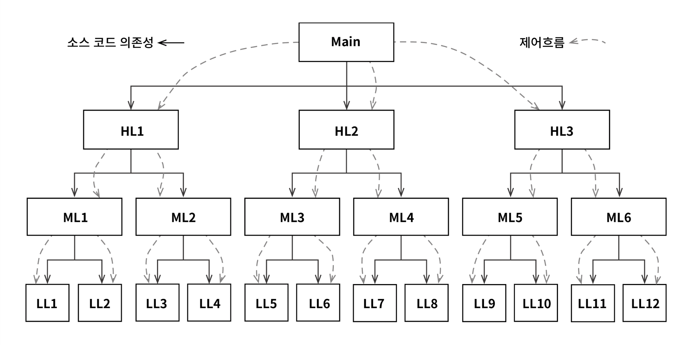
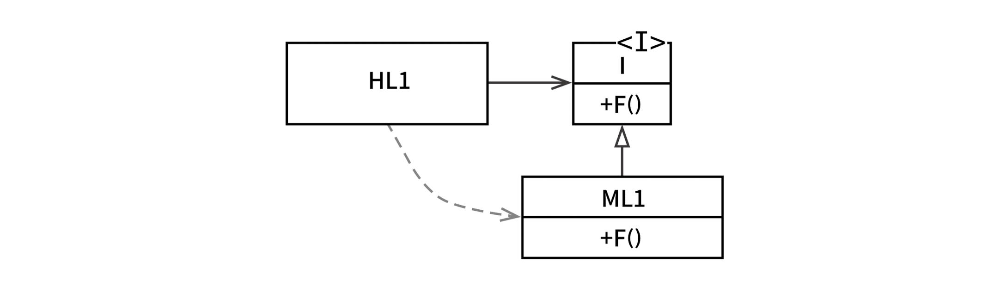

# 5장 객체 지향 프로그래밍

좋은 아키텍처를 만드는 일은 객체 지향 OO 설계 원칙을 이해하고 응용하는 데서 출발한다.

## 캡슐화?

**point.h** (헤더 파일)

```c
struct Point;
struct Point* makePoint(double x, double y);
double distance(struct Point *p1, struct Point *p2);
```

**point.c** (구현 파일)

```c
#include "point.h"
#include <stdlib.h>
#include <math.h>

struct Point {
  double x, y;
};

struct Point* makePoint(double x, double y) {
  struct Point* p = malloc(sizeof(struct Point));
  p->x = x;
  p->y = y;
  return p;
}

double distance(struct Point* p1, struct Point* p2) {
  double dx = p1->x - p2->x;
  double dy = p1->y - p2->y;
  return sqrt(dx*dx + dy*dy);
}
```

`point.h` 를 사용하는 측에서 `struct Point` 의 멤버에게 접근할 방법이 전혀 없다.

이것이 바로 완벽한 캡슐화이며 OO가 아닌 언어에서도 충분히 가능하다.

OO 프로그래밍은 프로그래머가 충분히 올바르게 행동함으로써 캡슐화된 데이터를 우회해서 사용하지 않을 거라는 믿음을 기반으로 한다. 하지만 OO를 제공한다고 주장한 언어들이 실제로는 C 언어에서 누렸던 완벽한 캡슐화를 약화해 온 것은 틀림없다.

## 상속?

**namedPoint.h** (헤더 파일)

```c
struct NamedPoint;
struct NamedPoint* makeNamedPoint(double x, double y, char* name);
void setName(struct NamedPoint* np, char* name);
char* getName(struct NamedPoint* np);
```

**namedPoint.c** (구현 파일)

```c
#include "namedPoint.h"
#include <stdlib.h>

struct NamedPoint {
  double x, y;
  char* name;
};

struct NamedPoint* makeNamedPoint(double x, double y, char* name) {
  struct NamedPoint* p = malloc(sizeof(struct NamedPoint));
  p->x = x;
  p->y = y;
  p->name = name;
  return p;
}

void setName(struct NamedPoint* np, char* name) {
  np->name = name;
}

char* getName(struct NamedPoint* np) {
  return np->name;
}
```

**main.c** (사용 예제)

```c
#include "point.h"
#include "namedPoint.h"
#include <stdio.h>

int main(int ac, char** av) {
  struct NamedPoint* origin = makeNamedPoint(0.0, 0.0, "origin");
  struct NamedPoint* upperRight = makeNamedPoint(1.0, 1.0, "upperRight");

  printf("distance=%f\n",
         distance(
           (struct Point*) origin,
           (struct Point*) upperRight));
}
```

main 프로그램을 살펴보면 `NamedPoint` 데이터 구조가 마치 `Point` 데이터 구조로부터 파생된 구조인 것처럼 동작한다는 사실을 볼 수 있다.

OO가 출현하기 이전부터 프로그래머가 흔히 사용하던 기법이었다. 실제로 C++에서는 이 방법을 이용해서 단일 상속을 구현했다.

OO 언어가 고안되기 훨씬 이전에도 상속과 비슷한 기법이 사용되었다고 말할 수 있다. 하지만 이렇게 말하는 데는 어폐가 있다. 상속을 흉내내는 요령은 있었지만 사실상 상속만큼 편리한 방식은 절대 아니기 때문이다.

## 다형성?

함수를 가리키는 포인터를 응용한 것이 다형성이다.

함수에 대한 포인터를 직접 사용하여 다형적 행위를 만드는 이 방식에는 문제가 있는데 함수 포인터는 위험하다는 사실이다. 포인터를 초기화하는 관례를 준수해야 한다는 사실을 기억해야 한다. 그리고 이들 포인터를 통해 모든 함수를 호출하는 관례를 지켜야 한다는 점도 기억해야 한다. 프로그래머가 관례를 지켜야 한다는 사실을 망각하게 되면 버그가 발생하고 이러한 버그는 찾아내고 없애기가 힘들다.

OO 언어는 이러한 관례를 없애주며 따라서 실수할 위험이 없다.

### 다형성이 가진 힘

플러그인 아키텍처는 입출력 장치 독립성을 지원하기 위해 만들어졌고 등장 이후 거의 모든 운영체제에서 구현되었다. 그럼에도 대다수의 프로그래머는 직접 작성하는 프로그램에서는 이러한 개념을 확장하여 적용하지 않았는데 함수를 가리키는 포인터를 사용하면 위험을 수반하기 때문이었다.

### 의존성 역전





HL1 모듈은 ML1 모듈의 F() 함수를 호출한다. 소스 코드에서는 HL1 모듈은 인터페이스를 통해 F() 함수를 호출한다. ML1 과 I 인터페이스 사이의 소스 코드 의존성이 제어 흐름과는 반대이다. 이를 **의존성 역전**이라고 부른다.

소스 코드 의존성이 제어 흐름의 방향과 일치되도록 제한되지 않는다. 호출하는 모듈이든 아니면 호출받는 모듈이든 관계없이 소프트웨어 아키텍트는 소스 코드 의존성을 원하는 방향으로 설정할 수 있다.

## 결론

OO란 다형성을 이용하여 전체 시스템의 모든 소스 코드 의존성에 대한 절대적인 제어 권한을 획득할 수 있는 능력이다. OO를 사용하면 아키텍트는 플러그인 아키텍처를 구성할 수 있고 이를 통해 고수준의 정책을 포함하는 모듈은 저수준의 세부 사항을 포함하는 모듈에 대해 독립성을 보장할 수 있다. 저수준의 세부 사항은 중요도가 낮은 플러그인 모듈로 만들 수 있고, 고수준의 정책을 포함하는 모듈과는 독립적으로 개발하고 배포할 수 있다.
