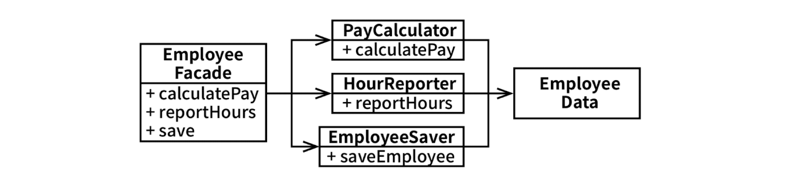

# 7장 SRP: 단일 책임 원칙

이 원칙의 이름을 듣는다면 모든 모듈이 단 하나의 일만 해야 한다는 의미로 받아들이기 쉽다.

단 하나의 일만 해야 한다는 원칙은 따로 있다. 함수는 반드시 단 하나의 일만 해야 한다는 원칙이다. 이 원칙은 커다란 함수를 작은 함수들로 리팩터링하는 더 저수준에서 사용된다.

역사적으로 SRP는 아래와 같이 기술되어 왔다.

> 단일 모듈은 변경의 이유가 오직 하나뿐이어야 한다.

소프트웨어 시스템은 사용자와 이해관계자를 만족시키기 위해 변경된다. SPR가 말하는 '변경의 이유'란 바로 이들 사용자와 이해관계자를 가리킨다.

> 하나의 모듈은 하나의, 오직 하나의 사용자 또는 이해관계자에 대해서만 책임져야 한다.

시스템이 동일한 방식으로 변경되기를 원하는 사용자나 이해관계자가 두 명 이상일 수도 있다. 여기에서는 이런 의미보다는 집단, 즉 해당 변경을 요청하는 한 명 이상의 사람들을 가리킨다. 이러한 집단을 액터라고 부르겠다.

> 하나의 모듈은 하나의, 오직 하나의 엑터에 대해서만 책임져야 한다.

모듈의 가장 단순한 정의는 소스 파일이다. 하지만 일부 언어와 개발 환경에서는 코드를 소스 파일에 저장하지 않는다. 이러한 경우 모듈은 단순히 함수와 데이터 구조로 구성된 응집된 집합이다.

'응집된'이라는 단어가 SRP를 암시한다. 단일 액터를 책임지는 코드를 함께 묶어주는 힘이 바로 응집성이다.

## 징후 1: 우발적 중복

SRP는 서로 다른 액터가 의존하는 코드를 서로 분리하라고 말한다.

## 징후 2: 병합

많은 사람이 서로 다른 목적으로 동일한 소스 파일을 변경하는 경우에 해당한다. 이 문제를 벗어나는 방법은 서로 다른 액터를 뒷받침하는 코드를 서로 분리하는 것이다.

## 해결책

아마도 가장 확실한 해결책은 데이터와 메서드를 분리하는 방식일 것이다. 각 클래스는 자신의 메서드에 반드시 필요한 소스 코드만을 포함한다.

개발자가 세 가지 클래스를 인스턴스화하고 추적해야 한다는 게 단점이다. 이러한 난관에서 빠져나올 때 흔히 쓰는 기법으로 퍼사드 패턴이 있다.

EmployeeFacade 클래스는 세 클래스의 객체를 생성하고, 요청된 메서드를 가지는 객체로 위임하는 일을 책임진다.

가장 중요한 메서드는 기존의 Employee 클래스에 그대로 유지하되, Employee 클래스를 덜 중요한 나머지 메서드들에 대한 퍼사드로 사용할 수도 있다.

## 결론

단일 책임 원칙은 메서드와 클래스 수준의 원칙이다. 하지만 이보다 상위의 두 수준에서도 다른 형태로 다시 등장한다. 컴포넌트 수준에서는 공통 폐쇄 원칙이 된다. 아키텍처 수준에서는 아키텍처 경계의 생성을 책임지는 변경의 축이 된다.
