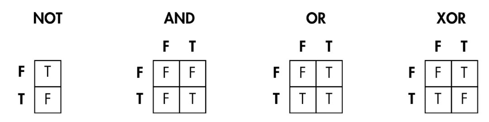

# 1장 컴퓨터 내부의 언어 체계 - 컴퓨터는 어떤 말을 사용할까

## 언어란 무엇인가

모든 언어의 뜻은 기호의 집합으로 **인코딩**된다. 의사소통하는 당사자 모두 같은 **문맥**을 공유해서 같은 기호에 같은 뜻을 부여할 수 있어야 한다.

## 문자 언어

다음과 같은 세 가지 구성 요소가 문자 언어의 틀을 이루는데, 컴퓨터 언어에서도 마찬가지다.

- 기호가 들어갈 상자
- 상자에 들어갈 기호
- 상자의 순서

일부 언어에는 주변의 상자 안에 들어 있는 기호의 종류에 따라 상자에 들어갈 수 있는 기호를 제한하는 복잡한 규칙이 존재하기도 한다. 예를 들어, 어떤 기호들은 서로 인접한 상자에 들어갈 수 없다.

## 비트

자연어에서는 상자를 **문자**라고 부르고 컴퓨터에서는 **비트**라고 부른다. '비트'라는 단어는 2진법을 사용한다는 뜻의 '바이너리'와 숫자를 뜻하는 '디지트'가 합쳐진 말이다.

## 논리 연산

비트 사용법 중 하나는 예/아니요 질문에 대한 답을 표현하는 것이다. '예'를 참이라는 용어로 부르고, '아니요'를 거짓이라는 용어로 부른다.

다른 비트들이 표현하는 내용으로부터 새로운 비트를 만들어내는 이런 동작을 논리 연산이라고 한다.

### 불리언 대수

일반 대수와 마찬가지로 결합 법칙, 교환 법칙, 분배 법칙을 불리언 대수에 적용할 수 있다.

- **NOT**: '논리적 반대'를 의미한다.
- **AND**: 2비트 연산인 경우 첫 번째 비트가 참이고 두 번째 비트도 참인 경우에만 결과가 참이 된다. 2비트보다 더 많은 비트에 연산을 적용하는 경우 모든 비트가 참이면 AND 연산의 결과도 참이다.
- **OR**: 2비트 연산인 경우 첫 번째 비트가 참이거나 두 번째 비트가 참이면 결과가 참이 된다. 2비트보다 더 많은 비트에 연산을 적용하는 경우 어느 한 비트라도 참이면 OR 연산의 결과도 참이다.
- **XOR**(exclusive OR): 첫 번째 비트와 두 번째 비트가 다른 값인 경우에만 참이 된다. 즉 두 값 중 어느 하나가 참이면 XOR도 참이지만 두 값이 모두 참이면 XOR의 결과는 거짓이다.

### 드모르간의 법칙

`a AND b` 라는 연산은 `NOT(NOT a OR NOT b)` 와 같다고 말한다.

NOT을 사용하면 AND 연산을 OR 연산으로 대신할 수 있다. **긍정적인 논리**에 더해 **부정적인 논리**를 기술하는 명제를 사용할 때 드모르간의 법칙을 활용할 수 있다.
